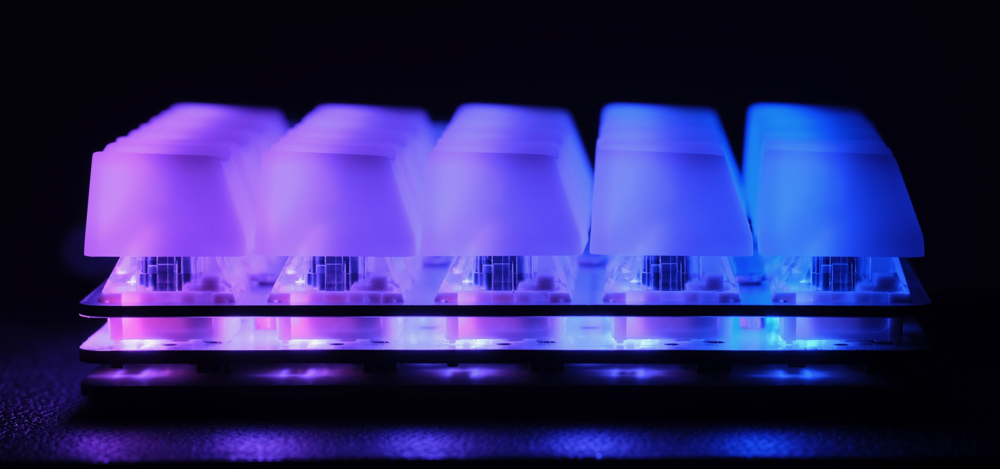

# duckyPad Pro: Macro Scripting Beyond QMK/VIA

-----------

duckyPad Pro is a 20-key mechanical macropad for power users who demand **advanced macro scripting and customisation** beyond the shackles of QMK/VIA.

Incorporating 4 years worth of feedback from the [original duckyPad](link_here), now with **Rotary Encoders**, **Bluetooth**, **Expansion Modules**, and more!


duckyPad Pro has all the basics:

* Hot-Swap
* Rotary Encoders
* Per-key RGB
* USB-C
* 100% **Open-source**

But also features **unlike any other**:

* Custom **[duckyScript](duckyscript_info.md)** engine, **NOT QMK/VIA**.
* **Longer and more complex** macros for **keyboard AND mouse**.
* Configurable **OLED** screen
* **Bluetooth**
* **Expansion Modules** for external switches / foot pedals
* **64 profiles**, 3712 macros total.
* [Automatic profile switching](https://github.com/dekuNukem/duckyPad-profile-autoswitcher) based on active window.
* microSD storage
* No proprietary drivers, works out-of-box.
* **Hacker friendly** with tinkering guide


## duckyScript vs QMK/VIA

duckyPad Pro runs a custom implementation of **duckyScript**, originally for [USB Rubber Ducky](https://shop.hak5.org/products/usb-rubber-ducky-deluxe).

Compared to QMK/VIA, you get:

* **Much Longer Macros**
	* [Entire Bee Movie](resources/beemovie.txt) in one macro? Yes please!
	* Up to 3712 macros in total

* **Advanced Interactive Scripting**
	* Variables, conditionals, loops, functions, etc.
	* Reading Buttons
	* Print to OLED screen
	* Change RGB Color
	* Fine timing control
	* Randomization

* **SD Card Storage**
	* Quick Configuration / Backup / Deployment
	* No sketchy drivers or apps
	* No recompiling

* **Existing Resources**
	* Lots of [scripts](https://github.com/hak5/usbrubberducky-payloads) to try out
	* Thriving [Discord](https://discord.gg/4sJCBx5) Community

While QMK/VIA are great for regular keyboards, they are rather hopeless at even the basics of input automations.

duckyScript is a no-brainer for power users with more demanding scripting needs.

## How It Works / Showcase

* Create up to **64 profiles**, one for each application.

* Assign up to **58 keys** per profile (20 onboard + 6 rotary encoder + 32 external)

* Names are shown on OLED screen

* Write a **duckyScript** for each key


### duckyScript: Simple Start

* **duckyScript** is an easy language for automating inputs

* You basically tell it what keys to press

* Start simple by consolidating shortcuts of your commonly used apps

```
Zoom In: CTRL +

Next Tab: CTRL SHIFT TAB
```


### Up a Notch

* Once familiar, you can write **much longer macros** to further speed up everyday task.

* Such as **filling forms** and typing **boilerplate text** with one keypress.


### Fancy Stuff

* Finally, realize its full potential with **interactive scripting**!

* Reading button inputs

* Writing to OLED screen

* Change RGB colors

a mini text adventure here?

### Hackerman!

* Of course, by automating keystrokes, you can take over an entire computer with the push of a button!


* This is known as [BadUSB attack](https://arstechnica.com/information-technology/2014/07/this-thumbdrive-hacks-computers-badusb-exploit-makes-devices-turn-evil/), which was the original purpose of [USB Rubber Ducky](https://shop.hak5.org/products/usb-rubber-ducky-deluxe).

* It's up to you to decide what to do!

## Expansion Modules

duckyPad Pro also supports optional **expansion modules**!


* Wire up your own switches / buttons / foot pedals


* 6 channels per module

* **Daisy-chain** up to 5 modules with regular USB-C cable

## Bluetooth

duckyPad Pro fully functions as a **Bluetooth Keyboard & Mouse**!

* Bluetooth 4.2 BLE

* Built-in Antenna

photo here next to iphone

gif here

* Add-your-own USB battery pack

* Yes I know it's a bit silly having BT without internal battery

* But it would involve more complicated case design, additional components, and international sourcing & shipping rechargeable batteries

* Which would inflate the overall cost way beyond an off-the-shelf battery pack

* As this is a one-person project, I'd prefer to keep it simple.

## Profile Autoswitcher

* Automatically jump to the appropriate profile

* Based on **current active window**


## Specifications

#### Keys

* 20 Mechanical Switches
* 4x5 Grid
* Cherry-MX style
* Kailh hot-swap socket



#### RGB Backlight

* Per-key configurable
* Adjustable brightness

#### Rotary Encoder

* Two encoders
* Bourns Inc. PEC12R-4215F-S0024
* 24 Detents
* Built-in tactile switch

#### Mounting Plate

* Standard: 1.6mm Pure White FR4 (same material as PCB)
* Optional: 1.6mm Brushed Aluminum

#### OLED screen

* 128x128
* **Configurable orientation**
* Shows what each key does
* Print-to-screen in duckyScript

screenshots here


#### Microcontroller

* ESP32-S3
* Dual-Core @ 240 MHz 
* 4MB Flash Memory
* 512KB RAM
* 2MB PSRAM

#### Wireless Communication

* **Bluetooth** (fully working, add your own battery)
* BLE 4.2
* Wi-Fi (Capable but currently unimplemented)

#### Configurator

* Fully open-source
* Windows / Mac / Linux
* Manage profiles/keys
* Write/debug duckyScript
* No need to create an account
* No data collection whatsoever
* No internet connection required


