# duckyPad Pro: Advanced Macro Scripting Beyond QMK/VIA

[Get duckyPad Pro](https://www.tindie.com/products/37399/) | [Official Discord](https://discord.gg/4sJCBx5) | [Getting Started](./doc/getting_started.md) | [Table of Contents](#table-of-contents)

-----------

duckyPad Pro is a 20-key **mechanical macropad** for power users who demand **advanced macro scripting and customisation** beyond the shackles of QMK/VIA.

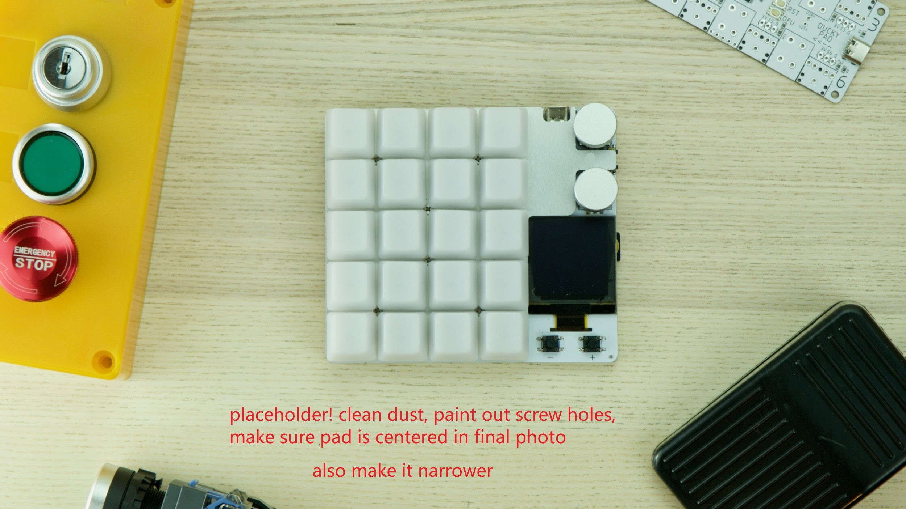

Using a [turing-complete scripting language](./doc/duckyscript_info.md), you can automate **any keyboard/mouse input** you want, from **simple combos** to **full-blown programs**.

Built on 4 years of feedback from the [original duckyPad](https://github.com/dekuNukem/duckyPad), **duckyPad Pro** combines long-requested upgrades with a no-nonsense design, aiming simply to be the **most capable** macropad today.

## Get One

duckyPad Pro has been [successfully funded on Kickstarter](https://www.kickstarter.com/projects/dekunukem/duckypad-pro-advanced-macro-scripting-beyond-qmk-via) with more than $100K raised!

* Now available [on my Tindie Store!](https://www.tindie.com/products/37399/)

## Highlights

duckyPad Pro has all the basics:

* Hot-Swap
* Rotary Encoders (**Tactile or Smooth**)
* Per-key RGB
* 100% **Open-source**

But also features **unlike any other**:

* Custom **[duckyScript](doc/duckyscript_info.md)** engine, **NOT QMK/VIA**.
* **Longer and more complex** macros
	* **64 profiles**, 3712 macros.
* **OLED** screen
* **Bluetooth**
* Real-time Clock (RTC)
* **[Expansion Modules](https://github.com/dekuNukem/duckyPad-expansion-modules)** for external switches / foot pedals
* [Profile Auto-switching](https://github.com/dekuNukem/duckyPad-profile-autoswitcher) based on **active window**.
* microSD storage
* No proprietary drivers, works out-of-box.
* **Hacker friendly** with [tinkering guide](./doc/tinkering_guide.md)

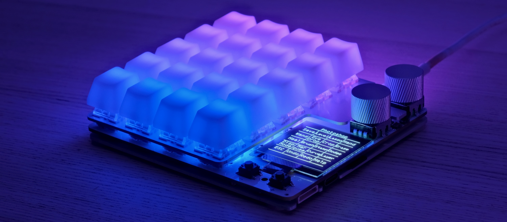

## duckyScript vs QMK/VIA

duckyPad Pro runs **duckyScript**, originally designed for the [USB Rubber Ducky](https://shop.hak5.org/products/usb-rubber-ducky-deluxe).

Compared to QMK/VIA, you get:

* **Much Longer Macros**
	* [Entire Bee Movie](resources/beemovie.txt) in one macro? Sure thing!
	* Over 3700 macros total

* **Turing-Complete Scripting**
	* Variables, conditions, loops, functions, and more.
	* Executed on [32-bit Bytecode VM](https://duckypad.github.io/DuckStack/)
	* With **Scratch** and **Non-volatile Memory**

* **Advanced Interactions**
	* Reading Buttons
	* Print to OLED screen
	* Change RGB Color
	* How about a fully functional [Pong game?](resources/photos/pong.gif) [[code]](resources/pong.txt)

* **SD Card Storage**
	* Fast Configuration / Backup / Deployment
	* No sketchy drivers or apps
	* No recompiling

While QMK/VIA are great for regular keyboards, they are rather limited at input automations.

duckyScript is a no-brainer for **power users** with more demanding scripting needs.

## How It Works / Showcase

* Create up to **64 profiles**, one for each application.

* Assign up to **58 keys** per profile (20 onboard + 6 rotary encoder + 32 external)

* Names are shown on OLED screen

* Write a **duckyScript** for each key

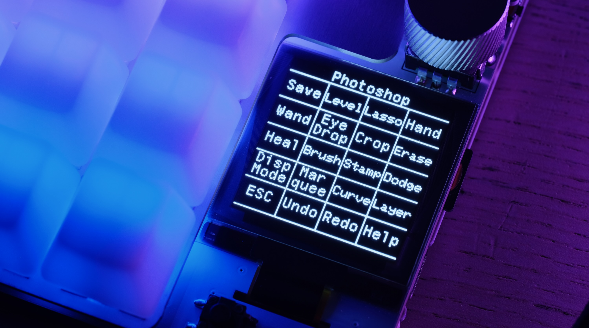

### Easy Start

* **duckyScript** is a language for automating inputs

	* At simplest, you just tell it what key to press!

* Such as **key combos** of your favorite app

**Browsing**

Zoom In: `CTRL +`

Next Tab: `CTRL SHIFT TAB`

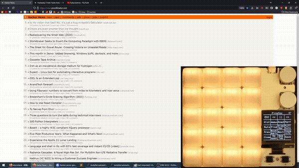

### Up a Notch

* Once familiar, you can write **longer multi-line macros** to further speed up everyday task.

* Such as **filling forms** and typing **boilerplate text** with one keypress.

```
STRING Michael Scott
TAB
STRING United States
ENTER
STRING 5705550100
TAB
STRING michael.scott@dundermifflin.com
TAB
```


Or a simple mouse jiggler:

```
WHILE TRUE
	MOUSE_MOVE $_RANDOM_INT $_RANDOM_INT
	DELAY 100
END_WHILE
```


### Full Potential

* Going all-out, duckyScript is a **Turing-Complete** **general-purpose** language.
* You can use it to:
	* Read Buttons
	* Write to OLED screen
	* Change RGB colors
	* Perform operations with **32-bit variables**, **conditions**, **loops**, **function call**s, and more!
* Write ultra-specific macros for your exact needs

```
RGB_SET 1 128 0 255

OLED_PRINT You are in a maze
OLED_PRINT of twisty little passages

VAR choice = _READKEY

IF choice == 1
    OLED_CURSOR 0 10
    OLED_PRINT It is a dead end.
    OLED_PRINT Something moves
    OLED_PRINT behind you.
END_IF
```


Or how about a fully working [Pong game?](resources/pong.txt)

```
WHILE TRUE
    active_key = _READKEY
    OLED_CLEAR
    draw_paddle()
    draw_court()
    draw_ball()
    OLED_UPDATE
    DELAY 20
END_WHILE
```


### Hackerman

* Of course, by automating HID inputs, you can take over an entire computer with the push of a button!

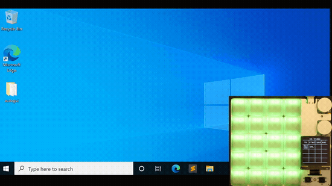

* This is known as [BadUSB attack](https://arstechnica.com/information-technology/2014/07/this-thumbdrive-hacks-computers-badusb-exploit-makes-devices-turn-evil/), and was the original purpose of [USB Rubber Ducky](https://shop.hak5.org/products/usb-rubber-ducky-deluxe).

---------

### Nothing Like It

* From **simple shortcuts** to **full-blown programs**, duckyScript can easily achieve what was impossible on QMK/VIA.

* Each macro can type over **60,000 characters**

* Store over **3700 macros** in total

* Executed on custom [virtual stack machine](https://duckypad.github.io/DuckStack/)

## Bluetooth

duckyPad Pro also works as a **Bluetooth Keyboard & Mouse** (with a catch!)

* Bluetooth 5.0
* Built-in Antenna for both BT and Wi-Fi


**So what's the catch?**

* You need to provide your own USB battery bank

Yes I know it's a bit silly having BT without internal battery! However, it would involve more complex case design, additional components, and international shipping of rechargeable batteries.

All of which would inflate the cost way beyond just using an off-the-shelf battery pack.

As this is a one-person project, I prefer to keep things simple.

## Expansion Modules

duckyPad Pro also supports optional [expansion modules](https://github.com/dekuNukem/duckyPad-expansion-modules) for even more customisability.

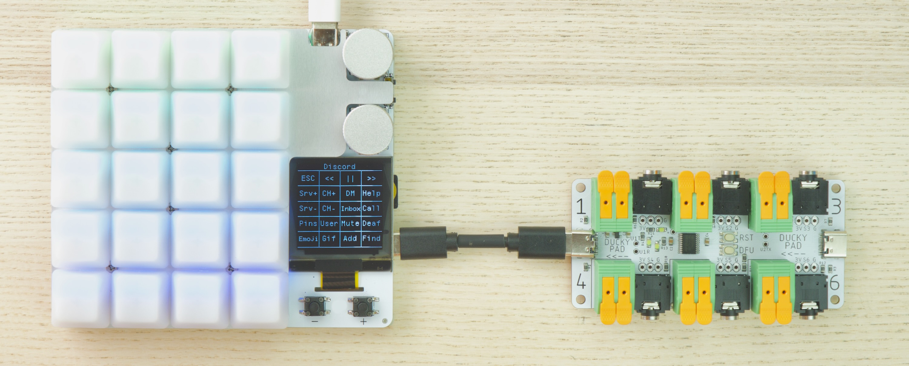

* Wire up your own **switches / buttons / foot pedals**
* **8 channels** per module
* **Daisy-chain** up to 32 channels


## New CPU

duckyPad Pro now runs a significantly more powerful processor:

* ESP32-S3
* Dual-Core @ 240 MHz 
* 4MB Flash Memory
* 512KB RAM
* 2MB PSRAM

Switching to ESP32 also allows **much simpler setup for tinkering:**

* VSCode IDE
* Open-source toolchain
* USB Flashing, no external programmer needed.
* [Tinkering guide provided](./doc/tinkering_guide.md)

## QoL Updates

* Separate script for **on press** and **on release**
* **Abort execution** with any key
* Read `NUMLOCK` / `CAPSLOCK` / `SCROLLLOCK` status
* Switch profile by name (instead of number)
* Configurable screen orientation
* Mount SD Card as **USB Storage**
* Blocking `$_READKEY`
* Much faster configurator load/save
* **Drag & drop** firmware update
* More sturdy +/- button
* Reinforced hotswap socket solder pads
* A lot more under-the-hood optimizations

## duckyPad Configurator

[Use the open-source configurator](https://github.com/duckyPad/duckyPad-Configurator) to set up your duckyPad Pro.

* Windows | Mac | Linux
* No account / subscription needed
* No data collection / telemetry


## Profile Auto-switching

* [Automatically jump to the appropriate profile](https://github.com/dekuNukem/duckyPad-profile-autoswitcher)
* Based on **current active window**

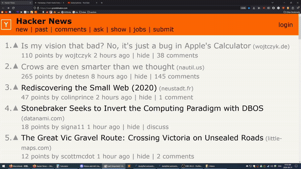

## Mechanical Switches

duckyPad Pro has **20 Mechanical Switches** in **4x5 Grid.**

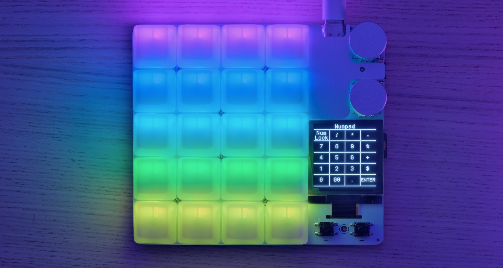

* Kailh hot-swap socket
* Cherry-MX compatible (Both 3 and 5-Pin)
* North-facing ARGB LED
* Configurable colour & brightness

## Rotary Encoders

* Two Encoders
* Bourns Inc. PEC12R Series
* Built-in Tactile Switch
* Max Knob Diameter: 24mm

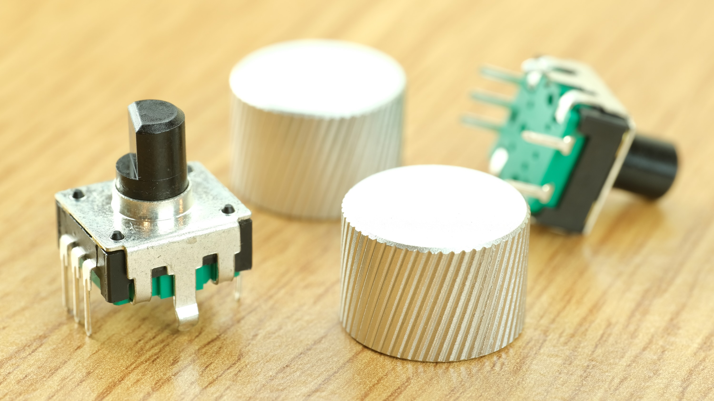

## OLED Display

* 128x128
* 1.5 inch
* High contrast with true black
* **Configurable orientation**
* Burn-in Prevention

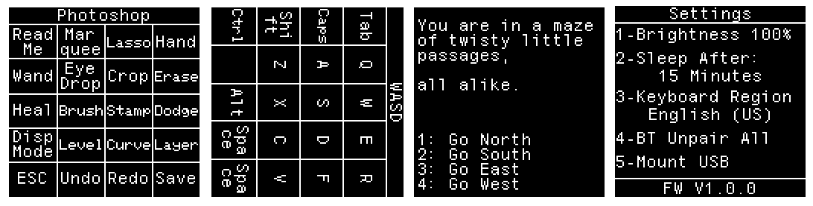

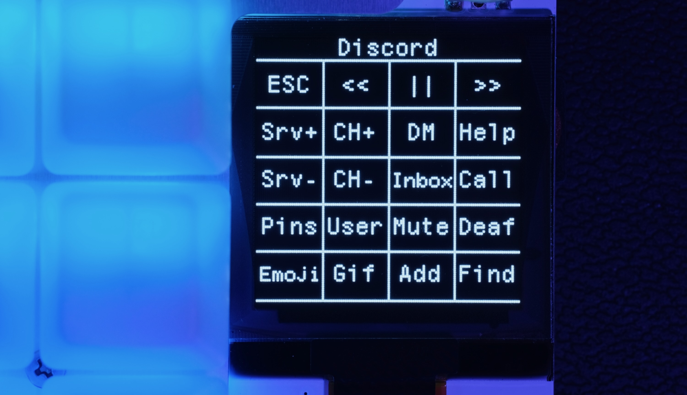

## Interested?

Available [on my Tindie store!](https://www.tindie.com/products/37399/)

Join our [Official Discord](https://discord.gg/4sJCBx5) for discussions and updates!

## Specifications

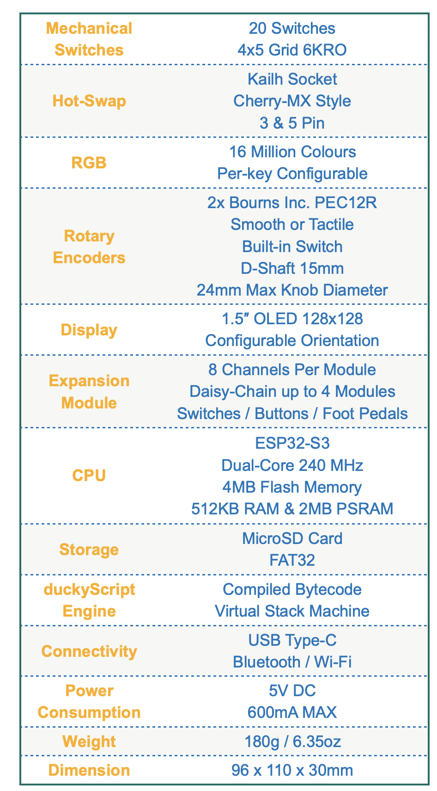

## Questions or Comments?

Please feel free to [open an issue](https://github.com/dekuNukem/duckypad-pro/issues), ask in the [official duckyPad discord](https://discord.gg/4sJCBx5), or email `dekuNukem`@`gmail`.`com`!

## Disclaimers

* duckyPad has been in active development since 2017, and every effort has been made to ensure its reliability. However, it is **NOT** designed or certified for safety-critical applications. Use at your own risk.

* Scripts are stored as **plain text** on the SD card. Keep in mind before including sensitive information.

* duckyScript appears to be a trademark of [Hak5 LLC](https://docs.hak5.org/hak5-usb-rubber-ducky/duckyscript-tm-quick-reference). The duckyPad project is not affiliated with, or endorsed by Hak5 LLC.

* The duckyScript [compiler and virtual machine](https://duckypad.github.io/DuckStack/) used in this project are independently developed from scratch.

## Table of Contents

[Main page](README.md)

[Getting Started Guide](./doc/getting_started.md)

[Kit Assembly Guide](./doc/kit_assembly.md)

[Writing duckyScript](./doc/duckyscript_info.md)

[duckStack VM](https://duckypad.github.io/DuckStack/)

[Tinkering Guide](./doc/tinkering_guide.md)

[Troubleshooting](./doc/troubleshooting.md)

[Firmware Update](./doc/fw_update.md)
