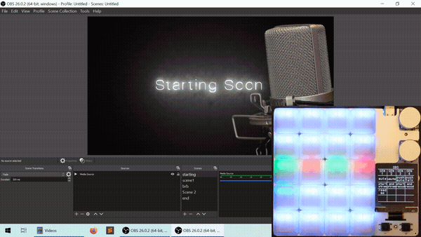

# duckyPad Pro: Advanced Macro Scripting Beyond QMK/VIA

[Get duckyPad](https://www.tindie.com/products/21984/) | [Official Discord](https://discord.gg/4sJCBx5) | [Getting Started](getting_started.md) | [Table of Contents](#table-of-contents)

-----------

duckyPad Pro is a 20-key **mechanical macropad** for power users who demand **advanced macro scripting and customisation** beyond the shackles of QMK/VIA.


Incorporating 4 years worth of feedback from the [original duckyPad](https://github.com/dekuNukem/duckyPad), duckyPad Pro combines long-requested upgrades with a no-nonsense design, aiming simply to be the **most capable** macropad today.

## Get duckyPad Pro

hi!

## Getting Started / Documentations

hi!

## Highlights

duckyPad Pro has all the basics:

* Hot-Swap
* **Rotary Encoders**
* Per-key RGB
* USB-C
* 100% **Open-source**

But also features **unlike any other**:

* Custom **[duckyScript](duckyscript_info.md)** engine, **NOT QMK/VIA**.
* **Longer and more complex** macros for **keyboard AND mouse**.
* Configurable **OLED** screen
* **Bluetooth**
* **Expansion Modules** for external switches / foot pedals
* **64 profiles**, 3712 macros total.
* [Automatic profile switching](https://github.com/dekuNukem/duckyPad-profile-autoswitcher) based on active window.
* microSD storage
* No proprietary drivers, works out-of-box.
* **Hacker friendly** with tinkering guide


## duckyScript vs QMK/VIA

duckyPad Pro runs **duckyScript**, originally designed for [USB Rubber Ducky](https://shop.hak5.org/products/usb-rubber-ducky-deluxe).

Compared to QMK/VIA, you get:

* **Much Longer Macros**
	* [Entire Bee Movie](resources/beemovie.txt) in one macro? Sure thing!
	* Up to 3712 in total

* **Advanced Interactive Scripting**
	* Variables, conditionals, loops, functions, etc.
	* Reading Buttons
	* Print to OLED screen
	* Change RGB Color
	* Fine timing control
	* Randomization

* **SD Card Storage**
	* Quick Configuration / Backup / Deployment
	* No sketchy drivers or apps
	* No recompiling

* **Existing Resources**
	* Lots of [scripts](https://github.com/hak5/usbrubberducky-payloads) to try out
	* Thriving [Discord](https://discord.gg/4sJCBx5) Community

While QMK/VIA are great for regular keyboards, they are rather hopeless at even the basics of input automations.

duckyScript is a no-brainer for power users with more demanding scripting needs.

## How It Works / Showcase

* Create up to **64 profiles**, one for each application.

* Assign up to **58 keys** per profile (20 onboard + 6 rotary encoder + 32 external)

* Names are shown on OLED screen

* Write a **duckyScript** for each key


### Easy Start

* **duckyScript** is an simple language for automating inputs

* You basically tell it what keys to press!

* Start simple by **mapping shortcuts** of your favourite app to any key or knob

**Browsing**

Zoom In: `CTRL +`

Next Tab: `CTRL SHIFT TAB`


**OBS**

Switch Scenes: `F13` `F14` `F15` `F16` 




### Up a Notch

* Once familiar, you can write **longer multi-line macros** to further speed up everyday task.

* Such as **filling forms** and typing **boilerplate text** with one keypress.

```
STRING Michael Scott
TAB
STRING United States
ENTER
STRING 5705550100
TAB
STRING michael.scott@dundermifflin.com
TAB
```


Or a simple mouse jiggler:

```
WHILE TRUE
	MOUSE_MOVE $_RANDOM_INT $_RANDOM_INT
	DELAY 100
END_WHILE
```


### Even Further

* Explore the full potential with **advanced interactive scripting**

* Read Buttons

* Write to OLED screen

* Change RGB colors

* Conditions and Loops

* Write ultra-specific macros for your exact needs

```
RGB_SET 1 128 0 255

OLED_PRINT You are in a maze
OLED_PRINT of twisty little passages

VAR $choice = $_READKEY

IF $choice == 1 THEN
    OLED_CURSOR 0 10
    OLED_PRINT It is a dead end.
    OLED_PRINT Something moves
    OLED_PRINT behind you.
END_IF
```


### Hackerman!

* Of course, by automating keystrokes, you can take over an entire computer with the push of a button!


* This is known as [BadUSB attack](https://arstechnica.com/information-technology/2014/07/this-thumbdrive-hacks-computers-badusb-exploit-makes-devices-turn-evil/), which was the original purpose of [USB Rubber Ducky](https://shop.hak5.org/products/usb-rubber-ducky-deluxe).

---------

### Nothing Like It

* Each macro can type over **60,000 characters**

* Store over **3700 macros** in total

* Scripts are compiled and executed on a custom [virtual stack machine](linkhere)

* With the power and flexibility of duckyScript, it is now trivial to achieve what was long considered impossible on QMK/VIA!

## Expansion Modules

duckyPad Pro also supports optional **expansion modules** for even more customisability.


* Wire up your own **switches / buttons / foot pedals**

* **6 channels** per module

* **Daisy-chain** up to 5 modules with regular USB-C cable


* 6 channels per module

* **Daisy-chain** up to 5 modules with regular USB-C cable

## Bluetooth

duckyPad Pro also works as a **Bluetooth Keyboard & Mouse** (with a catch!)

* Bluetooth 4.2 BLE

* Built-in Antenna for both BT and Wi-Fi


**So what's the catch?**

* You need to provide your own USB battery bank

Yes I know it's a bit silly having BT without internal battery! However, it would involve more complex case design, additional components, and international shipping of rechargeable batteries.

All of which would inflate the cost way beyond just getting an off-the-shelf battery pack. As this is a one-person project, I prefer to keep things simple.

Also, while the hardware for Wi-Fi is in place, the functionality is currently unimplemented.

## New CPU

duckyPad Pro now runs a significantly more powerful processor:

* ESP32-S3
* Dual-Core @ 240 MHz 
* 4MB Flash Memory
* 512KB RAM
* 2MB PSRAM

Switching to ESP32 also allows **much simpler setup for tinkering:**

* VSCode IDE
* Open-source toolchain
* USB Flashing, no external programmer needed.
* Code in Arduino or ESP-IDF
* Tinkering guide provided

## duckyPad Configurator

Use the open-source configurator to set up your duckyPad Pro.

* Windows / Mac / Linux
* No account creation
* No data collection / telemetry


## Profile Auto-switching

* Automatically jump to the appropriate profile

* Based on **current active window**


## Mechanical Switches

duckyPad Pro has **20 Mechanical Switches** in **4x5 Grid.**


* Kailh hot-swap socket
* Cherry-MX compatible (Both 3 and 5-Pin)
* North-facing ARGB LED
* Configurable colour & brightness

## Rotary Encoders

* Two Encoders
* Bourns Inc. PEC12R-4215F-S0024
* Built-in Tactile Switch
* D-shape 15mm Shaft
* Max Knob Diameter: 24mm


## OLED Display

* 128x128
* 1.5 inch
* High contrast with true black
* **Configurable orientation**
* Burn-in Prevention


## Table of Contents

hi!!
