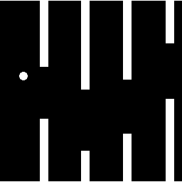

# [BETA TEST] duckyPad "Turing Complete" Update: Jan 2026

Happy New Year! Please enjoy a **major update** that makes your duckyPad even more powerful!

This update features a complete **scripting engine overhaul**, adds many **long-requested features**, and significantly expands **duckyScript's capabilities**, making it even more **general-purpose and versatile** than ever before.

**Highlights:**

* **32-bit** Overhaul
* Proper **Function Calls**
* **Print Format** Specifiers
* **User-defined Headers** and **StdLib**
* **Horizontal** Mouse Scrolling
* Streamlined Syntax & **Syntax Highlighter**
* **New Commands** & Bug Fixes

----

## Changelog Archive

Looking for older update notes? [Click me](./update_notes)

## Try It Out!

Follow the steps below:

### Update Firmware: duckyPad Pro (2024)

* [Get Beta Firmware (v3.3.2)](https://github.com/dekuNukem/duckyPad-Pro/raw/refs/heads/dsvm2/firmware/DPP_FW_3.3.2_f377ce53.bin)
* [Follow this guide](https://dekunukem.github.io/duckyPad-Pro/doc/fw_update.html) to update
    * Use the file **you just downloaded**

### 🆕 Update Firmware: duckyPad (2020)

* [Get Beta Firmware (v3.0.2)](https://github.com/dekuNukem/duckyPad/raw/refs/heads/dsvm2/firmware/beta_v3.0.2.dfu)
* [Follow this guide](https://dekunukem.github.io/duckyPad/firmware_updates_and_version_history.html) to update
    * Use the file **you just downloaded**

### 🆕 Download Latest Apps

* [Configurator](https://github.com/duckyPad/duckyPad-Configurator/releases/tag/4.0.2)
* [Autoswitcher](https://github.com/duckyPad/duckyPad-Profile-Autoswitcher/releases/tag/1.2.1)

### Do Your Worst!

* ⚠️ **Load & save** with latest configurator to **refresh the files**
* See if your **existing scripts** still work!
* If so, scroll down, **read about the new features** and try them out.
    * Give it a good thrashing

🐞 Bugs are expected, let me know if you run into any!

* [Discord](https://discord.gg/4sJCBx5)
* Email: `dekuNukem` `gmail.com`
* [Github Issue](https://github.com/dekuNukem/duckypad-pro/issues)

## Table of Contents

- [Syntax Shakeup](#syntax-shakeup)
- [In a 32-bit World](#in-a-32-bit-world)
- [Print Format Specifiers](#print-format-specifiers)
- [Numerical Padding](#numerical-padding)
- [Proper Function Calls](#proper-function-calls)
- [duckyPad Standard Library](#duckypad-standard-library)
- [User Headers](#user-headers)
- [Syntax Highlighter](#syntax-highlighter)
- [Built-in Functions](#built-in-functions)
- [New Commands](#new-commands)
- [Performance & Bugfixes](#performance--bugfixes)
- [Flappy Duck](#flappy-duck)

## Syntax Shakeup

* `$` prefix is **no longer required** when working with variables
    * **EXCEPT** when **printing**
* New **Augmented Assignment** Operators 
    * `+=`, `-=`, `*=` etc.
```
VAR foo = 100
foo += 5
STRING Value is: $foo
```
* New **Logical NOT** operator `!`
* `THEN` is **no longer required** in `IF` statements
* **Inline comments** with `//`
```
IF !foo 
    DELAY 100 // only if foo is 0
END_IF
```

## In a 32-bit World

* **All variable types** are now **Signed 32-bit Integers**
    * Can hold value between **−2,147,483,648 and 2,147,483,647**
* All operators are **signed** by default
    * [Explicit **unsigned** operators](https://github.com/dekuNukem/duckyPad-Pro/blob/dsvm2/doc/duckyscript_info.md#unsigned-operators) are available

## Print Format Specifiers

**C-Style Format Specifiers** are now supported when **printing variables**!

Use it to adjust **print format** and **padding**.

* Without specifier, variable are printed as **signed decimal** number
```
VAR foo = -10
STRING Value is $foo
```
```
Value is -10
```

To add a specifier: **Immediately after the variable name**, type `%`, then a **data-type indicator letter**.

* `%d` to print variable as **Signed Decimal**
    * Default, same as no specifier.
* `%u` to print variable as **Unsigned Decimal**
* `%x` to print variable as **Lowercase Hexadecimal**
* `%X` to print variable as **Uppercase Hexadecimal**

```
VAR $foo = -10

STRING Value is: $foo%d
STRING Value is: $foo%u
STRING Value is: $foo%x
STRING Value is: $foo%X
```

```
Value is: -10
Value is: 4294967286
Value is: fffffff6
Value is: FFFFFFF6
```

## Numerical Padding

* To pad with **SPACE**
    * Add a **width number** just **after `%`** and **before the letter**
    * The output will be **at least that** wide
    * Any extra space are padded with **space characters**
```
VAR $foo = 5
STRING I have $foo%10d apples!
```
```
I have          5 apples!
```

* To pad with **LEADING-ZERO**
    * Right **after `%`**, add a `0`, then **width number**, then the letter.
    * The output will be **at least that** wide
    * Any extra space are padded with `0`
* Useful for printing **dates** and **hex numbers**
```
VAR $foo = 5
STRING I have $foo%010d apples!
```
```
I have 0000000005 apples!
```

------

⚠️ This method replaces `_STR_PRINT_FORMAT` and `_STR_PRINT_PADDING`, which have been removed.

-----

## Proper Function Calls

Functions now support **arguments**, **return values**, **local variables**, and **recursive** calls, making them much more powerful and versatile.

### FUN FUN FUN

You can now use `FUN` and `END_FUN` to declare functions.

Old `FUNCTION` and `END_FUNCTION` still works of course.

### Back to Basics

As before, plain functions are handy for performing repetitive tasks.

```
FUN print_addr()
    STRINGLN 123 Ducky Lane
    STRINGLN Pond City, QU 12345
END_FUN

print_addr() // call it
```

### Arguments and Returns

But now, you can also **pass arguments** into a function and specify a **return value**.

```
FUN add_number(a, b)
    RETURN a + b
END_FUN

VAR total = add_number(10, 20)
```

### Variable Scoping

Variables declared **outside functions** have **global scope**, they can be **accessed anywhere**.

Variables declared **inside functions** now have **local scope**, they are only accessible **within the function**.

If a local variable has the **same name** as a global variable, the **local var takes priority** within that function.

```
// Both global scope
VAR x = 10
VAR y = 20

FUN scope_demo()
    VAR x = 5 // This x is local, will shadow the global x.
    x = x + y
    STRINGLN Local x is: $x
END_FUN
```
```
Local x is: 25
```

### Nested / Recursive Calls

You can now also call the **same function within itself**!

```
FUN factorial(n)
    IF n <= 1
        RETURN 1
    END_IF
    RETURN n * factorial(n - 1)
END_FUN

VAR fact = factorial(5)
```

## duckyPad Standard Library

With much more powerful function calls, a set of **handy helper functions** are provided as a **StdLib**.

To use them, add `USE_STDLIB` in your code.

[More Info / Contribute](https://github.com/duckyPad/DPDS-Standard-Library/blob/master/README.md)

```
USE_STDLIB

STRINGLN Press Key 3 to continue...
WAITKEY(3)

VAR high_score = MAX(100, 500)

STRINGLN The high score is: $high_score
```

## User Headers

You can now also **create your own header** for custom helper functions and more.

* Click `Edit Headers` Button
* Write code
* Add `USE_UH` to your script to include them
    * The header is added to your source code **AS-IS** during preprocessing

## Built-in Functions

Some **built-in functions** have been added.

They are **always available**, intended for **low-level tinkering**.

* [See main doc](duckyscript_info.md#built-in-functions) for details

```
PUTS()     RANDINT()
RANDCHR()  HIDTX()
RANDUINT()
```

1024 Bytes of **user scratch memory** is available with `PEEK()` and `POKE()` commands.

## Syntax Highlighter

[Now available for **VS Code** and **Sublime Text**](https://github.com/duckyPad/duckyScript-Syntax-Highlighter/blob/master/README.md)

* Recommended for writing longer and more complex scripts.

## New Commands

### Mouse Side Buttons

`FMOUSE`: **Forward** side button

`BMOUSE`: **Backward** side button

### Horizontal Mouse Scrolling

* `MOUSE_SCROLL h v`

Scroll mouse wheel **Horizontal** `h` lines, and **Vertical** `v` lines.

* `h`: Positive scrolls RIGHT, negative scrolls LEFT.
* `v`: Positive scrolls UP, negative scrolls DOWN.
* Set `0` for no scroll

### OLED Center-Aligned Print

Prints message **Center-Aligned** on the current Y cursor position.

* `OLED_CPRINT hello world!`

### OLED Shape Drawing

[`OLED_CIRCLE` and `OLED_RECT`](duckyscript_info.md#oled_circle-x-y-radius-options) now supports drawing in color **black**.

### "Random Letter" Commands 

**Types a random letter**. Added from [official duckyScript specs](https://docs.hak5.org/hak5-usb-rubber-ducky/duckyscript-quick-reference/).

```
RANDOM_LOWERCASE_LETTER    RANDOM_NUMBER
RANDOM_UPPERCASE_LETTER    RANDOM_SPECIAL
RANDOM_LETTER              RANDOM_CHAR
```
```
RANDOM_NUMBER
REPEAT 7
// types 8 random numbers
```

For more granular control, use `RANDCHR()` built-in function.

### New Reserved Variables

* `_SW_BITFIELD`: Read status of **all buttons at once**
* `_KBLED_BITFIELD`: Holds keyboard LED status

### `PASS` Command

Does nothing, can be used as empty statement block.

## Performance & Bugfixes

* **Faster Read/Write Speeds** in USB Storage Mode.
* Adjusted HID Descriptor to support `6KRO`
* Randomization now uses **Hardware RNG**
* Compiler optimizations to reduce code size.
* Only draws keyboard LED indicator if USB is connected
* Fixed runtime-user-assigned LED colors not saving properly.

## Flappy Duck

Glad you made it this far!

Please enjoy a **flappy bird clone** showcasing many of the new features in this update!

* Function calls with **arguments**, **return values** and **local vars**
* Struct-like object management in scratch memory
* Cleaner Syntax & New OLED commands
* Hardware RNG



* [Click me for source code](https://raw.githubusercontent.com/dekuNukem/duckyPad-Pro/refs/heads/dsvm2/resources/flappyduck.txt)
* **Copy & paste content AS-IS** into the script textbox

## Additional Reading

* [duckStack VM](https://github.com/duckyPad/DuckStack)
    * duckyScript compiler and Bytecode VM
* [duckyPad StdLib](https://github.com/duckyPad/DPDS-Standard-Library)
    * Useful Helper Functions
* [duckyScript Syntax Highligher](https://github.com/duckyPad/duckyScript-Syntax-Highlighter)
    * For **VS Code** and **Sublime Text**
* [Profile Autoswitcher](https://github.com/duckyPad/duckyPad-Profile-Autoswitcher)
    * Including [HID Command Protocol](https://github.com/duckyPad/duckyPad-Profile-Autoswitcher/blob/master/HID_details.md)
* [Configurator](https://github.com/duckyPad/duckyPad-Configurator)

## How'd It Go?

Let me know if you run into any bugs or have comments / suggestions.

* [Discord](https://discord.gg/4sJCBx5)
* Email: `dekuNukem` `gmail.com`
* [Github Issue](https://github.com/dekuNukem/duckypad-pro/issues)
