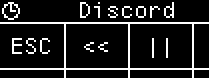

## Overview

duckyScript is a simple language for **automating keyboard/mouse inputs**.

## Comments

### `//`

C-style comment. Anything after `//` is ignored.

```
// This is a comment
```

### `REM_BLOCK` and `END_REM`

Comment block. Everything in-between is ignored.

```
REM_BLOCK
    Put as much comment here
    as you want!
END_REM
```


## Typing

### `STRING` and `STRINGLN`

`STRING` types out whatever after it **`AS-IS`**.

```
STRING Hello world!
// types out "Hello world!"
```

`STRINGLN` also presses **enter key** at the end.

### `STRINGLN_BLOCK` and `END_STRINGLN`

Type out everything inside as-is.

Also presses **enter key** at the **end of each line**.

```
STRINGLN_BLOCK

According to all known laws of aviation,
there is no way a bee should be able to fly.

END_STRINGLN
```

### `STRING_BLOCK` and `END_STRING`

Similar to above, but does **NOT** press enter on new lines.

## Pressing Keys

### Special Keys

duckyScript supports many special keys.

They can be used on their own:

```
WINDOWS
```

...or combined with a character to form shortcuts:

```
WINDOWS s
```

...or chained even longer:

```
WINDOWS SHIFT s
```

------

* Type the key name **as-is** in **`ALL CAPS`**.
* Keys are pressed in sequence from **left-to-right**, then released **right-to-left**.

------

List of Special Keys:

``` 
  CTRL / RCTRL         |     (media keys)             
  SHIFT / RSHIFT       |     MK_VOLUP                 
  ALT / RALT           |     MK_VOLDOWN               
  WINDOWS / RWINDOWS   |     MK_MUTE                  
  GUI                  |     MK_PREV
  COMMAND / RCOMMAND   |     MK_NEXT              
  OPTION / ROPTION     |     MK_PP (play/pause)                         
  ESC                  |     MK_STOP
  ENTER                |     
  UP/DOWN/LEFT/RIGHT   |                              
  SPACE                |     (numpad keys)            
  BACKSPACE            |     NUMLOCK                  
  TAB                  |     KP_SLASH                 
  CAPSLOCK             |     KP_ASTERISK              
  PRINTSCREEN          |     KP_MINUS                 
  SCROLLLOCK           |     KP_PLUS                  
  PAUSE                |     KP_ENTER                 
  BREAK                |     KP_0 to KP_9             
  INSERT               |     KP_DOT                   
  HOME                 |     KP_EQUAL                 
  PAGEUP / PAGEDOWN    |                              
  DELETE               |     (Japanese input method)  
  END                  |     ZENKAKUHANKAKU           
  MENU                 |     HENKAN                   
  POWER                |     MUHENKAN                 
  F1 to F24            |     KATAKANAHIRAGANA         

```

### `KEYDOWN` / `KEYUP`

Hold/release a key.

Allows more fine-grained control.

Can be used to input [Alt Codes](https://en.wikipedia.org/wiki/Alt_code) for special characters:

```
// types out ¼
KEYDOWN ALT
KP_1
KP_7
KP_2
KEYUP ALT
```

### `REPEAT`

Repeats the **last line** **`n`** times.

```
STRING Hello world
REPEAT 10
// types out "Hello world" 11 times (1 original + 10 repeats)
```


## Timing

### `DELAY n`

Pause execution for `n` **milliseconds**.

Useful for **waiting for UI to catch up**.

```
WINDOWS r
DELAY 1000 // 1000ms = 1 second
STRING cmd
```

### `DEFAULTDELAY n`

How long to wait between each **`NON-LETTER input actions`**.

* Default: 20ms
* Applies to:
    * `MOUSE_MOVE` and `MOUSE_SCROLL`
    * `KEYDOWN` and `KEYUP` (including combo keys)
    * Pressing ENTER at end of `STRINGLN`

```
DEFAULTDELAY 50
    // Waits 50ms between pressing each key
CTRL ALT DELETE
```

### `DEFAULTCHARDELAY n`

How long to wait between **`each letter`** when **`typing text`**.

* Default: 20ms
    * To type faster, set to around 10.
* Applies to:
    * `STRING` and `STRINGLN`
    * `RANDCHR()`
    * `PUTS()`

```
DEFAULTCHARDELAY 10
    // Waits 10ms between each letter 
STRING Hello World!
```

### `CHARJITTER n`

Adds an **`additional`** random delay between 0 and `n` milliseconds after **`each letter`** when **`typing text`**.

* Can make typing more human-like
* Set to 0 to disable
* Applies to:
    * `STRING` and `STRINGLN`
    * `RANDCHR()`
    * `PUTS()`


## Mouse

### Mouse Buttons

* `LMOUSE`: Click `LEFT` mouse button
* `RMOUSE`: Click `RIGHT` mouse button
* `MMOUSE`: Click `MIDDLE` mouse button
* `FMOUSE`: Click `FORWARD` mouse side-button
* `BMOUSE`: Click `BACKWARD` mouse side-button
* Can be used with `KEYDOWN` / `KEYUP` commands.

### `MOUSE_MOVE x y`

Move mouse cursor `x` pixels horizontally, and `y` pixels vertically.

* `x`: Positive moves RIGHT, negative moves LEFT.
* `y`: Positive moves UP, negative moves DOWN.
* Set to 0 if no movement needed
* **Disable mouse acceleration** for **pixel-accurate** results

### `MOUSE_SCROLL h v`

Scroll mouse wheel **Horizontal** `h` lines, and **Vertical** `v` lines.

* `h`: Positive scrolls RIGHT, negative scrolls LEFT.
* `v`: Positive scrolls UP, negative scrolls DOWN.
* Set to 0 for no scroll


## Multiple Actions

`LOOP` command lets you to **assign multiple actions to one key**.

You can use it to toggle / cycle through several actions like this:

```
LOOP0:
STRINGLN first action

LOOP1:
STRINGLN second action

LOOP2:
STRINGLN third action
```

* Start from `LOOP0`
* When pressed, a counter increments, and the script at the corresponding loop is executed.
* Keep the code inside simple!
    * For more complex needs, see [`WHILE` Loops](#loops) section below.


## Profile Switching

### `PREV_PROFILE` / `NEXT_PROFILE`

Switch to the previous / next profile.

### `GOTO_PROFILE`

Jump to a profile by name. **Case sensitive!**

This ends the current script execution.

Works with [Advanced Printing](#advanced-printing).

```
GOTO_PROFILE NumPad
```

## OLED

### `OLED_CURSOR x y`

Set where to print on screen.

`x y`: Pixel coordinates between `0` and `127`.

Characters are **7 pixels wide, 10 pixels tall.**

Max **18 Characters Per Line**.

Characters print from **top-left** corner.

### `OLED_PRINT`

`OLED_PRINT hello world!` 

Print the message into display buffer at **current cursor location**.

Works with [Advanced Printing](#advanced-printing).

### `OLED_CPRINT`

Same as `OLED_PRINT`, but prints message **center-aligned**.

### `OLED_CLEAR`

Clear the display buffer.

### `OLED_CIRCLE x y radius options`

* `x y`: Origin
* `radius`: In Pixels
* `options`:
    * `0`: White, outline.
    * `1`: White, filled.
    * `2`: Black, outline.
    * `3`: Black, filled.

### `OLED_LINE x1 y1 x2 y2`

* `x1, y1`: Start Point
* `X2, y2`: End Point

### `OLED_RECT x1 y1 x2 y2 options`

* `x1, y1`: Start Corner
* `X2, y2`: End Corner
* `options`:
    * `0`: White, outline.
    * `1`: White, filled.
    * `2`: Black, outline.
    * `3`: Black, filled.

### `OLED_UPDATE`

Actually update the OLED.

You should use the other commands to set up the buffer, then call `OLED_UPDATE` to write to display.

This is **much faster** than updating the whole screen for every change.

### `OLED_RESTORE`

Restore the default profile/key name display.

* `OLED_UPDATE` **NOT NEEDED**.


## Per-Key RGB

### `SWC_SET n r g b`

Change LED color of a switch

Set `n` to 0 for current key.

Set `n` between 1 to 20 for a particular key.

`r, g, b` must be between 0 and 255.

### `SWC_FILL r g b`

Change color of **ALL** LEDs.

`r, g, b` must be between 0 and 255.

### `SWC_RESET n`

Reset the key back to default color.

Set `n` to 0 for current key.

Set `n` from 1 to 20 for a particular key.

Set `n` to 99 for all keys.


## Constants

You can use `DEFINE` to, well, define a constant.

The content is **replaced AS-IS** during preprocessing, similar to `#define` in C.

```
DEFINE MY_EMAIL example@gmail.com

STRING My email is MY_EMAIL!
```


## Variables

You can declare a variable using `VAR` command, and assign values to it.

Assignment can be:

* Decimal: Normal numbers
* Hexadecimal: Starts with `0x`
* Character: **A single character** inside **single or double quote**
    * Will be converted to its 8-bit ASCII value

```
// Declaration
VAR spam = 42
VAR eggs = 0xff
VAR foo = 'a'

// Assignment
spam = 20
eggs = spam*2
```

* Variables are **SIGNED 32-bit Integers**
    * Can hold values between **−2,147,483,648 and 2,147,483,647**
* Variables declared at top level have **global scope** and can be accessed **anywhere**.
* Variables declared **inside a function** have **local scope** and is only accessible **within that function**.

### Persistent Global Variables

There are 32 pre-defined global variables that provides **non-volatile** data storage.

* `_GV0` to `_GV31`
* Available across **all profiles**
* Persists over reboots

### Reserved Variables

Some variables are **always available**. They all start with an underscore `_`.

You can read them to obtain information, or write to adjust settings.

```
VAR status = _IS_NUMLOCK_ON
_CHARJITTER = 10
```

[Click me for full list](#reserved-variables-list)

## Operators

You can perform operations on constants and variables.

All ops are **Signed** by default. Use explicit [**unsigned calls**](#unsigned-operators) to treat variables as unsigned.

### Mathematics

```
=       Assignment
+       Add       
-       Subtract  
*       Multiply  
/       SIGNED Integer Division
%       SIGNED Modulus   
**      Exponent
```

Example:

```
spam = 2+3
spam = eggs * 10
```

### Comparison

All comparisons evaluate to **either 0 or 1**.

```
==        Equal                  
!=        Not equal              
>         SIGNED Greater than           
<         SIGNED Less than              
>=        SIGNED Greater than or equal  
<=        SIGNED Less than or equal   
```

### Logical 

| Operator |          Name         | Comment                                                |
|:--------:|:---------------------:|--------------------------------------------------------|
|    `&&`    |      Logical AND      | Evaluates to 1 if BOTH side are non-zero, otherwise 0. |
|   `\|\|`   |       Logical OR      | Evaluates to 1 if ANY side is non-zero, otherwise 0.   |
|    `!`    |      Logical NOT      | **Single (Unary) Operand**<br>Evaluates to 1 if expression is 0<br>Evaluates to 0 if expression is **Non-Zero**|

### Bitwise

```
&       Bitwise AND   
|       Bitwise OR    
^       Bitwise XOR
~       Bitwise NOT
<<      Left Shift    
>>      Arithmetic Right Shift (sign-extend)
```

### Augmented Assignments

* E.g. `+=`, `-=`, `*=`, etc.
* Available for all **2-operand operators**
* `x += 1` same as `x = x + 1`, etc.

### UNSIGNED Operators

Call built-in functions below to perform **unsigned** operations on variables.

```
ULT(lhs, rhs)    Unsigned Less Than
ULTE(lhs, rhs)   Unsigned Less Than or Equal
UGT(lhs, rhs)    Unsigned Greater Than
UGTE(lhs, rhs)   Unsigned Greater Than or Equal
UDIV(val, n)     Unsigned Division (val / n)
UMOD(val, n)     Unsigned Modulo (val % n)
LSR(val, n)      Logical Right Shift (Zero-Extend)
```


## Advanced Printing

You can print the **value of a variable** by adding a **dollar symbol ($) before its name**.

```
VAR foo = -10
STRING Value is $foo
```
```
Value is -10
```

* Works with `STRING`, `STRINGLN`, `OLED_PRINT`, `OLED_CPRINT` and `GOTO_PROFILE`.

### Format Specifiers

You can use **optional C-Style Format Specifiers** to adjust **print format** and **padding**.

To add a specifier: **Immediately after the variable name**, type `%`, then a **data-type indicator letter**.

* `%d` to print variable as **Signed Decimal**
    * **DEFAULT**, same as no specifier.
* `%u` to print variable as **Unsigned Decimal**
* `%x` to print variable as **Lowercase Hexadecimal**
* `%X` to print variable as **Uppercase Hexadecimal**

```
VAR foo = -10

STRING Value is: $foo%d
STRING Value is: $foo%u
STRING Value is: $foo%x
STRING Value is: $foo%X
```

```
Value is: -10
Value is: 4294967286
Value is: fffffff6
Value is: FFFFFFF6
```

### Numerical Padding

* To pad with **SPACE**
    * Add a **width number** just **after `%`** and **before the letter**
    * The output will be **at least that** wide
    * Any extra space are padded with **space characters**
```
VAR foo = 5
STRING I have $foo%10d apples!
```
```
I have          5 apples!
```

* To pad with **LEADING-ZERO**
    * Right **after `%`**, add a `0`, then **width number**, then the letter.
    * The output will be **at least that** wide
    * Any extra space are padded with `0`
* Useful for printing **dates** and **hex numbers**
```
VAR foo = 5
STRING I have $foo%010d apples!
```
```
I have 0000000005 apples!
```


## Real-time Clock (RTC)

duckyPad can keep track of **current date and time** for use in scripts.

### Setting RTC

On cold-boot, duckyPad doesn't know what time it is.

It must be set once, after which it will keep time **as long as it is powered-on**.

* RTC is **automatically set** when using the [Autoswitcher](https://github.com/duckyPad/duckyPad-Profile-Autoswitcher)
    * A **clock icon** appears when RTC is valid



* You can also set it manually
    * [HID Commands](https://github.com/duckyPad/duckyPad-Profile-Autoswitcher/blob/master/HID_details.md)
    * [Sample Script](https://github.com/duckyPad/duckyPad-Profile-Autoswitcher/blob/master/hid_example/ex3_set_rtc.py)

### Reading RTC

#### Validity Check

**ALWAYS check** `_RTC_IS_VALID` **first**!

* **Do not proceed** if value is 0.

```
IF _RTC_IS_VALID == 0
    // RTC is uninitialised, do not proceed.
    HALT
END_IF
```

#### UTC Offset

The RTC always runs in **UTC**.

Local time is obtained by adding an **UTC Offset in `MINUTES`**

* It is **set automatically** to your **local timezone** when using the [Autoswitcher](https://github.com/duckyPad/duckyPad-Profile-Autoswitcher).
* You can check (and manually adjust) the offset by reading/writing `_RTC_UTC_OFFSET` variable
    * Can be positive, 0, or negative.

#### Time and Date

With **valid RTC** and **correct UTC offset**, you can now read from the variables below:

| Name      | Comment                | Range |
| ------------- | -------------------------- | --------------- |
| `_RTC_YEAR`  | **4-digit** Year          | e.g. `2025`    |
| `_RTC_MONTH` | Month              | `1–12`          |
| `_RTC_DAY`   | Day              | `1–31`          |
| `_RTC_HOUR`   | Hour | `0–23` |
| `_RTC_MINUTE` | Minute                | `0–59` |
| `_RTC_SECOND` | Second                | `0–60` |
| `_RTC_WDAY`  | Day of Week (`0 = Sunday`) | `0–6`           |
| `_RTC_YDAY`  | Day of Year (`0 = Jan 1`) | `0–365`           |

#### Example Usage

```
STRING $_RTC_YEAR%04d-$_RTC_MONTH%02d-$_RTC_DAY%02d $_RTC_HOUR%02d:$_RTC_MINUTE%02d:$_RTC_SECOND%02d
```

```
2025-09-18 09:07:23
```
See [Advanced Printing](#advanced-printing) for formatting tips.


## Conditional Statements

`IF` statements can be used to **conditionally execute code**.

At simplest, it involves `IF` and `END_IF`:

```
IF expression
    code to execute
END_IF
```

The code inside is executed if the **expression evaluates to non-zero**.

Indent doesn't matter, feel free to add them for a cleaner look.

----

You can use `ELSE IF` and `ELSE` for additional checks.

If the first `IF` evaluate to 0, `ELSE IF`s are checked.

If none of the conditions are met, code inside `ELSE` is executed.

```
VAR temp = 25

IF temp > 30
    STRING It's very hot!
ELSE IF temp > 18
    STRING It's a pleasant day.
ELSE
    STRING It's quite chilly!
END_IF
```


## Loops

You can use `WHILE` statement to **repeat actions** until a **certain condition is met**.

```
WHILE expression
    code to repeat
END_WHILE
```

* If `expression` evaluates to **non-zero**, code inside is repeated. Otherwise, the code is skipped.

This simple example loops 3 times.

```
VAR i = 0
WHILE i < 3
    STRINGLN Counter is $i!
    i = i + 1
END_WHILE
```

```
Counter is 0!
Counter is 1!
Counter is 2!
```

### `LBREAK`

Use `LBREAK` to **exit a loop** immediately.

```
VAR i = 0
WHILE 1
    STRINGLN Counter is $i!
    i = i + 1

    IF i == 3
        LBREAK
    END_IF
END_WHILE
```
```
Counter is 0!
Counter is 1!
Counter is 2!
```

### `CONTINUE`

Use `CONTINUE` to **jump to the start of loop** immediately.

```
VAR i = 0
WHILE i < 5
    i = i + 1

    IF i == 3
        CONTINUE
    END_IF

    STRINGLN Counter is $i!
END_WHILE
```

Here when `i` is 3, it skips printing and starts from the top instead.

```
Counter is 1!
Counter is 2!
Counter is 4!
Counter is 5!
```

### Infinite Loop

To exit an infinite loop, you can [check button status](#reading-inputs), or turn on `Allow Abort` in configurator settings.


## Functions

A function is a **block of organized code** that you can call to **perform a task**.

It makes your script **more modular** and **easier to maintain** compared to copy-pasting same code multiple times.

### Plain Functions

* Declare a function with `FUN name()` and `END_FUN`
* Put the code you want to execute inside
* Call it with `name()`
* Code inside are executed

```
FUN print_addr()
    STRINGLN 123 Ducky Lane
    STRINGLN Pond City, QU 12345
END_FUN

print_addr() // call it
```

### Arguments and Returns

You can also **pass arguments** into a function and specify a **return value**.

* Ideal for performing calculations

```
FUN add_number(a, b)
    RETURN a + b
END_FUN

VAR total = add_number(10, 20)
```

### Variable Scoping

Variables declared **outside functions** have **global scope**, they can be **accessed anywhere**.

Variables declared **inside functions** have **local scope**, they are only accessible **within that function**.

* If a local variable has the **same name** as a global variable, the **local var takes priority** within that function.

```
// Both global scope
VAR x = 10
VAR y = 20

FUN scope_demo()
    VAR x = 5 // This x is local, will shadow the global x.
    x = x + y
    STRINGLN Local x is: $x
END_FUN
```
```
Local x is: 25
```

### Nested / Recursive Calls

You can also:

* Call other functions from inside a function
* Including **calling itself**!

```
FUN factorial(n)
    IF n <= 1
        RETURN 1
    END_IF
    RETURN n * factorial(n - 1)
END_FUN

VAR fact = factorial(5)
```


## duckyPad Standard Library

The **DPDS StdLib** provides handy helper functions to simplify duckyScript coding.

To use them, add `USE_STDLIB` in your code.

[More Info / Contribute](https://github.com/duckyPad/DPDS-Standard-Library/blob/master/README.md)

```
USE_STDLIB

STRINGLN Press Key 3 to continue...
WAITKEY(3)

VAR high_score = MAX(100, 500)

STRINGLN The high score is: $high_score
```


## User Headers

You can also **create your own header** for custom helper functions and more.

* Click `Edit Headers` Button
* Write code
* Add `USE_UH` to your script to include them
    * The header is added to your source code **AS-IS** during preprocessing


## Built-in Functions

A few built-in functions are available. They are intended for **low-level tinkering**.

You might want to get familiar with [VM's memory map](https://duckypad.github.io/DuckStack/)

All multi-byte values are **little-endian**

### `PEEK8(addr)` / `PEEK16(addr)` / `PEEK32(addr)`
 
Read **SIGNED** value at memory address.

* High bits are **SIGN-extended**

### `PEEKU8(addr)` / `PEEKU16(addr)`
 
Read **UNSIGNED** value at memory address.

* High bits are **ZERO-extended**

### `POKE8(addr, val)` / `POKE16(addr, val)` / `POKE32(addr, val)`
 
Write value at memory address.

* `val` can be numbers or characters
    * `POKE8(0xf400, 'c')`
    * `POKE32(0xf410, 0xabcd)`

### `RANDCHR(value)`

Generate a **random character**.

* `value` is checked as a bitfield:
    * `Bit 0`: Letter Lowercase (A-Z)
    * `Bit 1`: Letter Uppercase (a-z)
    * `Bit 2`: Digits (0-9)
    * `Bit 3`: Symbols (\!\"\#\$\%\&\'\(\)\*\+\,\-\.\/\:\;\<\=\>\?\@\[\\\]\^\_\`\{\|\})
    * `Bit 8`: Type via Keyboard
    * `Bit 9`: Print to OLED at current cursor position
* For `Bit 0-3`, if any bit is `1`, its pool of characters will be included for random selection.
* If `Bit 8` is 1, it will type the character via keyboard.
* If `Bit 9` is 1, it will print the character to screen buffer
    * Don't forget to use `OLED_UPDATE` to actually refresh the screen.

### `RANDINT(lower, upper)` / `RANDUINT(lower, upper)`

Returns a **Signed/Unsigned** random number between `lower` and `upper` **INCLUSIVE**.

```
VAR value = RANDINT(-100, 100)
VAR value = RANDUINT(3000000000, 4000000000)
```

### `PUTS(value)`

**Print string** at memory address.

* `value` contains:
    * `Bit 0-15`: Address
    * `Bit 16-23`: `n`
    * `Bit 29`: Print to OLED at current cursor position
    * `Bit 30`: Print to OLED center-aligned
    * `Bit 31`: Type via Keyboard
* If `n = 0`, print until zero-termination.
    * Else, print max `n` characters.

### `HIDTX(addr)`

Send a **raw HID message**

* Pick an address `addr` in **scratch memory area**
* Use `POKE8()` to write **9 bytes** starting from `addr`
    * Follow the format below
* Call `HIDTX(addr)` to send the HID message
* Include a short delay (10-20ms) to allow computer to register the input
* Don't forget to **release the key** after pressing it
    * Set `Byte 1-8` to 0 to release

#### Keyboard

|Byte|Value|Description|
|:-------:|:----------:|:---------:|
|`addr`|1|Usage ID|
|`addr+1`|Modifier<br>Bitfield|`Bit 0`: Left Control<br>`Bit 1`: Left Shift<br>`Bit 2`: Left Alt<br>`Bit 3`: Left GUI (Win/Cmd)<br>`Bit 4`: Right Control<br>`Bit 5`: Right Shift<br>`Bit 6`: Right Alt (AltGr)<br>`Bit 7`: Right GUI (Win/Cmd)|
|`addr+2`|0|Reserved|
|`addr+3`<br>-<br>`addr+8`|HID Keyboard<br>Scan Code|[See list](https://gist.github.com/MightyPork/6da26e382a7ad91b5496ee55fdc73db2)<br>Max 6 keys at once (6KRO)<br>Write `0` for released / unused|

#### Media Keys

|Byte|Value|Description|
|:-------:|:----------:|:---------:|
|`addr`|2|Usage ID|
|`addr+1`|Key Status<br>Bitfield|`Bit 0`: Next Track<br>`Bit 1`: Previous Track<br>`Bit 2`: Stop<br>`Bit 3`: Eject<br>`Bit 4`: Play / Pause<br>`Bit 5`: Mute<br>`Bit 6`: Volume Up<br>`Bit 7`: Volume Down|
|`addr+2`<br>-<br>`addr+8`|0|0|

#### Mouse

|Byte|Value|Description|
|:-------:|:----------:|:---------:|
|`addr`|3|Usage ID|
|`addr+1`|Buttons<br>Status<br>Bitfield|`Bit 0`: Left<br>`Bit 1`: Right<br>`Bit 2`: Middle<br>`Bit 3`: Backward<br>`Bit 4`: Forward|
|`addr+2`|X Movement|-127 - 127|
|`addr+3`|Y Movement|-127 - 127|
|`addr+4`|Vertical<br>Scroll|-127 - 127|
|`addr+5`|Horizontal<br>Scroll|-127 - 127|
|`addr+6`<br>-<br>`addr+8`|0|0|


## Reading Inputs

You can **read the status of switches / encoders** to perform actions.

### Blocking Read

Simplest method.

Just read `_BLOCKING_READKEY` reserved variable.

It will block until a key is pressed.

```
VAR this_key = _BLOCKING_READKEY
// Blocks here until a key is pressed

IF this_key == 1
    // do something here
ELSE IF this_key == 2
    // do something else
END_IF

```

### Non-Blocking Read

Read `_READKEY`, **returns immediately**.

Returns 0 if no key is pressed. `Key ID` otherwise.

Check this **in a loop** to perform work even when no key is pressed.

```
WHILE TRUE
    VAR this_key = _READKEY
    IF this_key == 1
        // handling button press
    END_IF

    // otherwise do work here
END_WHILE
```

### Switch Status Bitfield

Read `_SW_BITFIELD`, **returns immediately**.

Each bit position stores the status of the corresponding key.

* E.g. `bit 1` = `key ID 1`, `bit 13` = `key ID 13`, etc.

If that bit is 1, the key is currently pressed.

You can use bitmasks to **check multiple keys at once**.

### Key ID

This is the number returned by methods above.

```
duckyPad Pro (2024):

1-20:
    * Built-in keys
    * Top left is 1
    * Bottom right is 20

21: Upper Rotary Encoder Clockwise
22: Upper Rotary Encoder Counterclockwise
23: Upper Rotary Encoder Push-down

24: Lower Rotary Encoder Clockwise
25: Lower Rotary Encoder Counterclockwise
26: Lower Rotary Encoder Push-down

27: Plus Button
28: Minus Button

37+: External Switches
```

```
duckyPad (2020):

1-15:
    * Top left is 1
    * Bottom right is 15
    * Plus button 16, Minus button 17.
```


## Randomization

### Random Number

Call `RANDINT(lower, upper)` for a random number between `lower` and `upper` **INCLUSIVE**.

```
VAR value = RANDINT(0, 1000)
```

### Random Character

Use one of below to **type a random character**:

```
RANDOM_LOWERCASE_LETTER     RANDOM_NUMBER
RANDOM_UPPERCASE_LETTER     RANDOM_SPECIAL
RANDOM_LETTER               RANDOM_CHAR
```

```
RANDOM_NUMBER
REPEAT 7
// types 8 random numbers
```

For more granular control, see `RANDCHR()` in [Built-in Functions](#built-in-functions).


## Miscellaneous

### `DP_SLEEP`

Make duckyPad go to sleep. Terminates execution.

Backlight and screen are turned off.

Press any key to wake up.

### `HALT`

Stop execution immediately

### `BCLR`

Clears the internal keypress event queue. Can be used:

* **At end of a long script**: Prevents "buffered" presses from triggering it again.
* **Before reading button status**: Ensures **new presses** are returned instead of old ones in the queue.

### `PASS`

Does nothing. Can be used as **placeholders** or empty statements.

## Reserved Variables List

There are some **reserved variables** that are always available.

You can read or write (RW) to adjust settings. Some are read-only (RO).

| Name                                                                 | Access | Description                                                                                    |
| --------------------------------------------------------------------------- | :-----: |:----:|
| **`_TIME_S`**<br>**`_TIME_MS`**        | RO    | Elapsed time since power-on|
| **`_READKEY`**<br>**`_BLOCKING_READKEY`**<br>**`_SW_BITFIELD`**                | RO    | See [Reading Inputs](#reading-inputs)|
| **`_KBLED_BITFIELD`** | RO    |Keyboard LED Status<br>`Bit 0`: Num Lock<br>`Bit 1`: Caps Lock<br>`Bit 2`: Scroll Lock<br>Bit is set if LED is on.<br>Certain OS may not have all LEDs|
| **`_IS_NUMLOCK_ON`**<br>**`_IS_CAPSLOCK_ON`**<br>**`_IS_SCROLLLOCK_ON`** | RO    | Aliases|
| **`_DEFAULTDELAY`**<br>**`_DEFAULTCHARDELAY`**<br>**`_CHARJITTER`**      | RW    | Aliases|
| **`_ALLOW_ABORT`**<br>**`_DONT_REPEAT`**                                  | RW    | Write `1` to enable<br>`0` to disable.   |
| **`_THIS_KEYID`**                       | RO    | Returns the [Key ID](#key-id) for the **current script**     |
| **`_DP_MODEL`**                         | RO    | Device model. Returns:<br>`1` for duckyPad (2020)<br>`2` for duckyPad Pro (2024)                              |
| **`_KEYPRESS_COUNT`**                   | RW    | How many times **current key**<br>has been pressed in the **current profile**<br>Assign **0 to reset** |
| **`_LOOP_SIZE`**                        | RO    | Used by `LOOP` command.<br>Do not modify                  |
| **`_NEEDS_EPILOGUE`**                   | RO    | Internal use only<br>Do not modify                           |
|**`_RTC_IS_VALID`**<br>**`_RTC_YEAR`**<br>**`_RTC_MONTH`**<br>**`_RTC_DAY`**<br>**`_RTC_HOUR`**<br>**`_RTC_MINUTE`**<br>**`_RTC_SECOND`**<br>**`_RTC_WDAY`**<br>**`_RTC_YDAY`**|RO|See [Real-time Clock](#real-time-clock-rtc)|
|**`_RTC_UTC_OFFSET`**|RW|See [Real-time Clock](#real-time-clock-rtc)|

-----------------

# DuckStack Bytecode Virtual Machine

DuckStack is a simple **stack-based bytecode VM** for executing compiled **duckyScript** binaries.

## Architecture Overview

duckStack uses **32-bit** variables, arithmetics, and stack width.

Addressing is **16-bit**, executable 64KB max.

* Single **Data Stack**
* Flat memory map
* Byte-addressed
* Program Counter (PC)
    * 16-bit byte-addressed
* Stack Pointer (SP)
    * 16-bit byte-addressed
    * Points to **the next free stack slot**
* Frame Pointer (FP)
    * Points to current function base frame

### Memory Map

|Address|Purpose|Size|Comment|`PEEK` and<br>`POKE`-able|
|:-:|:--:|:--:|:--:|:--:|
|`0000`<br>`EFFF`|Shared<br>**Executable**<br>and **Stack**<br>|61440 Bytes|See Notes Below|✅|
|`F000`<br>`F3FF`|User-defined<br>Global<br>Variables|1024 Bytes<br>4 Bytes/Entry<br>256 Entries|ZI Data|✅|
|`F400`<br>`F7FF`|Scratch<br>Memory|1024 Bytes|General-purpose|✅|
|`F800`<br>`FBFF`|Reserved|1024 Bytes||❌|
|`FC00`<br>`FDFF`|Persistent<br>Global<br>Variables|512 Bytes<br>4 Bytes/Entry<br>128 Entries|Non-volatile Data<br>Saved on SD card|✅|
|`FE00`<br>`FEFF`|VM<br>Internal<br>Variables|256 Bytes<br>4 Bytes/Entry<br>64 Entries|Read/Adjust<br>VM Settings|❌|
|`FF00`<br>`FFFF`|Memory-<br>Mapped IO|256 Bytes||✅|

* Binary executable is loaded at `0x0`
* Stack grows from `0xEFFF` towards **smaller address**
    * Each item **4 bytes long**
    * In actual implementation, SP can be **4-byte aligned** for better performance.
* Smaller executable allows larger stack, vise versa.

## Instruction Set

**Variable-length** between **1 to 5 bytes**.

* First byte (Byte 0): **Opcode**.
* Byte 1 - 4: **Optional payload**.
* ⚠️ All multi-byte payloads are **Little-endian**

### CPU Instructions

* **1 stack item** = 4 **bytes**
* `PUSHR` / `POPR` **Offset** is a **byte-addressed signed 16-bit integer**
    * Positive: Towards larger address / Base of Stack
    * Negative: Towards smaller address / Top of Stack (TOS)

|Name|Inst.<br>Size|Opcode<br>Byte 0|Comment|Payload<br>Byte 1-4|
|:-:|:-:|:-:|:-:|:-:|
|`NOP`|1|`0`/`0x0` |Do nothing|None|
|`PUSHC16`|3|`1`/`0x1` |Push **unsigned 16-bit (0-65535)** constant on stack<br>For negative numbers, push abs then use `USUB`.|2 Bytes:<br>`CONST_LSB`<br>`CONST_MSB` |
|`PUSHI`|3|`2`/`0x2` |Read **4 Bytes** at `ADDR`<br>Push to stack as one **32-bit** number|2 Bytes:<br>`ADDR_LSB`<br>`ADDR_MSB`|
|`PUSHR`|3|`3`/`0x3`|Read **4 Bytes** at **offset from FP**<br>Push to stack as one **32-bit** number|2 Bytes:<br>`OFFSET_LSB`<br>`OFFSET_MSB`|
|`POPI`|3|`4`/`0x4` |Pop one item off TOS<br>Write **4 bytes** to `ADDR`|2 Bytes:<br>`ADDR_LSB`<br>`ADDR_MSB`|
|`POPR`|3|`5`/`0x5`|Pop one item off TOS<br>Write as **4 Bytes** at **offset from FP**|2 Bytes:<br>`OFFSET_LSB`<br>`OFFSET_MSB`|
|`BRZ`|3|`6`/`0x6` |Pop one item off TOS<br>If value is zero, jump to `ADDR` |2 Bytes:<br>`ADDR_LSB`<br>`ADDR_MSB`|
|`JMP`|3|`7`/`0x7` |Unconditional Jump|2 Bytes:<br>`ADDR_LSB`<br>`ADDR_MSB`|
|`ALLOC`|3|`8`/`0x8` |Push `n` blank entries to stack<br>Used to allocate local variables<br>on function entry|2 Bytes:<br>`n_LSB`<br>`n_MSB`|
|`CALL`|3|`9`/`0x9` |Construct 32b value `frame_info`:<br>Top 16b `current_FP`,<br>Bottom 16b `return_addr (PC+3)`.<br>Push `frame_info` to TOS<br>Set **FP** to TOS<br>Jump to `ADDR`|2 Bytes:<br>`ADDR_LSB`<br>`ADDR_MSB`|
|`RET`|3|`10`/`0xa` |`return_value` on TOS<br>Pop `return_value` into temp location<br>Pop items until TOS is `FP`<br>Pop `frame_info`, restore **FP** and **PC**.<br>Pop off `ARG_COUNT` items<br>Push `return_value` back on TOS<br>Resumes execution at PC|2 Bytes:<br>`ARG_COUNT`<br>`Reserved`|
|`HALT`|1|`11`/`0xb` |Stop execution|None|
|`PUSH0`|1|`12`/`0xc` |Push `0` to TOS|None|
|`PUSH1`|1|`13`/`0xd` |Push `1` to TOS|None|
|`DROP`|1|`14`/`0xe` |Discard **ONE** item off TOS|None|
|`DUP`|1|`15`/`0xf` |**Duplicate the item** on TOS|None|
|`RANDINT`|1|`16`/`0x10` |Pop **TWO** item off TOS<br>First `Upper`, then `Lower`.<br>Push a **SIGNED** random number inbetween (**inclusive**) on TOS|None|
|`RANDUINT`|1|`17`/`0x10` |Pop **TWO** item off TOS<br>First `Upper`, then `Lower`.<br>Push an **UNSIGNED** random number inbetween (**inclusive**) on TOS|None|
|`PUSHC32`|5|`18`/`0x11` |Push **32-bit** constant on stack|4 Bytes<br>`CONST_LSB`<br>`CONST_B1`<br>`CONST_B2`<br>`CONST_MSB`|
|`PUSHC8`|2|`19`/`0x12` |Push **unsigned 8-bit (0-255)** constant on stack<br>For negative numbers, push abs then use `USUB`.|1 Byte|
|`VMVER`|3|`255`/`0xff`| VM Version Check<br>Abort if mismatch |2 Bytes:<br>`VM_VER`<br>`Reserved`|

### Memory Access

* All **single-byte** instructions

#### PEEK Instructions

* Pop **ONE** item off TOS as `ADDR`
    * Then...

|Name|Opcode<br>Byte 0|Comment|
|:-:|:-:|:-:|
|`PEEK8`|`24`/`0x18`|Read **ONE byte** at `ADDR`<br>Push on stack **SIGN-extended**|
|`PEEKU8`|`25`/`0x19`|Read **ONE byte** at `ADDR`<br>Push on stack **ZERO-extended**|
|`PEEK16`|`26`/`0x1a`|Read **TWO bytes** at `ADDR`<br>Push on stack **SIGN-extended**|
|`PEEKU16`|`27`/`0x1b`|Read **TWO bytes** at `ADDR`<br>Push on stack **ZERO-extended**|
|`PEEK32`|`28`/`0x1c`|Read **FOUR bytes** at `ADDR`<br>Push on stack **AS-IS**|

#### POKE Instructions

* Pop **TWO** item off TOS
    * First `ADDR`, then `VAL`
    * Then...

|Name|Opcode<br>Byte 0|Comment|
|:-:|:-:|:-:|
|`POKE8`|`29`/`0x1d`|Write **low 8 bits** of `VAL` to `ADDR`|
|`POKE16`|`30`/`0x1e`|Write **low 16 bits** of `VAL` to `ADDR`|
|`POKE32`|`31`/`0x1f`|Write `VAL` to `ADDR` **as-is**|

### Binary Operators

Binary as in **involving two operands**.

* All **single-byte** instructions
* Pop **TWO** items off TOS
    * First item: Left-hand-side
    * Second item: Right-hand-side
* Perform operation
* Push result back on TOS

-----

|Name|Opcode<br>Byte 0|Comment|
|:--:|:--:|:--:|
|`EQ`|`32`/`0x20`|Equal|
|`NOTEQ`|`33`/`0x21`|Not Equal|
|`LT`|`34`/`0x22`|**SIGNED** Less Than|
|`LTE`|`35`/`0x23`|**SIGNED** Less Than or Equal|
|`GT`|`36`/`0x24`|**SIGNED** Greater Than|
|`GTE`|`37`/`0x25`|**SIGNED** Greater Than or Equal|
|`ADD`|`38`/`0x26`|Add|
|`SUB`|`39`/`0x27`|Subtract|
|`MULT`|`40`/`0x28`|Multiply|
|`DIV`|`41`/`0x29`|**SIGNED** Integer Division|
|`MOD`|`42`/`0x2a`|**SIGNED** Modulus|
|`POW`|`43`/`0x2b`|Power of|
|`LSL`|`44`/`0x2c`|Logical Shift Left|
|`ASR`|`45`/`0x2d`|**Arithmetic** Shift Right<br>(Sign-extend)|
|`BITOR`|`46`/`0x2e`|Bitwise OR|
|`BITXOR`|`47`/`0x2f`|Bitwise XOR|
|`BITAND`|`48`/`0x30`|Bitwise AND|
|`LOGIAND`|`49`/`0x31`|Logical AND|
|`LOGIOR`|`50`/`0x32`|Logical OR|
|`ULT`|`51`/`0x33`|**UNSIGNED** Less Than|
|`ULTE`|`52`/`0x34`|**UNSIGNED** Less Than or Equal|
|`UGT`|`53`/`0x35`|**UNSIGNED** Greater Than|
|`UGTE`|`54`/`0x36`|**UNSIGNED** Greater Than or Equal|
|`UDIV`|`55`/`0x37`|**UNSIGNED** Integer Division|
|`UMOD`|`56`/`0x38`|**UNSIGNED** Modulus|
|`LSR`|`57`/`0x39`|**Logical** Shift Right<br>(Zero-extend)|

### Unary Operators

* All **single-byte** instructions
* Pop **ONE** items off TOS
* Perform operation
* Push result back on TOS

|Name|Opcode<br>Byte 0|Comment|
|:--:|:--:|:--:|
|`BITINV`|`60`/`0x3c`|Bitwise Invert|
|`LOGINOT`|`61`/`0x3d`|Logical NOT|
|`USUB`|`62`/`0x3e`|Unary Minus|

### duckyScript Commands

* All **single-byte** instructions

|Name|Opcode<br>Byte 0|Comment|
|:-------:|:----------:|:---------:|
|`DELAY`|`64`/`0x40`| **Delay**<br>Pop **ONE** item<br>Delay amount in **milliseconds**|
|`KDOWN`|`65`/`0x41`| **Press Key**<br>Pop **ONE** item<br>`\|MSB\|B2\|B1\|LSB`<br>`\|Unused\|Unused\|KeyType\|KeyCode\|`|
|`KUP`|`66`/`0x42`|**Release Key**<br>Pop **ONE** item<br>`\|MSB\|B2\|B1\|LSB`<br>`\|Unused\|Unused\|KeyType\|KeyCode\|`|
|`MSCL`|`67`/`0x43`| **Mouse Scroll**<br>Pop **TWO** items<br>First `hline`, then `vline`<br>Scroll `hline` horizontally<br>`(Positive: RIGHT, Negative: LEFT)`<br>Scroll `vline` vertically<br>`(Positive: UP, Negative: DOWN)`|
|`MMOV`|`68`/`0x44`|**Mouse Move**<br>Pop **TWO** items: `x` then `y`<br>`x`: Positive RIGHT, Negative LEFT.<br>`y`: Positive UP, Negative DOWN.|
|`SWCF`|`69`/`0x45`| **Switch Color Fill**<br>Pop **THREE** items<br>`Red, Green, Blue`<br>Set ALL LED color to the RGB value|
|`SWCC`|`70`/`0x46`| **Switch Color Change**<br>Pop **FOUR** item<br>`N, Red, Green, Blue`<br>Set N-th switch to the RGB value<br>If N is 0, set current switch.|
|`SWCR`|`71`/`0x47`| **Switch Color Reset**<br>Pop **ONE** item<br>If value is 0, reset color of current key<br>If value is between 1 and 20, reset color of that key<br>If value is 99, reset color of all keys.|
|`STR`|`72`/`0x48`|**Type String**<br>Pop **ONE** item as `ADDR`<br>Print zero-terminated<br>string at `ADDR`|
|`STRLN`|`73`/`0x49`|**Type Line**<br>Pop **ONE** item as `ADDR`<br>Print zero-terminated<br>string at `ADDR`<br>**Press ENTER at end**|
|`OLED_CUSR`|`74`/`0x4a`|**OLED Set Cursor**<br>Pop **TWO** items: `x` then `y`|
|`OLED_PRNT`|`75`/`0x4b`|**OLED Print**<br>Pop **TWO** items: `OPTIONS` then `ADDR`<br>Print zero-terminated<br>string at `ADDR` to OLED<br>`OPTIONS` Bit 0: If set, print center-aligned.|
|`OLED_UPDE`|`76`/`0x4c`|**OLED Update**|
|`OLED_CLR`|`77`/`0x4d`|**OLED Clear**|
|`OLED_REST`|`78`/`0x4e`| **OLED Restore**|
|`OLED_LINE`|`79`/`0x4f`|**OLED Draw Line**<br>Pop **FOUR** items<br>`x1, y1, x2, y2`<br>Draw single-pixel line in-between|
|`OLED_RECT`|`80`/`0x50`|**OLED Draw Rectangle**<br>Pop **FIVE** items<br>`opt, x1, y1, x2, y2`<br>Draw rectangle between two points<br>`opt`Bit 0: Fill, Bit 1: Color|
|`OLED_CIRC`|`81`/`0x51`|**OLED Draw Circle**<br>Pop **FOUR** items<br>`opt, radius, x, y`<br>Draw circle with `radius` at `(x,y)`<br>`opt`Bit 0: Fill, Bit 1: Color|
|`BCLR`|`82`/`0x52`|**Clear switch event queue**|
|`SKIPP`|`83`/`0x53`| **Skip Profile**<br>Pop **ONE** item as `n`<br>If `n` is **positive**, go to **next** profile<br>If `n` is **negative**, go to **prev** profile|
|`GOTOP`|`84`/`0x54`| **Goto Profile**<br>Pop **ONE** item as `ADDR`<br>Retrieve zero-terminated string at `ADDR`<br>If resolves into an **integer `n`**<br>Go to `n`th profile.<br>Otherwise jump to profile name|
|`SLEEP`|`85`/`0x55`| **Sleep**<br>Put duckyPad to sleep<br>Terminates execution|
|`RANDCHR`|`86`/`0x56`| **Random Character**<br>Pop **ONE** item as bitmask.<br>Bit 0: Letter Lowercase<br>Bit 1: Letter Uppercase<br>Bit 2: Digits<br>Bit 3: Symbols<br>Bit 8: Type via Keyboard<br>Bit 9: OLED Print-at-cursor|
|`PUTS`|`87`/`0x57` |**Print String**<br>Pop **ONE** item off TOS<br>------<br>Bit 0-15: `ADDR`<br>Bit 16-23: `n`<br>Bit 29: OLED Print-at-cursor<br>Bit 30: OLED Print-Center-Aligned<br>Bit 31: Type via Keyboard<br>Print string starting from `ADDR`<br>------<br>If `n=0`, print until zero-termination.<br>Else, print max `n` chars (or until `\0`).<br>|
|`HIDTX`|`88`/`0x59`| Pop **ONE** item off TOS as `ADDR`<br>Read **9 bytes** from `ADDR`<br>Construct & send raw HID message<br>[See `HIDTX()` in duckyScript doc](https://github.com/dekuNukem/duckyPad-Pro/blob/master/doc/duckyscript_info.md#hidtxaddr)|

## String Encoding

The following commands involves user-provided strings:

* `STRING`/ `STRINGLN`
* `OLED_PRINT` / `OLED_CPRINT`
* `GOTO_PROFILE`
* `PUTS()`

Strings are **zero-terminated** and appended at the **end of the binary executable**.

The **starting address** of a string is **pushed onto stack** before calling one of those commands, who pops off the address and fetch the string there.

Identical strings are deduplicated and share the same address.

```
STRING Hello World!
STRINGLN Hello World!
OLED_PRINT Hi there!
```
```
3    PUSHC16   16    0x10          ;STRING Hello World!
6    STR                           ;STRING Hello World!
7    PUSHC16   16    0x10          ;STRINGLN Hello World!
10   STRLN                         ;STRINGLN Hello World!
11   PUSHC16   29    0x1d          ;OLED_PRINT Hi there!
14   OLED_PRNT                     ;OLED_PRINT Hi there!
15   HALT
16   DATA: b'Hello World!\x00'
29   DATA: b'Hi there!\x00'
```

## Printing Variables

When printing a variable, its info is embedded into the string between **two separator bytes**.

* `0x1f` for **Global Variables**
    * Contains: **Little-endian** memory address
    * `[0x1f][ADDR_LSB][ADDR_MSB][Format Specifiers][0x1f]`
* `0x1e` for **Local variables & arguments inside functions**
    * Contains: **FP-Relative Offset**
    * `[0x1e][OFFSET_LSB][OFFSET_MSB][Format Specifiers][0x1e]`

```
VAR foo = 255
STRING Count is: $foo%02x
```
```
3    PUSHC16   255   0xff          ;VAR foo = 255
6    POPI      63488 0xf800        ;VAR foo = 255
9    PUSHC16   14    0xe           ;STRING Count is: $foo%02x
12   STR                           ;STRING Count is: $foo%02x
13   HALT                          
14   DATA: b'Count is: \x1f\x00\xf8%02x\x1f\x00'
```

## Run-time Exceptions

Exceptions such as Division-by-Zero, Stack Over/Underflow, etc, result in immediate termination of the VM execution.

## Calling Convention

* Multiple arguments, one return value.
* Supports nested and recursive calls
* **TOS** grows towards **smaller address**

### Stack Set-up

Outside function calls, FP points to **base of stack.**

||...|
|:--:|:--:|
||...|
|`FP ->`|Base (`EFFF`)|

When calling a function: **`foo(a, b, c)`**

* **Caller** pushes 32-bit arguments **right to left** to stack
    * Don't push if no args.

|||
|:--:|:--:|
||`a`|
||`b`|
||`c`|
||...|
|`FP ->`|Base (`EFFF`)|

Caller then executes `CALL` instruction, which:

* Constructs a 32b value `frame_info`
    * Top 16b: `current_FP`
    * Bottom 16b: `return_address`
* Pushes `frame_info` to TOS
* Sets **FP** to TOS
* Jumps to the function address

|||
|:--:|:--:|
|`FP ->`|`Prev_FP \| Return_addr`|
||`a`|
||`b`|
||`c`|
||...|
||Base (`EFFF`)|

### Arguments / Locals

Once in function, callee uses `ALLOC n` to make space for local variables.

To reference arguments and locals, **FP + Byte_Offset** is used.

* **Negative** offset towards **smaller address / TOS / locals**.
    * `FP - 4` points to **first local**, etc
* **Positive** offset towards **larger address / base of stack / args**.
    * `FP + 4` points to **leftmost argument**, etc
* Use `PUSHR + Offset` and `POPR + Offset` to read/write to args and locals.

|||
|:--:|:--:|
||...|
|`FP - 8`|`localvar_2`|
|`FP - 4`|`localvar_1`|
|`FP ->`|`Prev_FP \| Return_addr`|
|`FP + 4`|`a`|
|`FP + 8`|`b`|
|`FP + 12`|`c`|
||...|
||Base (`EFFF`)|

### Stack Unwinding

At end of a function, `return_value` is on TOS.

* If no explicit `RETURN` statement, **0 is returned**.

|||
|:--:|:--:|
||`return_value`|
||`temp data`|
|`FP - 8`|`localvar_2`|
|`FP - 4`|`localvar_1`|
|`FP ->`|`Prev_FP \| Return_addr`|
|`FP + 4`|`a`|
|`FP + 8`|`b`|
|`FP + 12`|`c`|
||...|
||Base (`EFFF`)|

**Callee** executes `RET n` instruction, which:

* Pops off `return_value` into temp location
* Pop off items until `frame_info` is on **TOS**
    * AKA `SP + 4 == FP`
* Pops off `frame_info`
    * Loads `previous FP` into **FP**
    * Loads `return address` into **PC**
* Pops off `n` arguments
* Pushes `return_value` back on TOS
* Resumes execution at PC
* Return value now on TOS for caller to use

|||
|:--:|:--:|
||`return_val`|
||...|
|`FP ->`|Base (`EFFF`)|
