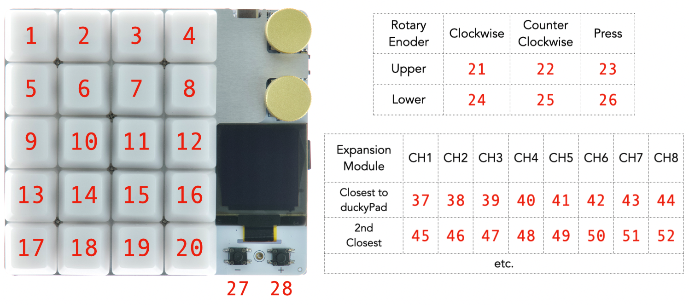
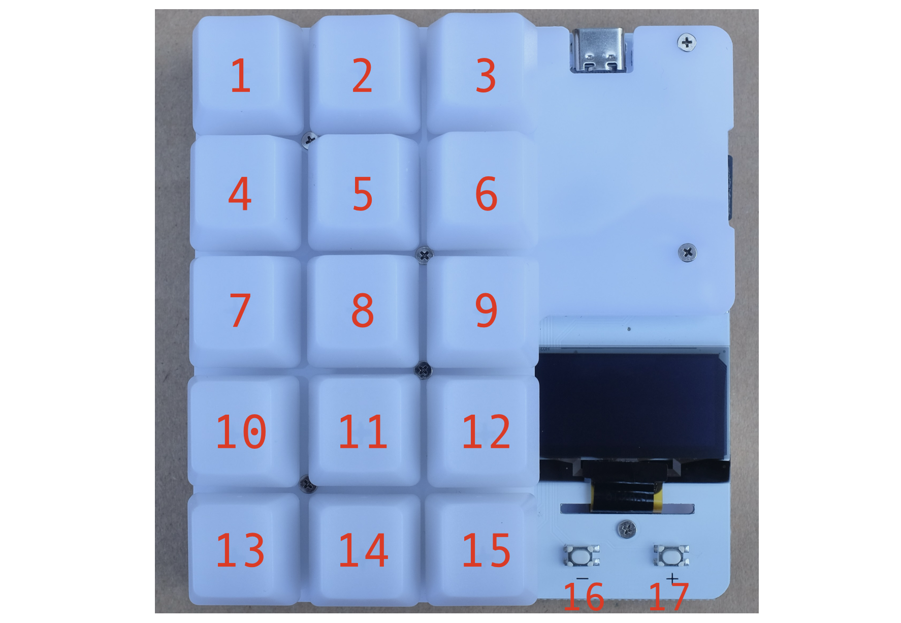

# Writing duckyScript

[Get duckyPad Pro](https://www.tindie.com/products/37399/) | [Official Discord](https://discord.gg/4sJCBx5) | [Getting Started](./getting_started.md) | [Table of Contents](#table-of-contents)

------

## Overview

duckyScript is a simple language for **automating keyboard/mouse inputs**.

It was originally developed for [USB Rubber Ducky](https://shop.hak5.org/products/usb-rubber-ducky-deluxe).

## Quick Examples

In the **simplest form**, you just tell it what key to press!

Ideal for key combos:

* New Tab: `CONTROL t`

* Task Manager: `CONTROL SHIFT ESC`

--------

Once familiar, you can write **longer multi-line** scripts for more complex actions.

**Open Webpage:**

```
WINDOWS r
DELAY 500
STRING https://youtu.be/dQw4w9WgXcQ
ENTER
```

---------

At **full potential**, duckyScript is much closer to a **general-purpose language**.

You can:

* Use Variables, Conditions, and Loops.
* Read Buttons
* Write to OLED screen
* Change RGB colors
* And more!

This allows highly customized macros for your exact needs.

## First Time?

There are quite a few commands, and it can be a bit daunting.

The **first few sections** (from `Comments` to `Mouse`) is more than enough to get started.

You can skim through the rest once familiar with the basics.

Also **playing with sample profiles** is a good way to get a feel of duckyScript.

Of course, people at the [Official Discord](https://discord.gg/4sJCBx5) are always happy to help!

## 👉👉 duckyScript Cheatsheet 👈👈

[Click me to download](https://github.com/dekuNukem/duckyPad-Pro/blob/master/doc/duckyscript_cheatsheet.pdf?raw=1) a copy of the quick reference guide!

Much easier to lookup than going through this whole page.

## List of Commands

- [Comments](#comments)
    - [`//`](#)
    - [`REM`](#rem)
    - [`REM_BLOCK` and `END_REM`](#rem_block-and-end_rem)
- [Typing](#typing)
    - [`STRING` and `STRINGLN`](#string-and-stringln)
    - [`STRINGLN_BLOCK` and `END_STRINGLN`](#stringln_block-and-end_stringln)
    - [`STRING_BLOCK` and `END_STRING`](#string_block-and-end_string)
    - [Printing Variables / Print Formatting](#printing-variables-print-formatting)
- [Pressing Keys](#pressing-keys)
    - [Special Keys](#special-keys)
    - [`KEYDOWN` / `KEYUP`](#keydown-keyup)
    - [`REPEAT`](#repeat)
- [Timing](#timing)
    - [`DELAY n`](#delay-n)
    - [`DEFAULTDELAY n`](#defaultdelay-n)
    - [`DEFAULTCHARDELAY n`](#defaultchardelay-n)
    - [`CHARJITTER n`](#charjitter-n)
- [Mouse](#mouse)
    - [Mouse Buttons](#mouse-buttons)
    - [`MOUSE_MOVE x y`](#mouse_move-x-y)
    - [`MOUSE_SCROLL h v`](#mouse_scroll-h-v)
- [Multiple Actions](#multiple-actions)
- [Profile Switching](#profile-switching)
    - [`PREV_PROFILE` / `NEXT_PROFILE`](#prev_profile-next_profile)
    - [`GOTO_PROFILE`](#goto_profile)
    - [Autoswitcher](#autoswitcher)
- [OLED](#oled)
    - [`OLED_CURSOR x y`](#oled_cursor-x-y)
    - [`OLED_PRINT`](#oled_print)
    - [`OLED_CLEAR`](#oled_clear)
    - [`OLED_CIRCLE x y radius fill`](#oled_circle-x-y-radius-fill)
    - [`OLED_LINE x1 y1 x2 y2`](#oled_line-x1-y1-x2-y2)
    - [`OLED_RECT x1 y1 x2 y2 fill`](#oled_rect-x1-y1-x2-y2-fill)
    - [`OLED_UPDATE`](#oled_update)
    - [`OLED_RESTORE`](#oled_restore)
- [Per-Key RGB](#per-key-rgb)
    - [`SWC_SET n r g b`](#swc_set-n-r-g-b)
    - [`SWC_FILL r g b`](#swc_fill-r-g-b)
    - [`SWC_RESET n`](#swc_reset-n)
- [Constants](#constants)
- [Variables](#variables)
    - [Math Modes](#math-modes)
    - [Persistent Global Variables](#persistent-global-variables)
    - [Reserved Variables](#reserved-variables)
- [Operators](#operators)
    - [Mathematics](#mathematics)
    - [Comparison](#comparison)
    - [Logical](#logical)
    - [Bitwise](#bitwise)
    - [Augmented Assignments](#augmented-assignments)
- [Advanced Printing](#advanced-printing)
    - [Format Specifiers](#format-specifiers)
    - [Numerical Padding](#numerical-padding)
- [Real-time Clock (RTC)](#real-time-clock-rtc)
    - [Setting RTC](#setting-rtc)
    - [Reading RTC](#reading-rtc)
- [Conditional Statements](#conditional-statements)
- [Loops](#loops)
    - [`LBREAK`](#lbreak)
    - [`CONTINUE`](#continue)
    - [Infinite Loop](#infinite-loop)
- [Functions](#functions)
    - [Plain Functions](#plain-functions)
    - [Arguments and Returns](#arguments-and-returns)
    - [Variable Scoping](#variable-scoping)
    - [Nested / Recursive Calls](#nested-recursive-calls)
- [Built-in Functions](#built-in-functions)
    - [`PEEK8(addr)`](#peek8addr)
    - [`POKE8(addr, value)`](#poke8addr-value)
    - [`RANDCHR(value)`](#randchrvalue)
    - [`RANDINT(lower, upper)`](#randintlower-upper)
    - [`PUTS(value)`](#putsvalue)
    - [`HIDTX(addr)`](#hidtxaddr)
- [Reading Inputs](#reading-inputs)
    - [Blocking Read](#blocking-read)
    - [Non-Blocking Read](#non-blocking-read)
    - [Switch Status Bitfield](#switch-status-bitfield)
    - [Key ID](#key-id)
- [Randomization](#randomization)
    - [Random Number](#random-number)
    - [Random Character](#random-character)
- [Miscellaneous](#miscellaneous)
    - [`DP_SLEEP`](#dp_sleep)
    - [`HALT`](#halt)
- [Reserved Variables List](#reserved-variables-list)

## Comments

### `//`

C-style comment. Anything after `//` is ignored.

```
// This is a comment
```

### `REM`

BASIC/Win style comment.

```
REM This is a comment
```

### `REM_BLOCK` and `END_REM`

Comment block. Everything in-between is ignored.

```
REM_BLOCK
    Put as much comment here
    as you want!
END_REM
```

-------
[⬆️⬆️⬆️⬆️⬆️⬆️ Back to Top ⬆️⬆️⬆️⬆️⬆️⬆️](#list-of-commands)

## Typing

### `STRING` and `STRINGLN`

`STRING` types out whatever after it **`AS-IS`**.

```
STRING Hello world!
// types out "Hello world!"
```

`STRINGLN` also presses **enter key** at the end.

### `STRINGLN_BLOCK` and `END_STRINGLN`

Type out everything inside as-is.

Also presses **enter key** at the **end of each line**.

```
STRINGLN_BLOCK

According to all known laws of aviation,
there is no way a bee should be able to fly.

END_STRINGLN
```

### `STRING_BLOCK` and `END_STRING`

Similar to above, but does **NOT** press enter on new lines.

### Printing Variables / Print Formatting

See [Advanced Printing](#advanced-printing)

-------
[⬆️⬆️⬆️⬆️⬆️⬆️ Back to Top ⬆️⬆️⬆️⬆️⬆️⬆️](#list-of-commands)

## Pressing Keys

### Special Keys

duckyScript supports many special keys.

They can be used on their own:

```
WINDOWS
```

...or combined with a character to form shortcuts:

```
WINDOWS s
```

...or chained even longer:

```
WINDOWS SHIFT s
```

------

* Type the key name **as-is** in **`ALL CAPS`**.

* Keys are pressed in sequence from **left-to-right**, then released **right-to-left**.

------

List of Special Keys:

``` 
  CTRL / RCTRL         |     (media keys)             
  SHIFT / RSHIFT       |     MK_VOLUP                 
  ALT / RALT           |     MK_VOLDOWN               
  WINDOWS / RWINDOWS   |     MK_MUTE                  
  COMMAND / RCOMMAND   |     MK_PREV                  
  OPTION / ROPTION     |     MK_NEXT                  
  ESC                  |     MK_PP (play/pause)       
  ENTER                |     MK_STOP                  
  UP/DOWN/LEFT/RIGHT   |                              
  SPACE                |     (numpad keys)            
  BACKSPACE            |     NUMLOCK                  
  TAB                  |     KP_SLASH                 
  CAPSLOCK             |     KP_ASTERISK              
  PRINTSCREEN          |     KP_MINUS                 
  SCROLLLOCK           |     KP_PLUS                  
  PAUSE                |     KP_ENTER                 
  BREAK                |     KP_0 to KP_9             
  INSERT               |     KP_DOT                   
  HOME                 |     KP_EQUAL                 
  PAGEUP / PAGEDOWN    |                              
  DELETE               |     (Japanese input method)  
  END                  |     ZENKAKUHANKAKU           
  MENU                 |     HENKAN                   
  POWER                |     MUHENKAN                 
  F1 to F24            |     KATAKANAHIRAGANA         

```

### `KEYDOWN` / `KEYUP`

Hold/release a key.

Allows more fine-grained control.

Can be used to input [Alt Codes](https://en.wikipedia.org/wiki/Alt_code) for special characters:

```
// types out ¼
KEYDOWN ALT
KP_1
KP_7
KP_2
KEYUP ALT
```

### `REPEAT`

Repeats the **last line** **`n`** times.

```
STRING Hello world
REPEAT 10
// types out "Hello world" 11 times (1 original + 10 repeats)
```

-------
[⬆️⬆️⬆️⬆️⬆️⬆️ Back to Top ⬆️⬆️⬆️⬆️⬆️⬆️](#list-of-commands)

## Timing

### `DELAY n`

Pause execution for `n` **milliseconds**.

Useful for **waiting for UI to catch up**.

```
WINDOWS r
DELAY 1000 // 1000ms = 1 second
STRING cmd
```

### `DEFAULTDELAY n`

How long to wait between each **`NON-LETTER input actions`**.

* Default: 20ms
* Applies to:
    * `MOUSE_MOVE` and `MOUSE_SCROLL`
    * `KEYDOWN` and `KEYUP` (including combo keys)
    * Pressing ENTER at end of `STRINGLN`

```
DEFAULTDELAY 50
    // Waits 50ms between pressing each key
CTRL ALT DELETE
```

### `DEFAULTCHARDELAY n`

How long to wait between **`each letter`** when **`typing text`**.

* Default: 20ms
    * To type faster, set to around 10.
* Applies to:
    * `STRING` and `STRINGLN`
    * `RANDCHR()`
    * `PUTS()`

```
DEFAULTCHARDELAY 10
    // Waits 10ms between each letter 
STRING Hello World!
```

### `CHARJITTER n`

Adds an **`additional`** random delay between 0 and `n` milliseconds after **`each letter`** when **`typing text`**.

* Can make typing more human-like
* Set to 0 to disable
* Applies to:
    * `STRING` and `STRINGLN`
    * `RANDCHR()`
    * `PUTS()`

-------
[⬆️⬆️⬆️⬆️⬆️⬆️ Back to Top ⬆️⬆️⬆️⬆️⬆️⬆️](#list-of-commands)

## Mouse

### Mouse Buttons

* `LMOUSE`: Click `LEFT` mouse button
* `RMOUSE`: Click `RIGHT` mouse button
* `MMOUSE`: Click `MIDDLE` mouse button
* `FMOUSE`: Click `FORWARD` mouse side-button
* `BMOUSE`: Click `BACKWARD` mouse side-button
* Can be used with `KEYDOWN` / `KEYUP` commands.

### `MOUSE_MOVE x y`

Move mouse cursor `x` pixels horizontally, and `y` pixels vertically.

* `x`: Positive moves RIGHT, negative moves LEFT.
* `y`: Positive moves UP, negative moves DOWN.
* Set to 0 if no movement needed
* **Disable mouse acceleration** for **pixel-accurate** results

### `MOUSE_SCROLL h v`

Scroll mouse wheel **Horizontal** `h` lines, and **Vertical** `v` lines.

* `h`: Positive scrolls RIGHT, negative scrolls LEFT.
* `v`: Positive scrolls UP, negative scrolls DOWN.
* Set to 0 for no scroll

-------
[⬆️⬆️⬆️⬆️⬆️⬆️ Back to Top ⬆️⬆️⬆️⬆️⬆️⬆️](#list-of-commands)

## Multiple Actions

`LOOP` command lets you to **assign multiple actions to one key**.

You can use it to toggle / cycle through several actions like this:

```
LOOP0:
STRINGLN first action

LOOP1:
STRINGLN second action

LOOP2:
STRINGLN third action
```

* When pressed, a counter increments, and the script at the corresponding loop is executed.
* Keep the code inside simple!
* For more complex needs, see [Loops](#loops) section below.

-------
[⬆️⬆️⬆️⬆️⬆️⬆️ Back to Top ⬆️⬆️⬆️⬆️⬆️⬆️](#list-of-commands)

## Profile Switching

### `PREV_PROFILE` / `NEXT_PROFILE`

Switch to the previous / next profile.

### `GOTO_PROFILE`

Jump to a profile by name. **Case sensitive!**

This ends the current script execution.

Works with [Advanced Printing](#advanced-printing).

```
GOTO_PROFILE NumPad
```

### Autoswitcher

Also try the [Autoswitcher](https://github.com/dekuNukem/duckyPad-profile-autoswitcher) for **switching profile automatically** based on **active window**!

-------
[⬆️⬆️⬆️⬆️⬆️⬆️ Back to Top ⬆️⬆️⬆️⬆️⬆️⬆️](#list-of-commands)

## OLED

### `OLED_CURSOR x y`

Set where to print on screen.

`x y`: Pixel coordinates between `0` and `127`.

Characters are **7 pixels wide, 10 pixels tall.**

Characters print from **top-left** corner.

### `OLED_PRINT`

`OLED_PRINT hello world!` 

Print the message into display buffer at **current cursor location**.

Works with [Advanced Printing](#advanced-printing).

### `OLED_CLEAR`

Clear the display buffer.

### `OLED_CIRCLE x y radius fill`

* `x y`: Origin
* `radius`: In Pixels
* `fill`: 0 or 1

### `OLED_LINE x1 y1 x2 y2`

* `x1, y1`: Start Point
* `X2, y2`: End Point

### `OLED_RECT x1 y1 x2 y2 fill`

* `x1, y1`: Start Corner
* `X2, y2`: End Corner
* `fill`: 0 or 1

### `OLED_UPDATE`

Actually update the OLED.

You should use the other commands to set up the buffer, then call `OLED_UPDATE` to write to display.

This is **much faster** than updating the whole screen for every change.

### `OLED_RESTORE`

Restore the default profile/key name display.

* `OLED_UPDATE` **NOT NEEDED**.

-------
[⬆️⬆️⬆️⬆️⬆️⬆️ Back to Top ⬆️⬆️⬆️⬆️⬆️⬆️](#list-of-commands)

## Per-Key RGB

### `SWC_SET n r g b`

Change LED color of a switch

Set `n` to 0 for current key.

Set `n` between 1 to 20 for a particular key.

`r, g, b` must be between 0 and 255.

### `SWC_FILL r g b`

Change color of **ALL** LEDs.

`r, g, b` must be between 0 and 255.

### `SWC_RESET n`

Reset the key back to default color.

Set `n` to 0 for current key.

Set `n` from 1 to 20 for a particular key.

Set `n` to 99 for all keys.

-------
[⬆️⬆️⬆️⬆️⬆️⬆️ Back to Top ⬆️⬆️⬆️⬆️⬆️⬆️](#list-of-commands)

## Constants

You can use `DEFINE` to, well, define a constant.

The content is **replaced AS-IS** during preprocessing, similar to `#define` in C.

```
DEFINE MY_EMAIL example@gmail.com

STRING My email is MY_EMAIL!
```

-------
[⬆️⬆️⬆️⬆️⬆️⬆️ Back to Top ⬆️⬆️⬆️⬆️⬆️⬆️](#list-of-commands)

## Variables

You can declare a variable using `VAR` command:

```
// Declaration
VAR spam = 0
VAR eggs = 10

// Assignment
spam = 20
eggs = spam*2
```

* Variables are **32-bit Integers**
* Variables declared at top level have **global scope** and can be accessed **anywhere**.
* Variables declared **inside a function** have **local scope** and is only accessible **within that function**.

### Math Modes

Write to `_UNSIGNED_MATH` to adjust **math mode**

* **Signed Mode** (Default)
    * Variables can hold values between **−2,147,483,648 and 2,147,483,647**
    * Suitable for all **general purpose** calculations
* **Unsigned Mode** (`_UNSIGNED_MATH = 1`)
    * Range: **0 to 4,294,967,295**
    * Suitable for **large numbers** or **bitwise operations**
* Unsure? Stick with default **signed mode**

### Persistent Global Variables

There are 32 pre-defined global variables that provides **non-volatile** data storage.

* `_GV0` to `_GV31`
* Available across **all profiles**
* Persists over reboots

### Reserved Variables

Some variables are **always available**. They all start with an underscore `_`.

You can read them to obtain information, or write to adjust settings.

```
VAR status = _IS_NUMLOCK_ON
_CHARJITTER = 10
```

[Click me for full list](#reserved-variables-list)

## Operators

You can perform operations on constants and variables.

* 🚨 All ops are **SIGNED** BY DEFAULT
    * Set `_UNSIGNED_MATH = 1` to switch to **unsigned** mode
    * ⚠️ = Affected by current **Math Mode**

### Mathematics

```
=       Assignment
+       Add       
-       Subtract  
*       Multiply  
/       ⚠️ Integer Division
%       ⚠️ Modulus   
**      Exponent
```

Example:

```
spam = 2+3
spam = eggs * 10
```

### Comparison

All comparisons evaluate to **either 0 or 1**.

```
==        Equal                  
!=        Not equal              
>         ⚠️Greater than           
<         ⚠️Less than              
>=        ⚠️Greater than or equal  
<=        ⚠️Less than or equal   
```

### Logical 

| Operator |          Name         | Comment                                                |
|:--------:|:---------------------:|--------------------------------------------------------|
|    `&&`    |      Logical AND      | Evaluates to 1 if BOTH side are non-zero, otherwise 0. |
|   `\|\|`   |       Logical OR      | Evaluates to 1 if ANY side is non-zero, otherwise 0.   |
|    `!`    |      Logical NOT      | **Single (Unary) Operand**<br>Evaluates to 1 if expression is 0<br>Evaluates to 0 if expression is **Non-Zero**|

### Bitwise

```
&       Bitwise AND   
|       Bitwise OR    
^       Bitwise XOR
~       Bitwise NOT
<<      Left Shift    
>>      ⚠️Right Shift
            Signed Mode: Arithmetic Shift (sign-extend)
            Unsigned Mode: Logical Shift (0-extend)
```

### Augmented Assignments

* E.g. `+=`, `-=`, `*=`, etc.
* Available for all **2-operand operators**
* `x += 1` same as `x = x + 1`, etc.

-------
[⬆️⬆️⬆️⬆️⬆️⬆️ Back to Top ⬆️⬆️⬆️⬆️⬆️⬆️](#list-of-commands)

## Advanced Printing

You can print the **value of a variable** by adding a **dollar symbol ($) before its name**.

```
VAR foo = -10
STRING Value is $foo
```
```
Value is -10
```

* Works with `STRING`, `STRINGLN`, `OLED_PRINT`, and `GOTO_PROFILE`.

### Format Specifiers

You can use **Optional C-Style Format Specifiers** to adjust **print format** and **padding**.

To add a specifier: **Immediately after the variable name**, type `%`, then a **data-type indicator letter**.

* `%d` to print variable as **Signed Decimal**
    * **DEFAULT**, same as no specifier.
* `%u` to print variable as **Unsigned Decimal**
* `%x` to print variable as **Lowercase Hexadecimal**
* `%X` to print variable as **Uppercase Hexadecimal**

```
VAR $foo = -10

STRING Value is: $foo%d
STRING Value is: $foo%u
STRING Value is: $foo%x
STRING Value is: $foo%X
```

```
Value is: -10
Value is: 4294967286
Value is: fffffff6
Value is: FFFFFFF6
```

### Numerical Padding

* To pad with **SPACE**
    * Add a **width number** just **after `%`** and **before the letter**
    * The output will be **at least that** wide
    * Any extra space are padded with **space characters**
```
VAR $foo = 5
STRING I have $foo%10d apples!
```
```
I have          5 apples!
```

* To pad with **LEADING-ZERO**
    * Right **after `%`**, add a `0`, then width number, then the letter.
    * The output will be **at least that** wide
    * Any extra space are padded with `0`
* Useful for printing **dates** and **hex numbers**
```
VAR $foo = 5
STRING I have $foo%010d apples!
```
```
I have 0000000005 apples!
```

-------
[⬆️⬆️⬆️⬆️⬆️⬆️ Back to Top ⬆️⬆️⬆️⬆️⬆️⬆️](#list-of-commands)

## Real-time Clock (RTC)

duckyPad can keep track of **current date and time** for use in scripts.

### Setting RTC

On cold-boot, duckyPad doesn't know what time it is.

It must be set once, after which it will keep time **as long as it is powered-on**.

* RTC is **automatically set** when using the [Autoswitcher](https://github.com/duckyPad/duckyPad-Profile-Autoswitcher)
    * A **clock icon** appears when RTC is valid


* You can also set it manually
    * [HID Commands](https://github.com/duckyPad/duckyPad-Profile-Autoswitcher/blob/master/HID_details.md)
    * [Sample Script](https://github.com/duckyPad/duckyPad-Profile-Autoswitcher/blob/master/hid_example/ex3_set_rtc.py)

### Reading RTC

#### Validity Check

**ALWAYS check** `_RTC_IS_VALID` **first**!

* **Do not proceed** if value is 0.

```
IF _RTC_IS_VALID == 0
    // RTC is uninitialised, do not proceed.
    HALT
END_IF
```

#### UTC Offset

The RTC always runs in **UTC**.

Local time is obtained by adding an **UTC Offset in `MINUTES`**

* It is **set automatically** to your **local timezone** when using the [Autoswitcher](https://github.com/duckyPad/duckyPad-Profile-Autoswitcher).
* You can check (and manually adjust) the offset by reading/writing `_RTC_UTC_OFFSET` variable
    * Can be positive, 0, or negative.

#### Time and Date

With **valid RTC** and **correct UTC offset**, you can now read from the variables below:

| Name      | Comment                | Range |
| ------------- | -------------------------- | --------------- |
| `_RTC_YEAR`  | **4-digit** Year          | e.g. `2025`    |
| `_RTC_MONTH` | Month              | `1–12`          |
| `_RTC_DAY`   | Day              | `1–31`          |
| `_RTC_HOUR`   | Hour | `0–23` |
| `_RTC_MINUTE` | Minute                | `0–59` |
| `_RTC_SECOND` | Second                | `0–60` |
| `_RTC_WDAY`  | Day of Week (`0 = Sunday`) | `0–6`           |
| `_RTC_YDAY`  | Day of Year (`0 = Jan 1`) | `0–365`           |

#### Example Usage

```
STRING $_RTC_YEAR%04d-$_RTC_MONTH%02d-$_RTC_DAY%02d $_RTC_HOUR%02d:$_RTC_MINUTE%02d:$_RTC_SECOND%02d
```

```
2025-09-18 09:07:23
```
See [Advanced Printing](#advanced-printing) for formatting tips.

-------
[⬆️⬆️⬆️⬆️⬆️⬆️ Back to Top ⬆️⬆️⬆️⬆️⬆️⬆️](#list-of-commands)

## Conditional Statements

`IF` statements can be used to **conditionally execute code**.

At simplest, it involves `IF` and `END_IF`:

```
IF expression
    code to execute
END_IF
```

The code inside is executed if the **expression evaluates to non-zero**.

Indent doesn't matter, feel free to add them for a cleaner look.

----

You can use `ELSE IF` and `ELSE` for additional checks.

If the first `IF` evaluate to 0, `ELSE IF`s are checked.

If none of the conditions are met, code inside `ELSE` is executed.

```
VAR temp = 25

IF temp > 30
    STRING It's very hot!
ELSE IF temp > 18
    STRING It's a pleasant day.
ELSE
    STRING It's quite chilly!
END_IF
```

-------
[⬆️⬆️⬆️⬆️⬆️⬆️ Back to Top ⬆️⬆️⬆️⬆️⬆️⬆️](#list-of-commands)

## Loops

You can use `WHILE` statement to **repeat actions** until a **certain condition is met**.

```
WHILE expression
    code to repeat
END_WHILE
```

* If `expression` evaluates to **non-zero**, code inside is repeated. Otherwise, the code is skipped.

This simple example loops 3 times.

```
VAR i = 0
WHILE i < 3
    STRINGLN Counter is $i!
    i = i + 1
END_WHILE
```

```
Counter is 0!
Counter is 1!
Counter is 2!
```

### `LBREAK`

Use `LBREAK` to **exit a loop** immediately.

```
VAR i = 0
WHILE 1
    STRINGLN Counter is $i!
    i = i + 1

    IF i == 3
        LBREAK
    END_IF
END_WHILE
```
```
Counter is 0!
Counter is 1!
Counter is 2!
```

### `CONTINUE`

Use `CONTINUE` to **jump to the start of loop** immediately.

```
VAR i = 0
WHILE i < 5
    i = i + 1

    IF i == 3
        CONTINUE
    END_IF

    STRINGLN Counter is $i!
END_WHILE
```

Here when `i` is 3, it skips printing and starts from the top instead.

```
Counter is 1!
Counter is 2!
Counter is 4!
Counter is 5!
```

### Infinite Loop

To exit an infinite loop, you can [check button status](#reading-inputs), or turn on `Allow Abort` in configurator settings.

-------
[⬆️⬆️⬆️⬆️⬆️⬆️ Back to Top ⬆️⬆️⬆️⬆️⬆️⬆️](#list-of-commands)

## Functions

A function is a **block of organized code** that you can call to **perform a task**.

It makes your script **more modular** and **easier to maintain** compared to copy-pasting code multiple times.

### Plain Functions

* Declare a function with `FUN name()` and `END_FUN`
* Put the code you want to execute inside
* Call it with `name()`
* Code inside are executed

```
FUN print_addr()
    STRINGLN 123 Ducky Lane
    STRINGLN Pond City, QU 12345
END_FUN

print_addr() // call it
```

### Arguments and Returns

You can also pass **up to 8 arguments** into a function and specify a **return value**.

* Ideal for performing calculations

```
FUN add_number(a, b)
    RETURN a + b
END_FUN

VAR total = add_number(10, 20)
```

### Variable Scoping

Variables declared **outside functions** have **global scope**, they can be **accessed anywhere**.

Variables declared **inside functions** have **local scope**, they are only accessible **within that function**.

* If a local variable has the **same name** as a global variable, the **local var takes priority** within that function.

```
// Both global scope
VAR x = 10
VAR y = 20

FUN scope_demo()
    VAR x = 5 // This x is local, will shadow the global x.
    x = x + y
    STRINGLN Local x is: $x
END_FUN
```
```
Local x is: 25
```

### Nested / Recursive Calls

You can also:

* Call other functions from inside a function
* Including **calling itself**!

```
FUN factorial(n)
    IF n <= 1
        RETURN 1
    END_IF
    RETURN n * factorial(n - 1)
END_FUN

VAR fact = factorial(5)
```

-------
[⬆️⬆️⬆️⬆️⬆️⬆️ Back to Top ⬆️⬆️⬆️⬆️⬆️⬆️](#list-of-commands)

## Built-in Functions

A few built-in functions are available. They are intended for **low-level tinkering**.

You might want to get familiar with [VM's memory map](https://duckypad.github.io/DuckStack/)

### `PEEK8(addr)`

Read and return **one byte** at memory address

* `VAR value = PEEK8(0xfa00)`
* Address <= End of scratch memory (`0xfaff`)

### `POKE8(addr, value)`

Write **one byte** to memory address

* `POKE8(0xfa00, 5)`
* Address <= End of scratch memory (`0xfaff`)

### `RANDCHR(value)`

Generate a **random character**.

* `value` is checked as a bitfield:
    * `Bit 0`: Letter Lowercase (A-Z)
    * `Bit 1`: Letter Uppercase (a-z)
    * `Bit 2`: Digits (0-9)
    * `Bit 3`: Symbols (\!\"\#\$\%\&\'\(\)\*\+\,\-\.\/\:\;\<\=\>\?\@\[\\\]\^\_\`\{\|\})
    * `Bit 16`: Type via Keyboard
    * `Bit 17`: Write to Screen Buffer
* For `Bit 0-3`, if any bit is `1`, its pool of characters will be included for random selection.
* If `Bit 16` is 1, it will type the character via keyboard.
* If `Bit 17` is 1, it will print the character to screen buffer
    * Don't forget to use `OLED_UPDATE` to actually refresh the screen.

### `RANDINT(lower, upper)`

Returns a random number between `lower` and `upper` **INCLUSIVE**.

```
VAR value = RANDINT(0, 1000)
```

### `PUTS(value)`

**Print string** at memory address.

* `value` contains:
    * `Bit 0-15`: Address
    * `Bit 16-23`: `n`
    * `Bit 30`: Type via Keyboard
    * `Bit 31`: Write to Screen Buffer
* If `n = 0`, print until zero-termination.
    * Else, print max `n` characters.

### `HIDTX(addr)`

Send a **raw HID message**

* Pick an address `addr` in **scratch memory area**
* Use `POKE8()` to write **9 bytes** starting from `addr`
    * Follow the format below
* Call `HIDTX(addr)` to send the HID message
* Include a short delay (10-20ms) to allow computer to register the input
* Don't forget to **release the key** after pressing it
    * Set `Byte 1-8` to 0 to release

#### Keyboard

|Byte|Value|Description|
|:-------:|:----------:|:---------:|
|`addr`|1|Usage ID|
|`addr+1`|Modifier<br>Bitfield|`Bit 0`: Left Control<br>`Bit 1`: Left Shift<br>`Bit 2`: Left Alt<br>`Bit 3`: Left GUI (Win/Cmd)<br>`Bit 4`: Right Control<br>`Bit 5`: Right Shift<br>`Bit 6`: Right Alt (AltGr)<br>`Bit 7`: Right GUI (Win/Cmd)|
|`addr+2`|0|Reserved|
|`addr+3`<br>-<br>`addr+8`|HID Keyboard<br>Scan Code|[See list](https://gist.github.com/MightyPork/6da26e382a7ad91b5496ee55fdc73db2)<br>Max 6 keys at once (6KRO)<br>Write `0` for released / unused|

#### Media Keys

|Byte|Value|Description|
|:-------:|:----------:|:---------:|
|`addr`|2|Usage ID|
|`addr+1`|Key Status<br>Bitfield|`Bit 0`: Next Track<br>`Bit 1`: Previous Track<br>`Bit 2`: Stop<br>`Bit 3`: Eject<br>`Bit 4`: Play / Pause<br>`Bit 5`: Mute<br>`Bit 6`: Volume Up<br>`Bit 7`: Volume Down|
|`addr+2`<br>-<br>`addr+8`|0|0|

#### Mouse

|Byte|Value|Description|
|:-------:|:----------:|:---------:|
|`addr`|3|Usage ID|
|`addr+1`|Buttons<br>Status<br>Bitfield|`Bit 0`: Left<br>`Bit 1`: Right<br>`Bit 2`: Middle<br>`Bit 3`: Backward<br>`Bit 4`: Forward|
|`addr+2`|X Movement|-127 - 127|
|`addr+3`|Y Movement|-127 - 127|
|`addr+4`|Vertical<br>Scroll|-127 - 127|
|`addr+5`|Horizontal<br>Scroll|-127 - 127|
|`addr+6`<br>-<br>`addr+8`|0|0|

-------
[⬆️⬆️⬆️⬆️⬆️⬆️ Back to Top ⬆️⬆️⬆️⬆️⬆️⬆️](#list-of-commands)

## Reading Inputs

You can **read the status of switches / encoders** to perform actions.

### Blocking Read

Simplest method.

Just read `_BLOCKING_READKEY` reserved variable.

It will block until a key is pressed.

```
VAR this_key = _BLOCKING_READKEY
// Blocks here until a key is pressed

IF this_key == 1
    // do something here
ELSE IF this_key == 2
    // do something else
END_IF

```

### Non-Blocking Read

Read `_READKEY`, **returns immediately**.

Returns 0 if no key is pressed. `Key ID` otherwise.

Check this **in a loop** to perform work even when no key is pressed.

```
WHILE TRUE
    VAR this_key = _READKEY
    IF this_key == 1
        // handling button press
    END_IF

    // otherwise do work here
END_WHILE
```

### Switch Status Bitfield

Read `_SW_BITFIELD`, **returns immediately**.

Each bit position stores the status of the corresponding key.

* E.g. `bit 1` = `key ID 1`, `bit 13` = `key ID 13`, etc.

If that bit is 1, the key is currently pressed.

You can use bitmasks to **check multiple keys at once**.

### Key ID

This is the number returned by methods above.

```
duckyPad Pro (2024):

1-20:
    * Built-in keys
    * Top left is 1
    * Bottom right is 20

21: Upper Rotary Encoder Clockwise
22: Upper Rotary Encoder Counterclockwise
23: Upper Rotary Encoder Push-down

24: Lower Rotary Encoder Clockwise
25: Lower Rotary Encoder Counterclockwise
26: Lower Rotary Encoder Push-down

27: Plus Button
28: Minus Button

37+: External Switches
```



```
duckyPad (2020):

1-15:
    * Top left is 1
    * Bottom right is 15
    * Plus button 16, Minus button 17.
```



-------
[⬆️⬆️⬆️⬆️⬆️⬆️ Back to Top ⬆️⬆️⬆️⬆️⬆️⬆️](#list-of-commands)

## Randomization

### Random Number

Call `RANDINT(lower, upper)` for a random number between `lower` and `upper` **INCLUSIVE**.

```
VAR value = RANDINT(0, 1000)
```

### Random Character

Use one of below to **type a random character**:

```
RANDOM_LOWERCASE_LETTER     RANDOM_NUMBER
RANDOM_UPPERCASE_LETTER     RANDOM_SPECIAL
RANDOM_LETTER               RANDOM_CHAR
```

```
RANDOM_NUMBER
REPEAT 7
// types 8 random numbers
```

For more granular control, see `RANDCHR()` in [Built-in Functions](#built-in-functions).

-------
[⬆️⬆️⬆️⬆️⬆️⬆️ Back to Top ⬆️⬆️⬆️⬆️⬆️⬆️](#list-of-commands)

## Miscellaneous

### `DP_SLEEP`

Make duckyPad go to sleep. Terminates execution.

Backlight and screen are turned off.

Press any key to wake up.

### `HALT`

Stop execution immediately

-------
[⬆️⬆️⬆️⬆️⬆️⬆️ Back to Top ⬆️⬆️⬆️⬆️⬆️⬆️](#list-of-commands)

## Reserved Variables List

There are some **reserved variables** that are always available.

You can read or write (RW) to adjust settings. Some are read-only (RO).

| Name                                                                 | Access | Description                                                                                    |
| --------------------------------------------------------------------------- | :-----: |:----:|
| **`_TIME_S`**<br>**`_TIME_MS`**                                           | RO    | Elapsed time since power-on|
| **`_READKEY`**<br>**`_BLOCKING_READKEY`**<br>**`_SW_BITFIELD`**                | RO    | See [Reading Inputs](#reading-inputs)|
| **`_IS_NUMLOCK_ON`**<br>**`_IS_CAPSLOCK_ON`**<br>**`_IS_SCROLLLOCK_ON`** | RO    | Returns **1 if LED is on**, **0 otherwise**.<br>Certain OS may not have all LEDs|
| **`_DEFAULTDELAY`**<br>**`_DEFAULTCHARDELAY`**<br>**`_CHARJITTER`**      | RW    | Aliases|
| **`_ALLOW_ABORT`**<br>**`_DONT_REPEAT`**                                  | RW    | Write `1` to enable<br>`0` to disable.                                      |
| **`_THIS_KEYID`**                                                          | RO    | Returns the [Key ID](#key-id) for the **current script**     |
| **`_DP_MODEL`**                                                            | RO    | Device model. Returns:<br>`1` for duckyPad (2020)<br>`2` for duckyPad Pro (2024)                              |
| **`_KEYPRESS_COUNT`**                                                      | RW    | How many times **current key**<br>has been pressed in the **current profile**<br>Assign **0 to reset** |
| **`_LOOP_SIZE`**                                                           | RO    | Used by `LOOP` command.<br>Do not modify                                                     |
| **`_NEEDS_EPILOGUE`**                                                      | RO    | Internal use only<br>Do not modify                                                              |
|**`_RTC_IS_VALID`**<br>**`_RTC_YEAR`**<br>**`_RTC_MONTH`**<br>**`_RTC_DAY`**<br>**`_RTC_HOUR`**<br>**`_RTC_MINUTE`**<br>**`_RTC_SECOND`**<br>**`_RTC_WDAY`**<br>**`_RTC_YDAY`**|RO|See [Real-time Clock](#real-time-clock-rtc)|
|**`_RTC_UTC_OFFSET`**|RW|See [Real-time Clock](#real-time-clock-rtc)|
|**`_UNSIGNED_MATH`**|RW|Set to `1` to treat variables as<br>**unsigned numbers** using **unsigned math**|

-------
[⬆️⬆️⬆️⬆️⬆️⬆️ Back to Top ⬆️⬆️⬆️⬆️⬆️⬆️](#list-of-commands)

## Table of Contents

[Main page](../README.md)

[User Manual / Getting Started](getting_started.md)

[Kit Assembly Guide](kit_assembly.md)

[Writing duckyScript](duckyscript_info.md)

[duckStack Bytecode VM](https://github.com/duckyPad/DuckStack/blob/master/README.md)

[Firmware Update](fw_update.md)

[Tinkering Guide](tinkering_guide.md)

[Troubleshooting](troubleshooting.md)

## Questions or Comments?

Please feel free to [open an issue](https://github.com/dekuNukem/duckypad-pro/issues), ask in the [official duckyPad discord](https://discord.gg/4sJCBx5), or email `dekuNukem`@`gmail`.`com`!
