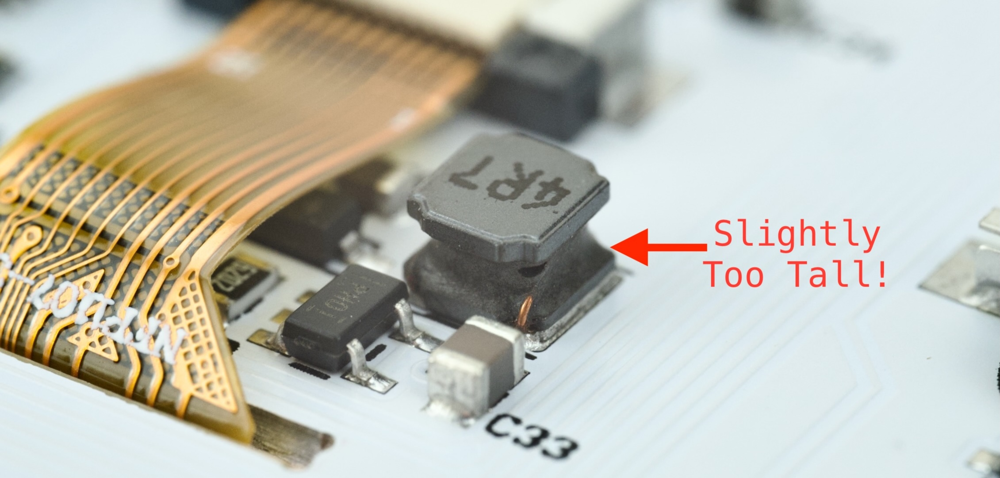
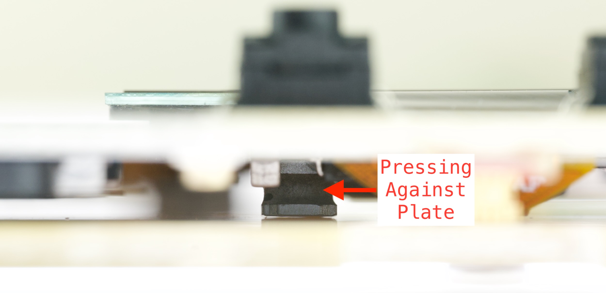
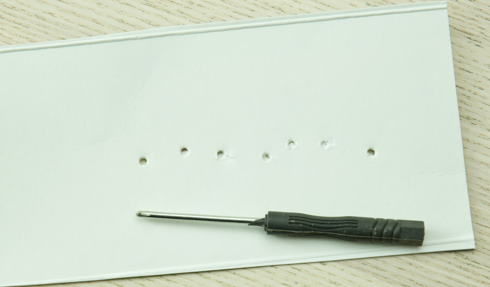
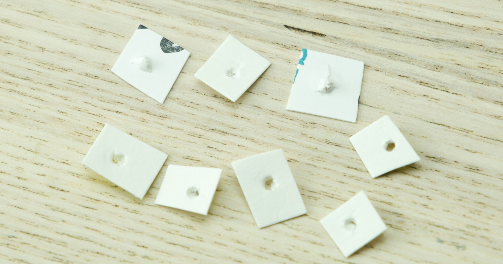
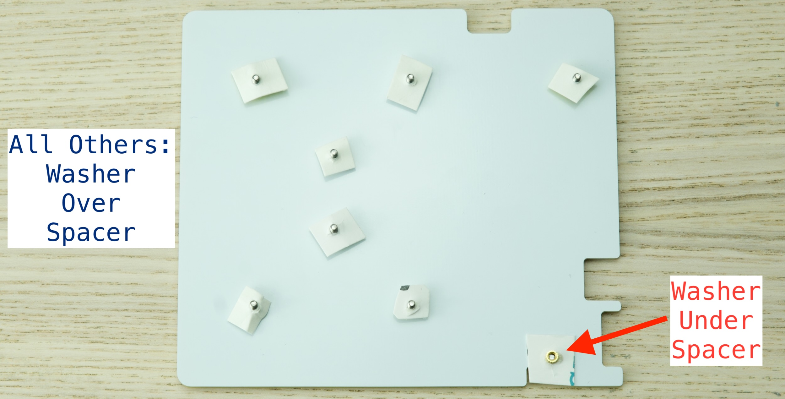
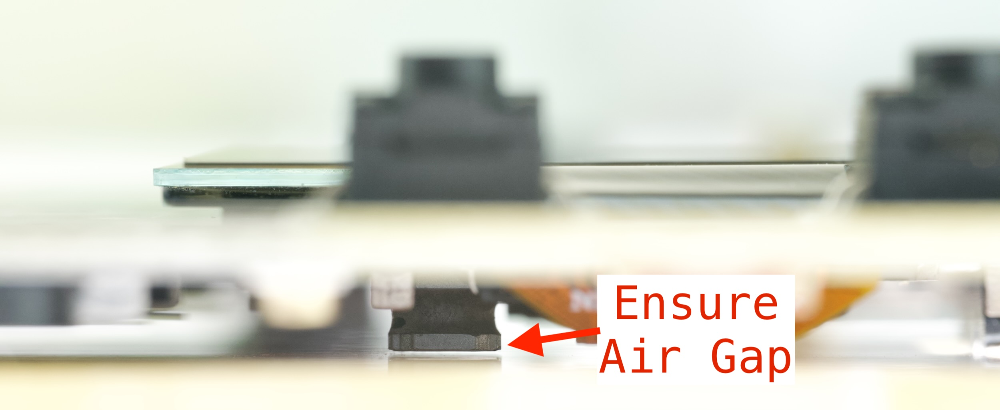
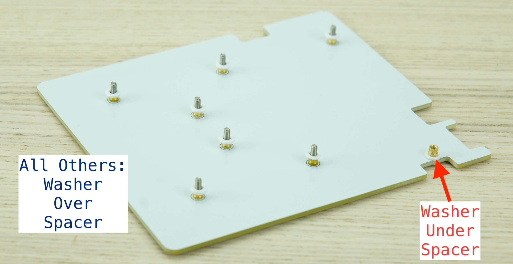

# duckyPad Pro Spacer Adjustment

This guide shows how to resolve an issue where a component presses against the bottom plate due to its height.

## Who's Affected?

* Kickstarter backer number **prior to (and including) 155**

If your backer number is greater than 155, it is already fixed!

## Symptoms

An inductor on the PCB is slightly too tall, causing it to touch the bottom plate during assembly.

The inductor used in the production run differs slightly from the one in prototyping, and I overlooked the height difference.

This oversight is entirely my fault, and I sincerely apologize.

## Severity

The contact may cause the PCB to bend slightly, putting stress on nearby components.

No hardware malfunctions has been reported yet, but it's best to address the issue promptly.

## Resolution

Fortunately, it can be fixed by adding some washers to increase the clearance.

Easily doable by hand, here are some options:

* DIY Paper Washer

	* Easiest and fastest

* Off-the-shelf or 3D Printed Washer

	* Neater if resources are available

* Request Replacement Fasteners

	* Free but takes the longest (outside UK)

---------

### Paper Washer

Easiest and fastest.

* Get a piece of semi-rigid paper 
	* Thickness similar to cereal box / business card
* Use the included screw driver, punch 8 holes in it.

* Cut into 8 washers
	* No need to be pretty, won't be visible anyway!

* [Follow this guide in reverse](troubleshooting.md) until PCB is removed and bottom plate is visible
* Place the paper washers above the spacer
	* For **Bottom-Right**, remove the spacer, place the paper **UNDER** it, and reinstall.

* Reinstall the PCB
* Ensure the inductor is **not touching the plate**

* If still touching, double up the paper.
* If all good, reassemble.

### Off-the-shelf / 3D-Printed Washer

If you already have some **NON-METAL** M2 washer, feel free to use them!

If you have a 3D printer, it's trivial to print some.

* [Click me to download the STL file](../resources/photos/fix/dpp_washer.stl)

Same steps as paper washer above.

### Replacement Fasteners

Of course, you can request a set of replacement fasteners to be sent for free!

Send me a message on Kickstarter or [Discord](https://discord.gg/4sJCBx5).

It's worth doing if you're in UK, as it arrives next day.

Outside UK is going to take a week or so, so doing it yourself might be faster. But still, let me know!

