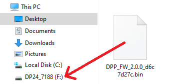
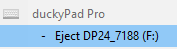
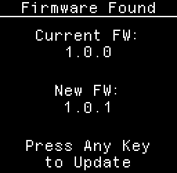
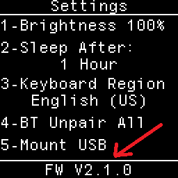

# duckyPad Pro Firmware Update Guide

[Kickstarter Info](https://www.kickstarter.com/projects/dekunukem/duckypad-pro-advanced-macro-scripting-beyond-qmk-via) | [Official Discord](https://discord.gg/4sJCBx5) | [Getting Started](./doc/getting_started.md) | [Table of Contents](#table-of-contents)

-----

You can easily update the firmware for new features and bug fixes.

## Drag-and-Drop Update

* Long-press `+/-` Button

* Select **Mount USB**

* A USB drive should show up

* With a name starting with `DP24_`

* Drag the file **AS-IS** into the drive

* Safely Eject in OS

* **Long-press** `+/-` button again

* duckyPad should reboot and find the new file

* Press any key to start. Might take a few seconds.

* It will reboot and be ready to use!

* Verify new FW version in settings menu.

## Version History

### 2.0.0

Initial Public Release

## Table of Contents

[Main page](README.md)

[Getting Started Guide](./doc/getting_started.md)

[Kit Assembly Guide](./doc/kit_assembly.md)

[Using duckyScript](./doc/duckyscript_info.md)

[duckyScript VM](./doc/bytecode_vm.md)

[Tinkering Guide](./doc/tinkering_guide.md)

[Troubleshooting](./doc/troubleshooting.md)

[Firmware Update](./doc/fw_update.md)

## Questions or Comments?

Please feel free to [open an issue](https://github.com/dekuNukem/duckypad/issues), ask in the [official duckyPad discord](https://discord.gg/4sJCBx5), DM me on discord `dekuNukem#6998`, or email `dekuNukem`@`gmail`.`com` for inquires.
