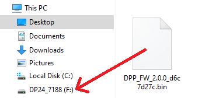
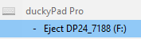
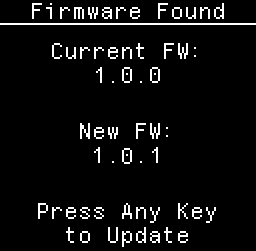
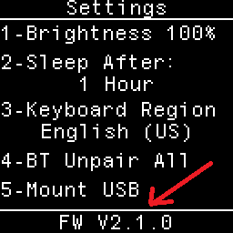

# duckyPad Pro Firmware Update Guide

[Get duckyPad Pro](https://www.tindie.com/products/37399/) | [Official Discord](https://discord.gg/4sJCBx5) | [Getting Started](./getting_started.md) | [Table of Contents](#table-of-contents)

-----

## Latest Firmware

### 3.3.5

15 Mar 2026

* 🐞 Increased Anykey-to-Abort check frequency 
* 🆕 **"Turing Complete" Mega-update**
	* 👉 [**Full Details & Changelog**](https://dekunukem.github.io/duckyPad-Pro/doc/beta_test.html)

👇👇👇👇👇👇👇👇👇👇

* [Download Firmware](https://github.com/dekuNukem/duckyPad-Pro/raw/master/firmware/DPP_FW_3.3.5_7e717835.bin)

☝️☝️☝️☝️☝️☝️☝️☝️☝️☝️☝️

## Drag-and-Drop Update

* Long-press `+/-` Button
* Select **Mount USB**

* A USB drive should show up
* Drag the file **AS-IS** into the drive

* Safely Eject in OS

* **Long-press** `+/-` button again
* duckyPad should reboot and find the new file

* Press any key to start. Might take a few seconds.
* It will reboot and be ready to use!
* Verify new FW version in settings menu.

## Version History

### 3.3.4

11 Mar 2026

* 🐞 Fixed a bug that may cause increased power consumption

### 3.3.3

9 Feb 2026

* 🆕 **"Turing Complete" Mega-update**
	* **32-bit** Overhaul
	* Proper **Function Calls**
	* **Print Format** Specifiers
	* **Horizontal** Mouse Scrolling
	* **New Commands**, Bug Fixes, and much more!
* 👉 [**Full Details & Changelog**](https://dekunukem.github.io/duckyPad-Pro/doc/beta_test.html)

### 2.4.3

16 Dec 2025

🆕 **1000Hz** Polling Rate!

* 🐇 Much faster typing speed
* To try it out, put `DEFAULTCHARDELAY 10` at top of script.
	* `5` even faster, `1` might be too fast

### 2.4.2

26 Nov 2025

🆕 Real-time Clock (RTC)

🆕 Print Formatting

🆕 Numerical Padding

🆕 More Persistent Global Variables

🆕 Bitwise XOR

🐞 Bug Fixes

👉 [More info about those new features](https://dekunukem.github.io/duckyPad-Pro/doc/beta_test.html)

#### 2.3.2

9 July 2025

🆕 Increased Persistent Global Variables count to 32

🆕 Added support for **reading and writing PGVs from a computer**. [Details](https://github.com/duckyPad/duckyPad-Profile-Autoswitcher/blob/master/HID_details.md)

🐞 Fixed a bug where HID buffer was not properly cleared causing ghost inputs

#### 2.2.0

14 June 2025

* 🆕 Supports increased rotary encoder sensitivity

* 🆕 Recent keypresses are cached to reduce latency

* 🐞 Reboots after changing Bluetooth mode

#### 2.0.2

24 Apr 2025

* 🐞 Boots into USB storage mode if SD card is empty.

#### 2.0.1

14 Apr 2025

* 🐞 Faster Save / Load time when reordering profiles.

* 🐞 Fixed `MOUSE_MOVE` not holding mouse buttons

#### 1.1.1

6 Feb 2025

* 🐞 Fixed `DP_SLEEP` wakes up right away

#### 1.1.0

9 Jan 2025

* 🆕 Persistent Global Variables
	* `$_GV0` to `$_GV15`
	* Available on all profiles
	* Persistent over reboots

* 🆕 Added `_DP_MODEL` reserved variable

* 🐞 Adjusted keypress counter implementation and logic

* 🐞 Waking up from sleep with +/- button no longer changes profile

* 🐞 Fixed typos

#### 1.0.3

* 18 Dec 2024

* 🆕 Added BT Mode Override: Auto/Always/Never

* 🐞 Fixed Dead Key behaviour

### 1.0.1

28 Nov 2024

* 🐞 Bug Fix: `MOUSE_WHEEL` hangs when scrolling upwards

### 1.0.0

20 Nov 2024

Initial Public Release

## Table of Contents

[Main page](../README.md)

[User Manual / Getting Started](getting_started.md)

[Kit Assembly Guide](kit_assembly.md)

[Writing duckyScript](duckyscript_info.md)

[duckStack VM](https://duckypad.github.io/DuckStack/)

[Firmware Update](fw_update.md)

[Tinkering Guide](tinkering_guide.md)

[Troubleshooting](troubleshooting.md)

## Questions or Comments?

Please feel free to [open an issue](https://github.com/dekuNukem/duckypad-pro/issues), ask in the [official duckyPad discord](https://discord.gg/4sJCBx5), or email `dekuNukem`@`gmail`.`com`!