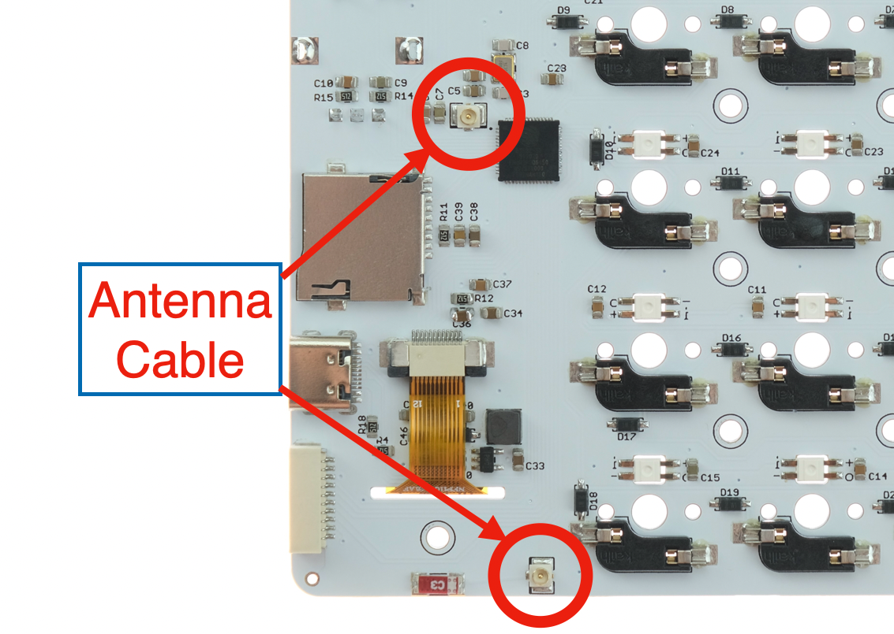
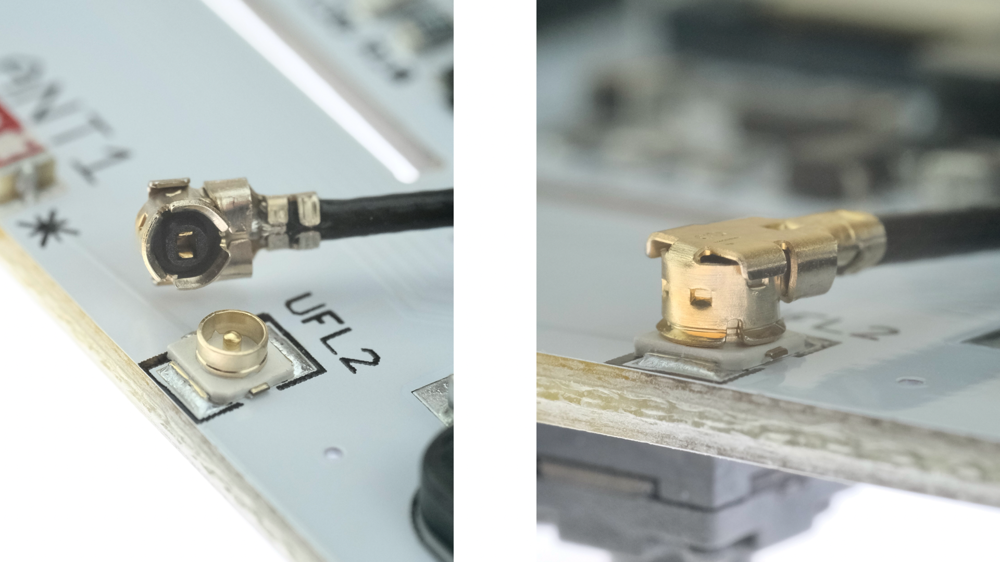
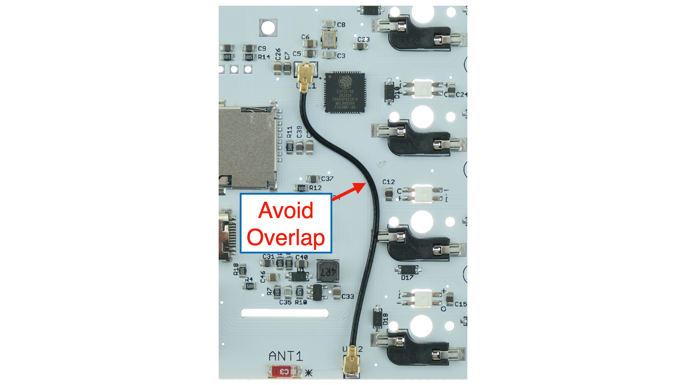
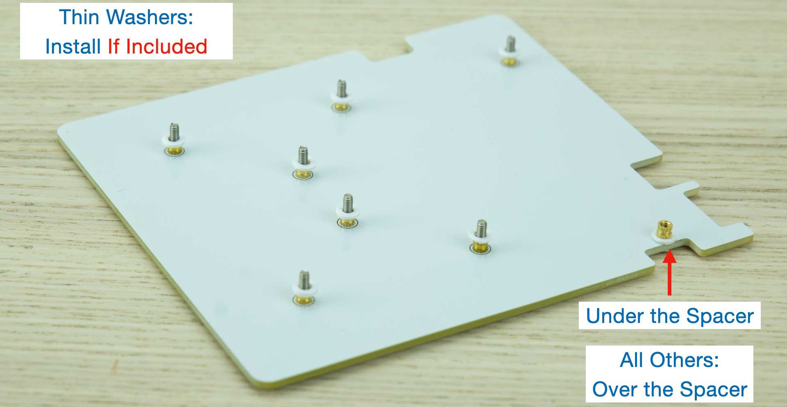
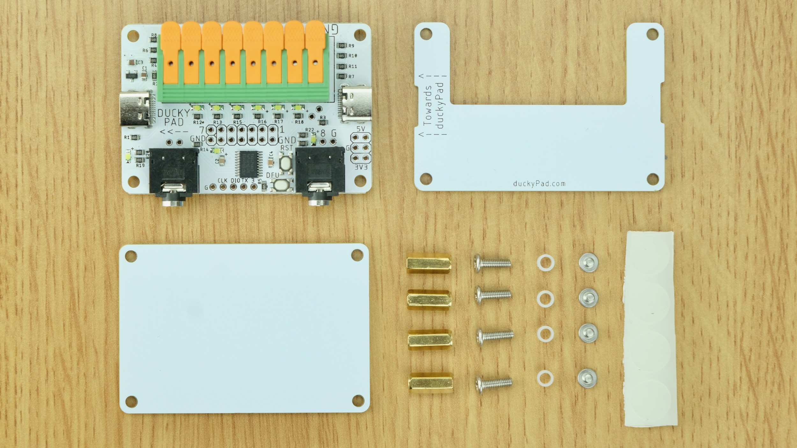

# duckyPad Assembly Guide

[Get duckyPad Pro](https://www.tindie.com/products/37399/) | [Official Discord](https://discord.gg/4sJCBx5) | [Getting Started](./getting_started.md) | [Table of Contents](#table-of-contents)

------

Thanks for getting duckyPad Pro!

Here's how to put everything together.

## Join Our Discord!

Join our [Official Discord](https://discord.gg/4sJCBx5) for discussions and latest updates!

## Tools

A small **Phillips-head screwdriver** (`+`shape) should be provided in the package.

A socket bit or **pair of pliers** also helps, but not required.

## Assembly Steps

You should have the following items:

As well as the following fasteners:

Pay special attention to the **brass spacers**!

* One is **slightly shorter** than the other.

* Separate them out before starting

----------

Before we start, **go wash your hands** to discharge static electricity.

First, the antenna cable.

Look at the back of the PCB. Identify the sockets:

Match the receptacles, push straight down. 

If too tight, put some soft cushion on the other side, and use the flat end of a pen for more leverage. Careful not to slip and damage nearby components.

It should click in place. Check it's fully seated.

Adjust the cable to avoid overlapping any components.

Hold the `Back Plate` **in the orientation shown**.

Insert `8mm` and `3mm` screws.

Place **something rigid** against the back, and flip over. The screws should stay in place.

Put on **3mm spacers** (the slightly shorter one)

Moderately tighten, with a socket bit if available. It shouldn't rattle when shaken.

**`IF`** you received some **thin washers**, install them:

🚨🚨🚨🚨🚨🚨🚨🚨🚨🚨🚨🚨🚨🚨🚨🚨🚨🚨🚨🚨🚨🚨

And if your Kickstarter Backer Number is **PRIOR TO 155**

[Follow this guide to fix a minor clearance issue](errata.md).

🚨🚨🚨🚨🚨🚨🚨🚨🚨🚨🚨🚨🚨🚨🚨🚨🚨🚨🚨🚨🚨🚨

--------

Install the circuit board, then `4mm spacers`.

* Moderately tighten

* Avoid scratching the PCB or nearby components

Offer up the `top plate`, place the `3mm screws`, **loosely** at first.

Ensure it is **properly aligned**, then tighten all.

Flip over, wipe surface clean.

Stick `anti-slip pads` on the corners

Time for the switches!

* **Make sure the pins are straight!**

* **Make sure the pins are straight!** 

* Otherwise you might damage the socket or the switch

* Match the pins and push in

Keycaps next!

Note the orientation ("slope" side pointing left). Just push down.

Peel off OLED screen protector.

Match the `D-Cutout` on the knob to the shaft

Push all the way down, make sure it bottoms out.

And you're done!

Head back to the [Quick Start Guide](./getting_started.md) to see how to use it!

## Expansion Module

👇👇👇👇👇👇👇👇👇👇

[See this guide](https://github.com/dekuNukem/duckyPad-expansion-modules/blob/master/README.md) to put your Expansion Module together!

☝️☝️☝️☝️☝️☝️☝️☝️☝️☝️

## Table of Contents

[Main page](../README.md)

[Getting Started Guide](getting_started.md)

[Kit Assembly Guide](kit_assembly.md)

[Using duckyScript](duckyscript_info.md)

[duckyScript VM](bytecode_vm.md)

[Tinkering Guide](tinkering_guide.md)

[Troubleshooting](troubleshooting.md)

[Firmware Update](fw_update.md)

## Questions or Comments?

Please feel free to [open an issue](https://github.com/dekuNukem/duckypad-pro/issues), ask in the [official duckyPad discord](https://discord.gg/4sJCBx5), or email `dekuNukem`@`gmail`.`com`!