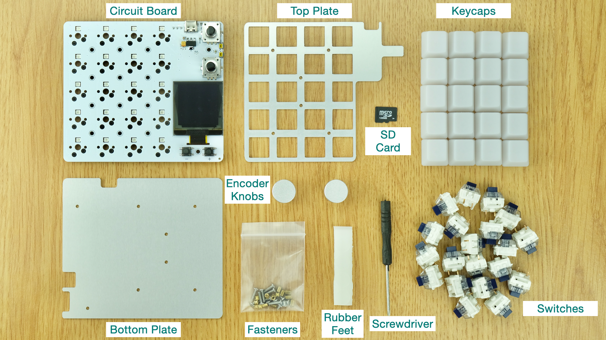
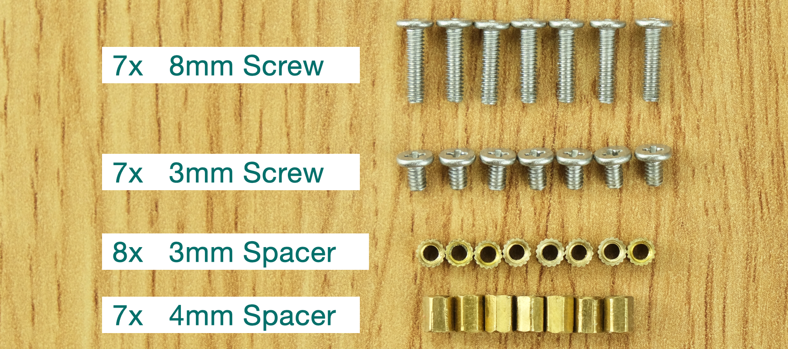
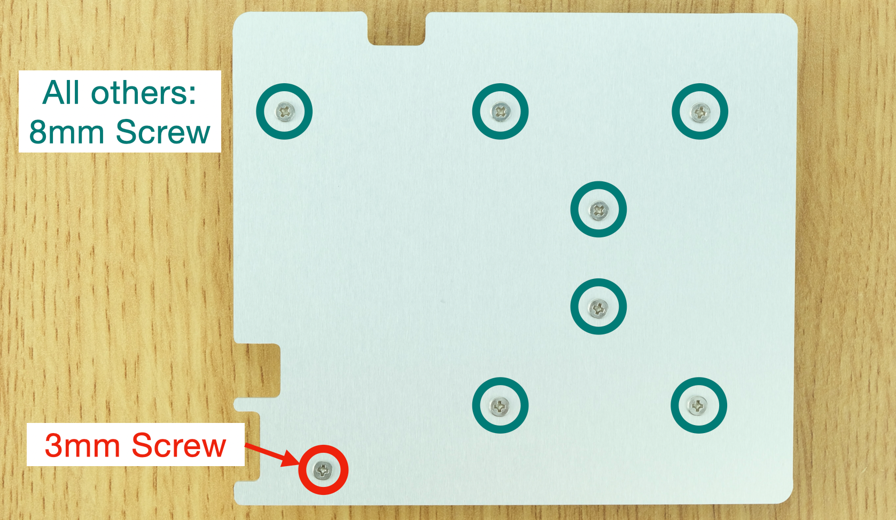
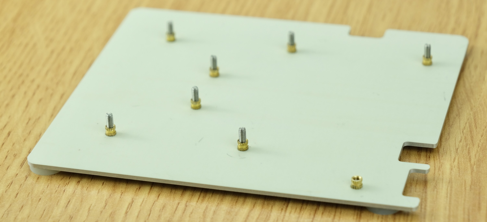
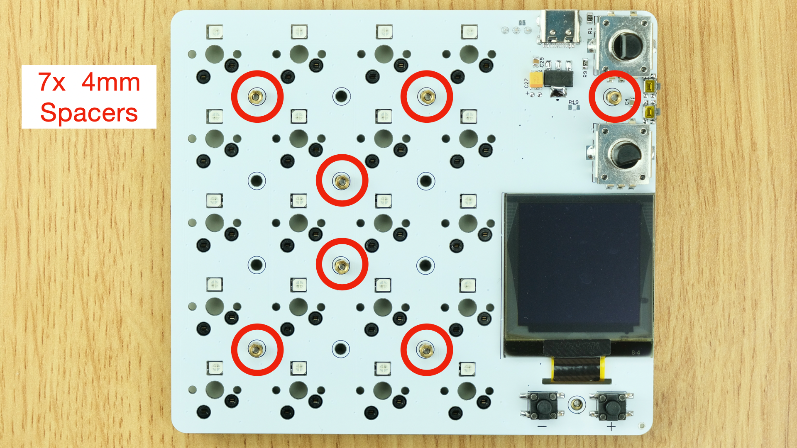
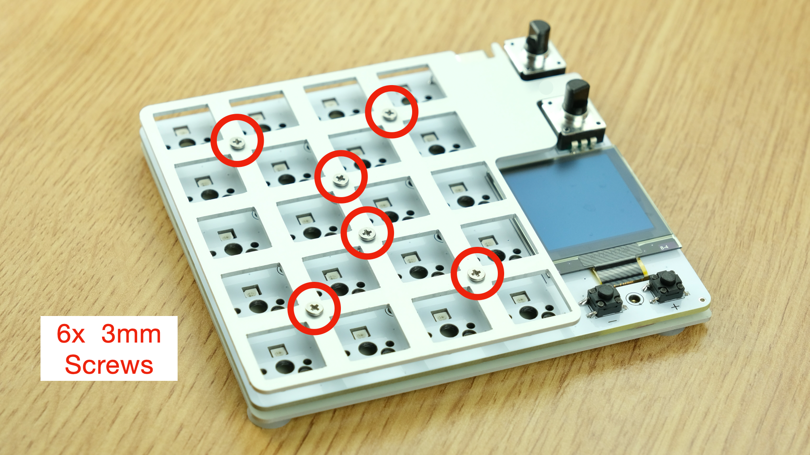
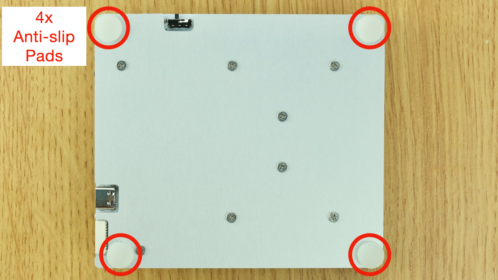
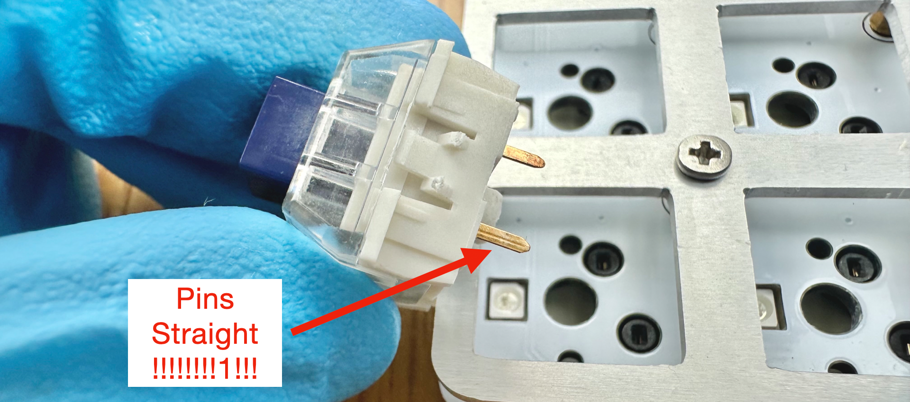
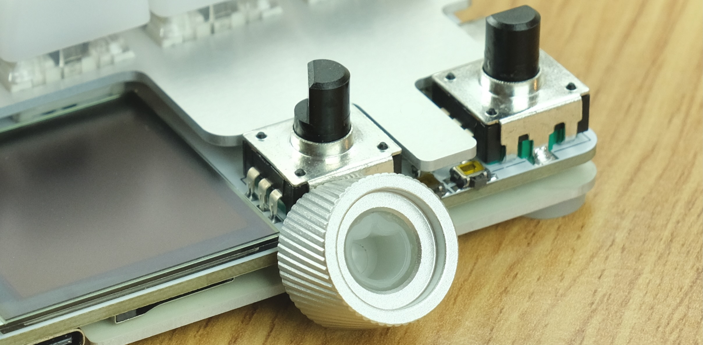
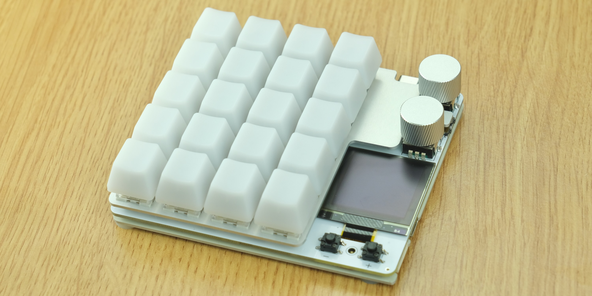

# duckyPad Assembly Guide

[Kickstarter Info](https://www.kickstarter.com/projects/dekunukem/duckypad-pro-advanced-macro-scripting-beyond-qmk-via) | [Official Discord](https://discord.gg/4sJCBx5) | [Getting Started](getting_started.md) | [Table of Contents](#table-of-contents)

------

Thanks for purchasing duckyPad Pro!

Here's how to put everything together.

## Join Our Discord!

Join our [Official Discord](https://discord.gg/4sJCBx5) for discussions, questions, scripts, and latest updates!

## Tools

A small **Phillips-head screwdriver** (`+`shape) is needed. One should be provided in the package.

A **pair of pliers** also helps, but not required.

## Handling PCB

When handling the bare circuit board, remember to:

* Wash your hands first

* Always hold by its edge

* Don't touch the components

## Assembly Steps

You should have the following items:

As well as the following fasteners:

Hold the `Back Plate` **in the orientation shown**.

Insert `8mm` and `3mm` screws.

Place **something rigid** against the back, and flip over. The screws should stay in place.

Thread on **2.5mm spacers**.

**Moderately** tighten, use pliers if available.

It shouldn't rattle when shaken.

Install the circuit board, then `4mm spacers`.

* Moderately tighten with a socket bit if available

* If using pliers, avoid scratching the PCB or nearby components.

Offer up the `top plate`, place the `3mm screws`, **loosely** at first.

Ensure it is **properly aligned**, then tighten all.

Flip over, wipe surface clean.

Stick `anti-slip pads` on the corners

Time for the switches!

* **Make sure the pins are straight!**

* **Make sure the pins are straight!** 

* Otherwise you might damage the socket or the switch

* Match the pins and push in

Keycaps next!

Note the orientation ("slope" side pointing left). Just push down.

Peel off OLED screen protector.

Match the `D-Cutout` on the knob to the shaft

Push all the way down, make sure it bottoms out.

And you're done!

Head back to the [Quick Start Guide](/getting_started.md) to see how to use it!

## Table of Contents

[Main page](../README.md)

[Getting Started Guide](getting_started.md)

[Kit Assembly Guide](kit_assembly.md)

[Using duckyScript](duckyscript_info.md)

[duckyScript VM](bytecode_vm.md)

[Tinkering Guide](tinkering_guide.md)

[Troubleshooting](troubleshooting.md)

[Firmware Update](fw_update.md)

## Questions or Comments?

Please feel free to [open an issue](https://github.com/dekuNukem/duckypad/issues), ask in the [official duckyPad discord](https://discord.gg/4sJCBx5), DM me on discord `dekuNukem#6998`, or email `dekuNukem`@`gmail`.`com` for inquires.
