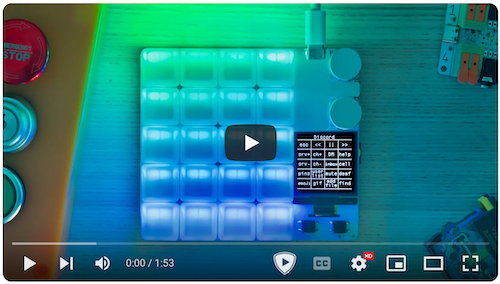

# duckyPad Pro Kickstarter Information

Introducing **duckyPad Pro**, the second entry to the duckyPad family!

With 4 years worth of feedback, long-requested upgrades, brand new features, and free from the shackles of QMK/VIA, duckyPad Pro aims to be the **most capable** macropad available today.

## Keep in Touch

If you're interested, please consider:

* Signing up [Kickstarter Pre-launch Page](https://www.kickstarter.com/projects/dekunukem/duckypad-pro-advanced-macro-scripting-beyond-qmk-via) to get notified!

* Joining our [Official Discord](https://discord.gg/4sJCBx5) for latest discussions and updates!

## What's New

Compared to [original duckyPad](https://github.com/dekuNukem/duckyPad/), we now have:

* **Rotary Encoders (finally!)**
	* Two encoders
	* Built-in tactile switch
	* Six duckyScript actions

* **Bluetooth**
	* Now works as BT keyboard & Mouse!
	* Bluetooth 5.0
	* Built-in Antenna for both BT and Wi-Fi

* **Expansion Modules**
	* Wire up your own **switches / buttons / foot pedals!**
	* **Daisy-chainable**

* **Bigger OLED Screen**
	* 128x128
	* **Portrait/landscape orientation**

* **Faster CPU**
	* ESP32-S3
	* 5x faster
	* Much simpler setup for tinkerers

* **More Keys**
	* 20 Switches
	* In 4x5 Grid

* **duckyScript Engine**
	* Separate script for **on press** and **on release**
	* **Abort execution** with any key
	* **Unlimited** `EMUK` Keypresses
	* Read `NUMLOCK` / `CAPSLOCK` / `SCROLLLOCK` status
	* Switch profile by name (instead of number)
	* Much longer & more complex scripting than QMK/VIA
	* 64 Profiles, 3712 macros.
	* Many under-the-hood optimizations

* **QoL Updates**
	* Mount SD Card as **USB Storage**
	* Much faster configurator load/save
	* **Drag & drop** firmware update
	* More sturdy +/- button
	* Reinforced hotswap socket solder pads

* **New Configurator**
	* New UI for new features!
	* General cleanup

## Kickstarter Plan

Starting 1st October

21 days

similar to [last time](https://www.kickstarter.com/projects/dekunukem/duckypad-do-it-all-mechanical-macropad). Around 200 Early bird rewards for immediately shipping in november 

rest of the rewards december / early 2025

## Pricing

Still deciding, likely starts around $80 or $85 for the base model (add-your-own swiches and keycaps, FR4 plate), around $120 for mid-trim (Gateron green ), and $140 fully loaded with options

## What about existing duckypad

Original duckyPad still will be supported!

planning to backport new firmware and software features during / after the campaign.

## Table of Contents

[Main page](../README.md)

[Getting Started Guide](getting_started.md)

[Kit Assembly Guide](kit_assembly.md)

[Using duckyScript](duckyscript_info.md)

[duckyScript VM](bytecode_vm.md)

[Tinkering Guide](tinkering_guide.md)

[Troubleshooting](troubleshooting.md)

[Firmware Update](fw_update.md)
