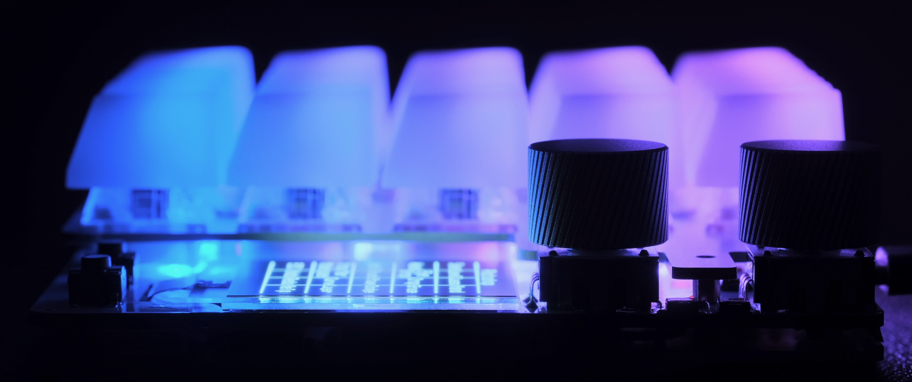
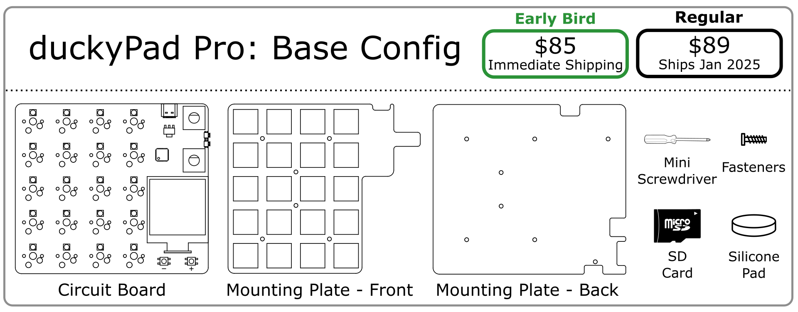
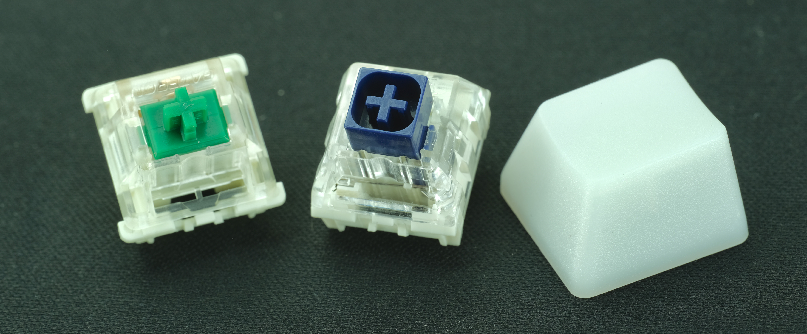
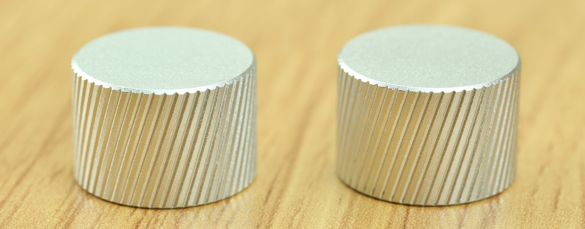
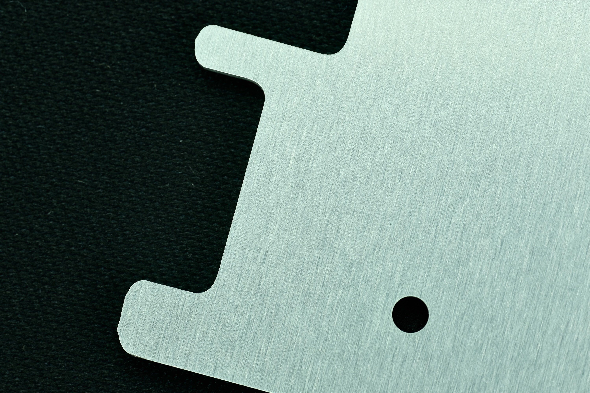
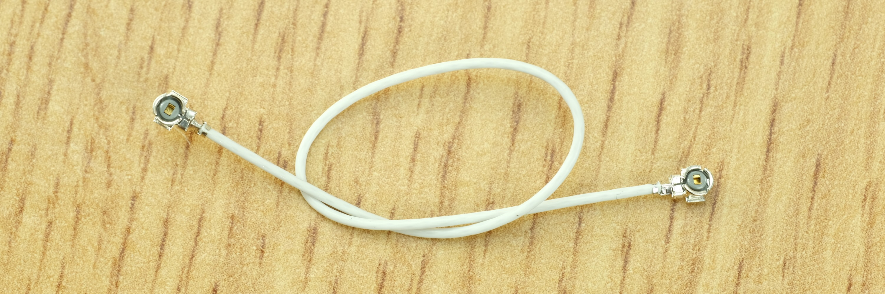
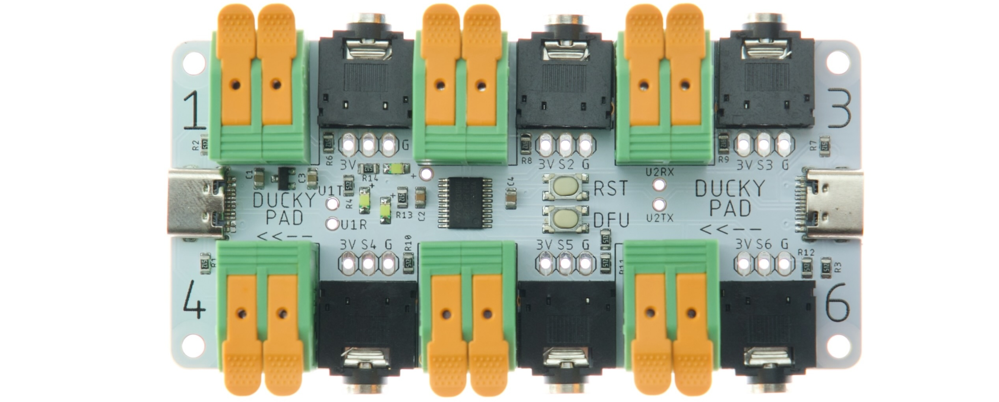

# duckyPad Pro Kickstarter Information

Thank you very much for the interest and support of the duckyPad project!

I'm excited to share the details about the upcoming Kickstarter campaign, so here it goes!

## Keep in Touch

If you haven't already, please consider:

* Signing up [Pre-launch page](https://www.kickstarter.com/projects/dekunukem/duckypad-pro-advanced-macro-scripting-beyond-qmk-via) to get notified. (Or [Leave your email here](https://forms.gle/rERNdy7BvTqJD88S6))

* Joining our [Official Discord](https://discord.gg/4sJCBx5) for questions, discussions, and updates.

## Launch Date

duckyPad Pro is scheduled to launch on **`Tuesday October 1st 2024`** at:

##### United States

* 9:00AM **PDT**
* 10:00AM **MDT**
* 11:00AM **CDT**
* 12:00PM (noon) **EDT**

##### Europe

* 17:00 **BST**
* 18:00 **CEST**

##### Asia-Pacific

* 01:00AM (October 2) **JST**
* 02:00AM (October 2) **AEDT**

The campaign will:

* Run for **`22 days`**

* Conclude on **`Wednesday 23 October 2024`** on the **`same hour`**.

The **`funding goal`** is set to $10700 (£8000).

## Pricing

* All numbers in **USD**

* duckyPad Pro is priced approximately **$20 higher** than the standard duckyPad

* **Board-only** config starts at $89.99 ($84.99 early bird)

* **Mid-trim:** Around $120

* **Fully-loaded:** Around $155

## Rewards

* The rewards consist of a **`board-only base config`** and several **`optional add-ons`**.

* **Early bird:**
	* Small discount
	* **Immediate shipping** after campaign ends (November 2024)
	* 200 Slots

* **Regular:**
	* Separate production run
	* Ships early Jan 2025

* duckyPads will be shipped in **`kit form`**. You can [put it together](kit_assembly.md) in minutes, **`no soldering needed`**.

### What You'll Get

### Optional Add-ons

Pick-and-choose any extras you want.

#### Switches & Keycaps

* 20x Gateron Green **- $16.99**
	* Firm & Clicky

* 20x Kailh BOX NAVY **- $25.99**
	* Heavy, crisp, clicky

* 20x Keycaps **- $16.99**
	* Blank Milky Translucent
	* R4 OEM Profile
	* ABS

#### 2x Rotary Encoder Knobs - $5.99

* Anodised Aluminium
* Chamfered Groove Pattern
* 16mm Diameter x 11mm Height

#### Aluminum Upgrade - $14.99

* Upgrade to **Brushed Aluminum** mounting plates
* Premium Finish
* Rigid & Durable
* Both front and back

#### Bluetooth / Wi-Fi Antenna Cable - $4.99

* Needed for wireless functions

#### Expansion Module - $34.99

* Wire up your own **switches / buttons / foot pedals**
* **6 channels** per module, daisy-chainable. [Details here](https://github.com/dekuNukem/duckyPad-expansion-modules).

## Shipping Methods

duckyPad Pro will be shipped from **`United Kingdom`**.

[Royal Mail 1st Class](https://www.royalmail.com/sending/uk/1st-class) will be used for domestic shipping. 

[Royal Mail International Standard](https://www.royalmail.com/sending/international/international-standard) will be used for everywhere else:

* $10
* 6-8 working days
* Untracked

You can also upgrade to [Royal Mail International Tracked & Signed](https://www.royalmail.com/sending/international/international-tracked-signed):

* $20
* 6-8 working days
* End-to-end tracking
* Signature on delivery

For fastest delivery, [DHL Express Worldwide](https://parcel.dhl.co.uk/) is available:

* $50
* 2 working days
* End-to-end tracking 
* Signature on delivery

## Shipping Timeline

**`Early Bird`** backers:

* Shipping will begin after campaign concludes and fund is received. 

* Most likely **`early November 2024`**.

Regular backers:

* A new production run will take place to produce your boards.

* Shipping most likely **`early January 2025`**.

I'm fairly confident with these estimates, however they may change if any unexpected circumstances arise.

## What about my existing duckyPad?

The original duckyPad (2020) will **continue to be produced and supported**, as a lower-price entry to the duckyPad family.

I'm planning to **backport a majority of firmware improvements** to the OG duckyPad after the campaign wraps up and I have more time.

## Any Questions?

* Join our [Official Discord](https://discord.gg/4sJCBx5) for questions and discussions!
* Or email me `dekunukem` `gmail.com`
* Don't forget to follow the [Pre-launch Page](https://www.kickstarter.com/projects/dekunukem/duckypad-pro-advanced-macro-scripting-beyond-qmk-via)! (Or [Leave your email here](https://forms.gle/rERNdy7BvTqJD88S6))

## Table of Contents

[Main page](../README.md)

[Getting Started Guide](getting_started.md)

[Kit Assembly Guide](kit_assembly.md)

[Using duckyScript](duckyscript_info.md)

[duckyScript VM](bytecode_vm.md)

[Tinkering Guide](tinkering_guide.md)

[Troubleshooting](troubleshooting.md)

[Firmware Update](fw_update.md)

## Questions or Comments?

Please feel free to [open an issue](https://github.com/dekuNukem/duckypad-pro/issues), ask in the [official duckyPad discord](https://discord.gg/4sJCBx5), or email `dekuNukem`@`gmail`.`com`!
