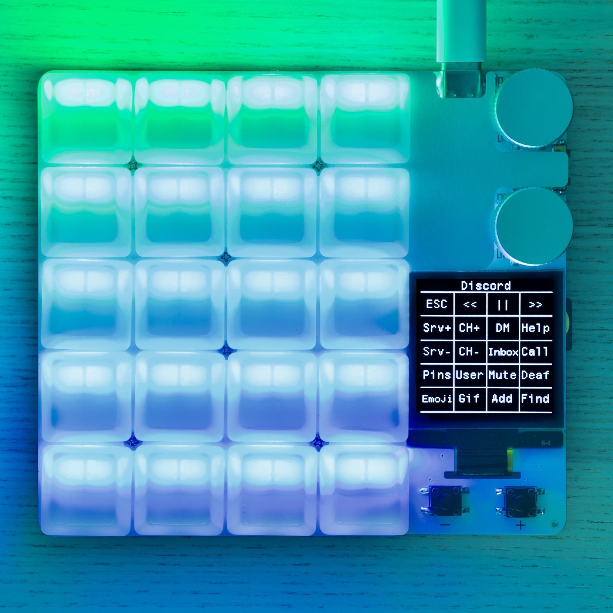
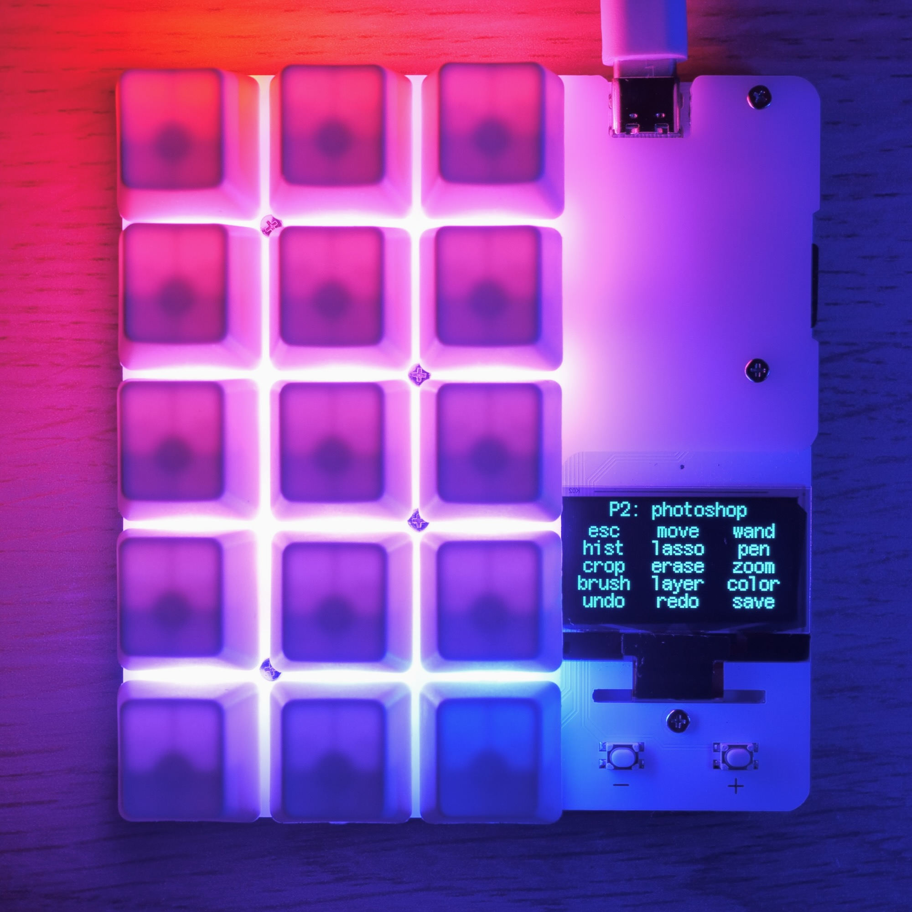

# Welcome to duckyPad!

duckyPad is a line of **mechanical macropads** for power users demanding **advanced macro scripting** beyond the shackles of QMK/VIA.

|duckyPad Pro (2024)|duckyPad (2020)|
|:--:|:--:|
|||
|[Purchase Link](https://www.kickstarter.com/projects/dekunukem/duckypad-pro-advanced-macro-scripting-beyond-qmk-via)|[Purchase Link](https://www.tindie.com/products/21984/)|
|[User Manual](getting_started.md)|[User Manual](https://github.com/dekuNukem/duckyPad/blob/master/getting_started.md)|

# Highlights

duckyPad Pro runs **duckyScript**, originally designed for [USB Rubber Ducky](https://shop.hak5.org/products/usb-rubber-ducky-deluxe) to perform [BadUSB attacks.](https://arstechnica.com/information-technology/2014/07/this-thumbdrive-hacks-computers-badusb-exploit-makes-devices-turn-evil/)

Compared to QMK/VIA, you get:

* **Much Longer Macros**
	* [Entire Bee Movie](../resources/beemovie.txt) in one macro? Sure thing!

* **Advanced Interactive Scripting**
	* Variables, conditions, loops, functions, etc.
	* Reading Buttons
	* Print to OLED screen
	* How about a fully functional [Pong game?](../resources/photos/pong.gif) [[code]](../resources/pong.txt)

* **SD Card Storage**
	* Fast Config / Backup / Deployment
	* No sketchy drivers or apps
	* No recompiling

From **simple shortcuts** to **full-blown programs**, duckyScript can easily achieve the impossible on QMK/VIA.

It is a no-brainer for power users with more demanding scripting needs.

# Comparisons

||duckyPad Pro (2024)|duckyPad (2020)|Notes|
|:--:|:--:|:--:|:--:|
|Hot-Swap Switches|20|15||
|Rotary Encoders|✅|❌|2 Encoders Tactile or Smooth|
|Bluetooth|✅|❌||
|Expansion Module|✅|❌|Wire up your own Switches / Buttons / Foot Pedals|
|Screen Rotation|✅|❌|Portrait / Landscape|
|Capacity|64 Profiles 3712 Macros|32 Profiles 480 Macros||
|OLED|1.5" 128 x 128|1.3" 128 x 64|Shows Key Function User Controllable|
|duckyScript Engine|✅|✅|Much Longer Macros Interactive Scripting|
|Per-key RGB|✅|✅|User Controllable|
|SD Card Storage|✅|✅|Fast Backup / Duplication / Deploy No recompile needed|
|Automatic Profile Switching|✅|✅|Based on Active Window|
|Open-Source|✅|✅|No proprietary drivers Works anywhere|
|USB-C|✅|✅||

# Questions or Comments?

Feel free to join our [official discord](https://discord.gg/4sJCBx5), or email `dekuNukem`@`gmail`.`com`!
