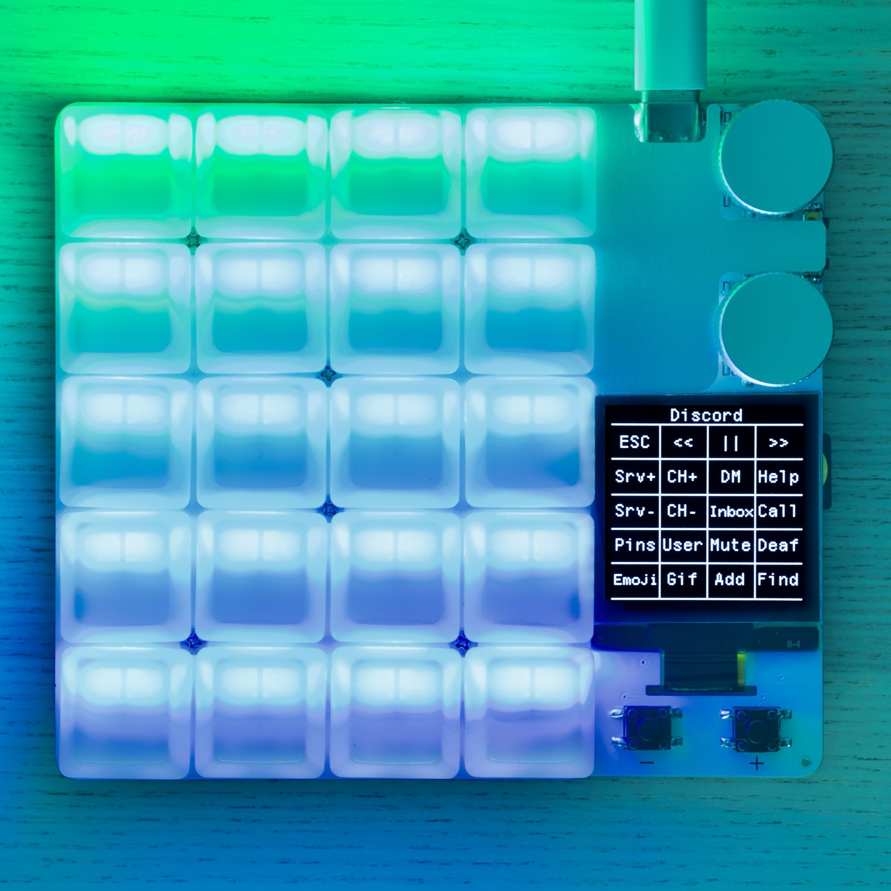
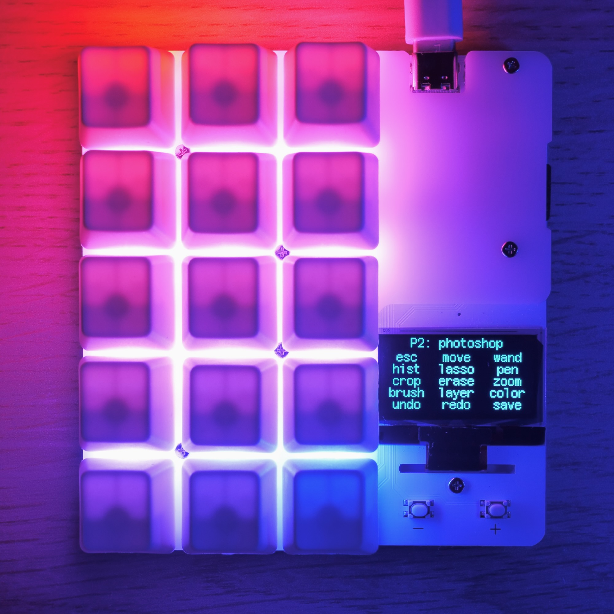
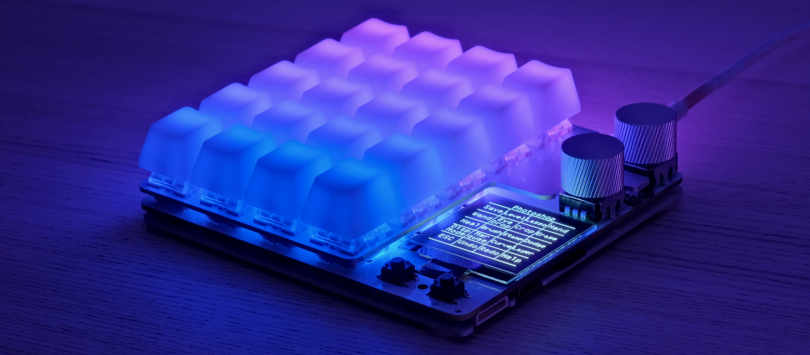

# Welcome to duckyPad!

duckyPad is a line of **mechanical macropads** for power users demanding **advanced macro scripting** beyond the shackles of QMK/VIA.

Using a [Turing-complete scripting language](https://dekunukem.github.io/duckyPad-Pro/doc/duckyscript_info.html) with **massive on-board storage**, it can automate **any keyboard/mouse input** you want, from **simple combos** to **full-blown programs**.

No drivers needed. Works anywhere.

|duckyPad Pro (2024)|duckyPad (2020)|
|:--:|:--:|
|||
|[Purchase Link](https://lectronz.com/products/duckypad-pro-macro-scripting-beyond-qmk-via/)|[Purchase Link](https://www.tindie.com/products/21984/)|
|[User Manual](getting_started.md)|[User Manual](https://dekunukem.github.io/duckyPad/getting_started.html)|
|[Accessories & Upgrades](https://www.tindie.com/products/dekunukem/duckypad-pro-accessories/)|[Accessories & Upgrades](https://www.tindie.com/products/dekunukem/duckypad-accessories/)|

# Highlights

duckyPad runs **duckyScript**, originally designed for [USB Rubber Ducky](https://shop.hak5.org/products/usb-rubber-ducky-deluxe).

Compared to QMK/VIA, you get:

* **Much Longer Macros**
	* Type over **60,000 characters** per macro
	* [Entire Bee Movie](../resources/beemovie.txt) in one macro? Sure thing!

* **Turing-Complete Interactive Scripting**
	* Variables, Conditions, Loops, Functions, and more.
		* Read Buttons / Print to OLED / Set RGB / Real-time Clock
	* Executed on [32-bit Bytecode VM](https://duckypad.github.io/DuckStack/)
		* How about a fully functional [Pong game?](../resources/photos/pong.gif) [[code]](../resources/pong.txt)

* On-board **SD Card Storage**
	* Fast Config / Backup / Deployment
	* No Recompiling

* Fully **Open Source**
	* MIT License
	* No Sketchy Drivers or Apps
	* [Tinkering Welcome!](tinkering_guide.md)

From **simple shortcuts** to **full-blown programs**, duckyPad can easily achieve what was impossible on QMK/VIA.

duckyPad aims to be the **most capable macropad today**, and is a no-brainer for power users with more demanding scripting needs.

# Comparisons

||duckyPad Pro (2024)|duckyPad (2020)|Notes|
|:--:|:--:|:--:|:--:|
|Hot-Swap Switches|20|15||
|Rotary Encoders|✅|❌|2 Encoders Tactile or Smooth|
|Bluetooth|✅|❌||
|[Expansion Module](https://github.com/dekuNukem/duckyPad-expansion-modules)|✅|❌|Wire up your own Switches / Buttons / Foot Pedals|
|Screen Rotation|✅|❌|Portrait / Landscape|
|Capacity|64 Profiles 3712 Macros|32 Profiles 480 Macros||
|OLED|1.5" 128 x 128|1.3" 128 x 64|Shows Key Name User Controllable|
|duckyScript Engine|✅|✅|Much Longer Macros Interactive Scripting|
|Per-key RGB|✅|✅|User Controllable|
|SD Card Storage|✅|✅|Fast Backup / Duplication / Deploy No recompile needed|
|Real-time Clock|✅|✅|Aware of current date and time|
|[Automatic](https://github.com/duckyPad/duckyPad-Profile-Autoswitcher) [Profile Switching](https://github.com/duckyPad/duckyPad-Profile-Autoswitcher)|✅|✅|Based on Active Window|
|100% Open-Source|✅|✅|MIT License No Proprietary Apps No Subscription|
|USB-C|✅|✅||

# Questions or Comments?

Feel free to join our [official discord](https://discord.gg/4sJCBx5), or email `dekuNukem`@`gmail`.`com`!