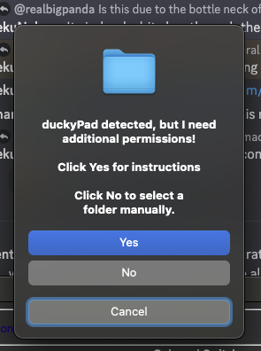
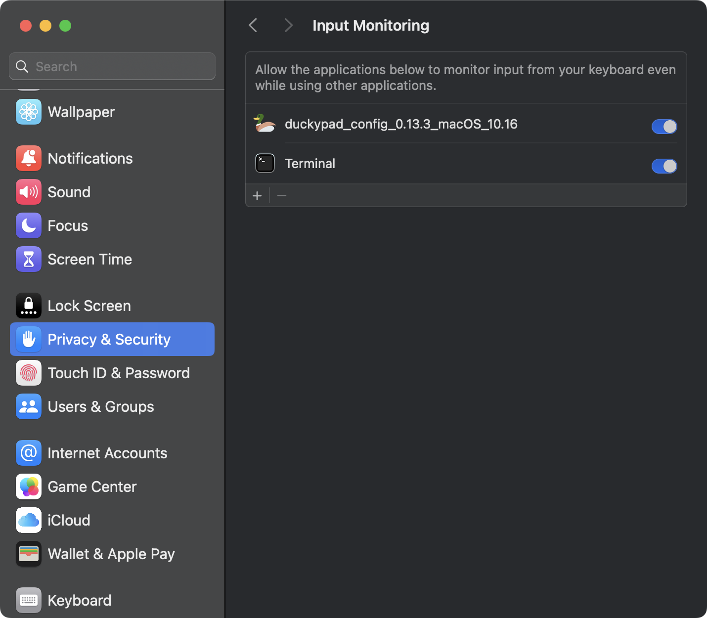

# duckyPad Configurator macOS Notes

[Get duckyPad Pro](https://www.tindie.com/products/37399/) | [Official Discord](https://discord.gg/4sJCBx5) | [Getting Started](./getting_started.md) | [Table of Contents](#table-of-contents)

---------

On macOS, you can run the configurator as a **pre-packaged app**, or execute the **source code** directly.

## Pre-packaged App

* [Download the latest macOS release here](https://github.com/dekuNukem/duckyPad-Pro/releases/latest)

* Double click to unzip

* **Right Click** on the folder, select `New Terminal at Folder`

* Type `sh ./run.sh`, press enter.

* Authenticate. Your password will be hidden in the terminal, the letters won't appear but press enter and the configurator should launch!

> [!IMPORTANT]
> You should use this to start the application every time, it grants the configurator permission to connect to the duckypad.

---------

* If macOS complains about unsigned app

* Go to Settings > Privacy & Security

* Scroll down to security section and click "Allow Anyway" 

---------

If the configurator complains about **needing additional permissions:**

* Try granting "Input Monitoring" permissions for the `Terminal app`.

  
  
  

* If still not working, try "Full Disk Access" or "Developer Tools".

* If everything fails, you can also edit your duckypad by manually entering USB mount mode (hold +, select key 6) and selecting the newly mounted SD card. Be careful, this will fail to properly eject the SD card before restarting the duckypad which may corrupt it, and macOS will complain about this.

## Run from Source

* [Download the latest source release here](https://github.com/dekuNukem/duckyPad-Pro/releases/latest)
* Double click to unzip
* **Right Click** on the folder, select `New Terminal at Folder`

----

* Use [homebrew](https://brew.sh) to install python-tk: `brew install python-tk`
* **[Optional]** Make a virtualenv and activate it: `python3 -m venv .venv; source .venv/bin/activate`
* Install dependencies: `pip3 install -r requirements.txt`
* Launch the app: `sudo python3 ./duckypad_config.py`
