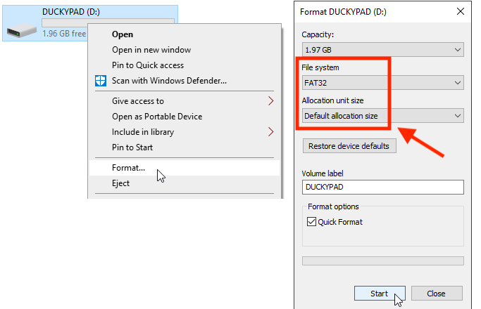

# Common Issues / Troubleshooting

[Get duckyPad Pro](https://www.kickstarter.com/projects/dekunukem/duckypad-pro-advanced-macro-scripting-beyond-qmk-via) | [Official Discord](https://discord.gg/4sJCBx5) | [Getting Started](./getting_started.md) | [Table of Contents](#table-of-contents)

----

Some commonly encountered issues are explained here.

- [I press a key and nothing happens!](#i-press-a-key-and-nothing-happens)
- [Letters and symbols come out wrong!](#letters-and-symbols-come-out-wrong)
- [My script behaves inconsistently!](#my-script-behaves-inconsistently)
- [I want to use my own SD card!](#i-want-to-use-my-own-sd-card)
- [The RGB backlight is flickering slightly!](#the-rgb-backlight-is-flickering-slightly)
- [The RGB backlight is too bright!](#the-rgb-backlight-is-too-bright)
- [Will OLED suffer burn-in?](#will-oled-suffer-burn-in)
- [Numpad keys doesn't work!](#numpad-keys-doesnt-work)

## Join Our Discord!

If you have issues not in this list, feel free to join our [Official Discord](https://discord.gg/4sJCBx5) to ask!

----

## I press a key and nothing happens!

First of all, make sure the key has a script mapped to it.

If in doubt, use one of the sample profiles.

### If *none* of the keys work

* Check you're using the **top USB-C port**, NOT the one next to the screen!

* Check that the cable is plugged all the way in.

* Try a different cable (some don't have data pins).

* Try a different USB port.

* Try using a USB hub.

* Try a different computer.

### If a certain key doesn't work

Take off the switch and inspect the pins, chances are one of them is bent:

Straighten it up with a pair of pliers, then insert again.

Make sure the **pins are straight** and aim for hot-swap socket holes.

## Letters and symbols come out wrong!

* **Long-press** `+/-` button.

* Select the correct keyboard layout.

* Read more about [writing your own keymaps](https://github.com/dekuNukem/duckyPad/blob/master/keymap_instructions.md).

## My script behaves inconsistently!

duckyPad might be typing too fast for your computer.

Slow it down with the following commands:

* `DELAY n` adds an arbitrary delay in milliseconds.

* `DEFAULTDELAY n` sets how long to wait between **`each line`** of code.

* `DEFAULTCHARDELAY n` sets how long to wait between **`each keystroke`**.

* Default is 20ms, try 50 if too fast. Set it at the very beginning of script.

## I want to use my own SD card!

* (Optional) Copy off existing files of old SD card.

* Format the new SD card in `FAT or FAT32`:

* Copy all the files back.

* You can also download the [sample profiles](../resources/sample_profiles/sample_profiles.zip) and copy everything to the **root of your SD card**:

## The RGB backlight is flickering slightly!

* Make sure the USB port can provide enough power

* Use a high-quality cable

## The RGB backlight is too bright!

* Adjust the brightness by **long-pressing `+/-` button**.

## Will OLED suffer burn-in?

Measures have been taken to prevent burn-in.

* Screen dims after 1 minute.

* duckyPad goes to sleep after 5 minutes (adjustable).

## Numpad keys doesn't work!

Make sure `NUMLOCK` is on.

## Table of Contents

[Main page](../README.md)

[Getting Started Guide](getting_started.md)

[Kit Assembly Guide](kit_assembly.md)

[Using duckyScript](duckyscript_info.md)

[duckyScript VM](bytecode_vm.md)

[Tinkering Guide](tinkering_guide.md)

[Troubleshooting](troubleshooting.md)

[Firmware Update](fw_update.md)

## Questions or Comments?

Please feel free to [open an issue](https://github.com/dekuNukem/duckypad-pro/issues), ask in the [official duckyPad discord](https://discord.gg/4sJCBx5), or email `dekuNukem`@`gmail`.`com`!