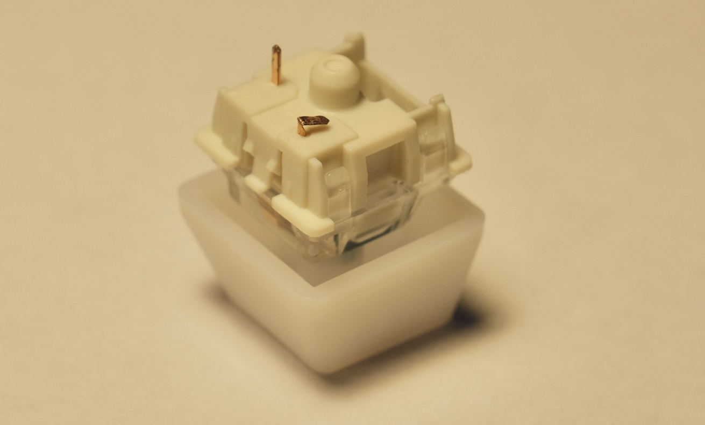

# Common Issues / Troubleshooting

[Get duckyPad](https://www.tindie.com/products/21984/) | [Official Discord](https://discord.gg/4sJCBx5) | [Getting Started](getting_started.md) | [Table of Contents](#table-of-contents)

----

Some commonly encountered issues are explained here.

* [I press a key and nothing happens!](#I-press-a-key-and-nothing-happens)

* [The letters and symbols come out wrong!](#The-letters-and-symbols-come-out-wrong)

* [F13 - F24 keys doesn't work!](#f13---f24-keys-doesnt-work)

* [My duckyPad stopped working on latest firmware!](#my-duckypad-stopped-working-on-latest-firmware)

* [My script behaves inconsistently!](#My-script-behaves-inconsistently)

* [My duckyPad seems to be getting sluggish!](#My-duckyPad-seems-to-be-getting-sluggish)

* [I want to use my own SD card!](#i-want-to-use-my-own-sd-card)

* [The RGB backlight is flickering slightly!](#The-RGB-backlight-is-flickering-slightly)

* [The RGB backlight is too bright!](#The-RGB-backlight-is-too-bright)

* [The OLED screen isn't working properly!](#the-oled-screen-isnt-working-properly)

* [Will the OLED suffer burn-in?](#Will-the-OLED-suffer-burn-in)

* [Numpad keys doesn't work!](#Numpad-keys-doesnt-work)

* [SD Card doesn't work on mac!](#SD-Card-doesnt-work-on-mac)

* [USB configuration / Autoswitcher isn't working on macOS!](#usb-configuration--autoswitcher-isnt-working-on-macos)

## Join Our Discord!

If you have issues not in this list, feel free to join our [Official Discord](https://discord.gg/4sJCBx5) to ask about it! We also have discussions, script sharing, and latest updates!

----

## I press a key and nothing happens!

First of all, make sure the key has a script mapped to it.

If in doubt, use one of the sample profiles.

### Just updated firmware?

Use the [latest configurator](https://github.com/dekuNukem/duckyPad/releases/latest), press `Connect` to load up data, then press `Save` to write it back.

### If *none* of the keys work

* Check that the cable is plugged all the way in.

* Try a different cable.

* Try a different USB port.

* Try using a USB hub.

* Try a different computer.

### If a certain key doesn't work

Take off the switch and inspect the pins, chances are one of them is bent:

Straighten it up with a pair of pliers, then insert again.

Make sure the **pins are straight** and aim for hot-swap socket holes.

## Letters and symbols come out wrong!

* **Long-press** `+/-` button.

* Select the correct keyboard layout.

* Read more about [writing your own keymaps](https://github.com/dekuNukem/duckyPad/blob/master/keymap_instructions.md).

## My script behaves inconsistently!

duckyPad might be typing too fast for your computer.

Slow it down with the following commands:

* `DELAY n` adds an arbitrary delay in milliseconds.

* `DEFAULTDELAY n` sets how long to wait between **`each line`** of code.

* `DEFAULTCHARDELAY n` sets how long to wait between **`each keystroke`**.

* Default is 20ms, try 50 if too fast. Set it at the very beginning of script.

## I want to use my own SD card!

* (Optional) Make a backup of the contents of the original SD card.

* Format the new SD card in `FAT or FAT32`:

* Copy all the files back.

* You can also download the [sample profiles](https://github.com/dekuNukem/duckyPad/raw/master/sample_profiles.zip) and copy everything to the **root of your SD card**:

## The RGB backlight is flickering slightly!

* Make sure the USB port can provide enough power

* Use a high-quality cable

## The RGB backlight is too bright!

* Adjust the brightness by **long-pressing `+/-` button**.

## Will OLED suffer burn-in?

Measures have been taken to prevent burn-in.

* Screen dims after 1 minute.

* duckyPad goes to sleep after 5 minutes (adjustable).

## Numpad keys doesn't work!

Make sure `NUMLOCK` is on.

## USB configuration / Autoswitcher isn't working on macOS!

Due to the security restrictions of macOS, to use USB configuration and autoswitcher, you need to:

* Enable "Input Monitoring" permission (for loading from USB)

* Enable "Screen Recording" permission (for reading window titles)

* Run the app as root

### Enable permission

* Open `System Preferences` -> `Security & Privacy`

* Select `Input Monitoring`

* Click the lock to make changes

* Press the `+` button

* Go to `Applications` -> `Utilities`, and add `Terminal` to the list.

* Select `Screen Recording`, and repeat the same process

### Launch app as administrator

* Open `System Preferences` -> `Keyboard` -> `Shortcuts` -> `Services`

* Tick `New Terminal at Folder`

* Download the latest macOS software, unzip into a folder.

* `Right click` on the unzipped folder and select `New Terminal at Folder`

* Type in `sh run.sh` and press enter, then enter your password.

* The app should launch as administrator, and should be fully functional now.

* If it still doesn't work, [let me know](#questions-or-comments)!

## Table of Contents

[Main page](README.md)

[Getting Started Guide](getting_started.md)

[Kit Assembly Guide](kit_assembly_guide.md)

[Using duckyScript](duckyscript_info.md) | [duckyScript 3 Info](duckyscript3_instructions.md)

[Common issues / Troubleshooting](troubleshooting.md)

[Firmware Updates and Version History](firmware_updates_and_version_history.md)

[Make Your Own Keymap](./keymap_instructions.md)

[Build a duckyPad Yourself](build_it_yourself.md)

[Kickstarter Backer Acknowledgments](kickstarter_backers.md)

## Questions or Comments?

Please feel free to [open an issue](https://github.com/dekuNukem/duckypad/issues), ask in the [official duckyPad discord](https://discord.gg/4sJCBx5), DM me on discord `dekuNukem#6998`, or email `dekuNukem`@`gmail`.`com` for inquires.
