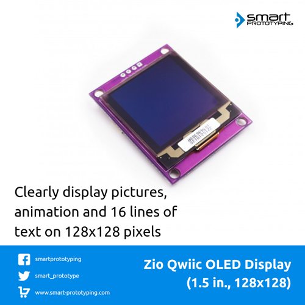

# Zio Qwiic OLED Display 1.5inch (128 x 128 pixels)

> This product can be available for purchase [here](https://www.smart-prototyping.com/Zio-Qwiic-OLED-Display-1_5inch-128x128).

#### Description

When you want to display more content, [Qwiic 0.91inch display](https://www.smart-prototyping.com/Zio-OLED-Display-0-91-in-128-32-Qwiic.html) would not suffice. Here is the Qwiic 1.5inch 128 x 128 pixels OLED display module. Compared to the Qwiic 0.91inch display, it can display more lines (max. 16 lines) of text content, and display picture and animation better, this is super exciting! 

On the backside, there are  two Qwiic connectors, Qwiic connectors means it is an I2C device, so that you can just use [Qwiic cables](https://www.smart-prototyping.com/zio-cables) to quickly connect it to the other modules, with no soldering! 

For the coding side, we recommend to use [U8g2lib library](https://github.com/olikraus/u8glib).

#### Specification

* Resolution: 128 x 128 pixels
* Display IC: SSD1327
* I2C address:0x78, 0x7A (Default: 0x78)
* Display Color: White
* Dimension: 36.5 x 45.6mm
* Weight: 7.7g

#### Links

* [PCB Source file](https://github.com/ZIOCC/Zio-Qwiic-OLED-Display-1.5inch-128x128/tree/master/EAGLE)
* [PCB schematic](https://github.com/ZIOCC/Zio-Qwiic-OLED-Display-1.5inch-128x128/blob/master/Zio%20Qwiic%201.5%20inch%20OLED%20Display%20module%20schematic.pdf)
* [Demo code (U8glib library)](https://github.com/olikraus/u8glib)
* [Datasheets for the bare OLED display, display IC SSD1327, SX1308](https://github.com/ZIOCC/Zio-Qwiic-OLED-Display-1.5inch-128x128/tree/master/datasheet)

###### About Zio
> Zio is a new line of open sourced, compact, and grid layout boards, fully integrated for Arduino and Qwiic ecosystem. Designed ideally for wearables, robotics, small-space limitations or other on the go projects. Check out other awesome Zio products [here](https://www.smart-prototyping.com/Zio).
